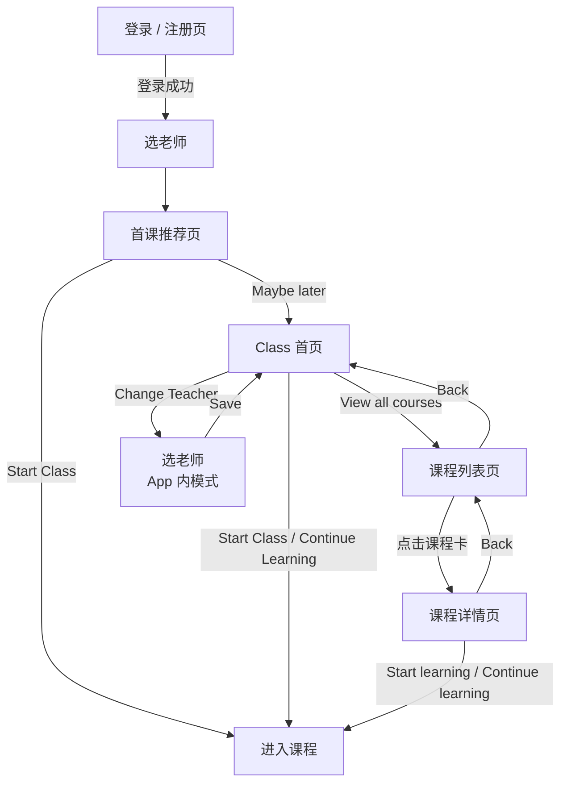

# Dino English — V1.1.0 产品需求文档（PRD）

> **版本**：V1.1.0（Landscape login + Class flow）  
> **状态**：Draft  
> **更新日期**：2026-05-26  
> **交互 Demo（V1.1.0）**：[https://cyanlee888.github.io/cyan/dino-english/V1.1.0-ui-demo.html](https://cyanlee888.github.io/cyan/dino-english/V1.1.0-ui-demo.html)（本地同源文件：`V1.1.0-ui-demo.html`）  
> **版本说明**：本版本采用横屏主流程：`登录 / 注册页 -> 选老师 -> 首课推荐页 -> Class 首页 / 课程列表页 / 课程详情页 -> 进入课程`。

---

## 1. 版本范围

| 项 | 说明 |
| --- | --- |
| 版本定位 | 横屏首课进课版本 |
| 默认入口 | 横屏登录 / 注册页 |
| 本期页面 | 登录 / 注册页、选老师、首课推荐页、Class 首页、课程列表页、课程详情页、进入课程 handoff |
| 本期目标 | 用户进入 App 后先完成登录，再快速选老师、看懂第一节课，并始终有清晰主路径进入课程 |
| 核心能力 | 当前课程曝光、课程列表页横滑浏览、课程详情页查看内容与进课、切换老师入口 |

---

## 2. 产品概述

### 2.1 用户与版本价值

| 项 | 内容 |
| --- | --- |
| 目标用户 | 首次进入 App、还没有开始第一节课的新用户；已经开始上课、但希望切换老师的老用户 |
| 版本价值主张 | 用户先完成登录，再快速选老师、看懂第一节课、开始上课 |
| 本期核心问题 | 用户登录后需要尽快理解下一步并进入课程 |
| 产品方案 | 用一条横屏主流程承接用户：登录 / 注册 -> 选老师 -> 首课推荐 -> 开始上课；如果暂时不上课，则进入 Class 首页，通过课程列表页与课程详情页继续浏览并进入课程 |

### 2.2 本期成功指标

| 目标 | 指标 |
| --- | --- |
| 登录完成 | 登录 / 注册页完成率 |
| 选老师完成 | 选老师页完成率 |
| 首课转化 | 首课推荐页 `Start Class` 点击率 |
| 稍后进入 App | 首课推荐页 `Maybe later` 点击率 |
| 首页承接 | Class 首页 `Go to Class / Continue Learning` 点击率 |
| 课程列表页承接 | 课程列表页课程卡点击率 |
| 课程详情页转化 | 课程详情页 `Start learning / Continue learning` 点击率 |
| 流程稳定性 | 关键页面曝光成功率、按钮点击成功率、页面切换无异常 |

---

## 3. 信息架构

### 3.1 屏幕方向

| 阶段 | 方向 | 页面 |
| --- | --- | --- |
| 主流程 | 横屏 | 登录 / 注册页、选老师、首课推荐页、Class 首页、课程列表页、课程详情页 |
| 进入课程 | 横屏 | 由首课推荐页或 Class 首页进入课程 |

### 3.2 页面地图

### 3.3 页面职责

| 页面 | 职责 | 本期要求 |
| --- | --- | --- |
| 登录 / 注册页 | 让用户先完成登录，再进入首课链路 | 提供清晰登录入口，完成后进入选老师页 |
| 选老师 | 让用户先选定教学风格 | 完成选择后进入首课推荐页 |
| 首课推荐页 | 告诉用户“第一节课已经准备好” | 提供 `Start Class` 与 `Maybe later` 两个主操作，按钮位于课程卡片下方 |
| Class 首页 | 作为“暂不上课”时的默认落点 | 继续曝光当前课程，并提供课程列表页与切换老师入口 |
| 课程列表页 | 承接“查看更多课程”的浏览需求 | 展示 6 张横滑课程卡，点击整卡进入课程详情页 |
| 课程详情页 | 承接单节课的信息确认与进课 | 展示课程名称、学习内容、学习目标，并提供 `Start learning / Continue learning` |
| 课程入口 | 接住主 CTA | 从首课推荐页、Class 首页、课程详情页进入课程 |

---

## 4. 关键流程与状态

### 4.1 首次登录后的默认流程

1. 用户先看到横屏 `登录 / 注册页`。
2. 用户完成登录或注册后，进入 `选老师`。
3. 用户确认老师后，进入 `首课推荐页`。
4. 用户有两个选择：
   - 点击 `Start Class`：直接进入课程。
   - 点击 `Maybe later`：进入 `Class 首页`。
5. 进入 `Class 首页` 后，当前课程仍然保持最高优先级展示。
6. 用户如果想看更多课程，可进入 `课程列表页` 浏览横滑课程卡，再进入 `课程详情页` 查看单节课信息并开始学习。

### 4.2 已上过课用户的切换老师流程

1. 用户从 `Class 首页` 点击 `Change Teacher`。
2. 进入选老师页的 App 内模式。
3. 用户修改老师并点击 `Save`。
4. 返回 `Class 首页`，原当前课程仍保留。

### 4.3 状态规则

| 场景 | 规则 |
| --- | --- |
| 首次入口 | 默认先显示横屏 `登录 / 注册页` |
| 首次选老师 | 默认选中 `Kym` |
| `Maybe later` | 只表示“先不开始首课”，不跳过老师选择 |
| Class 首页 | 无论用户是从 `Maybe later` 进入，还是从第一节课返回，当前课程都需要保持置顶 |
| 课程列表页 | 默认选中当前推荐课程；一屏只展示 6 张课程卡；点击整张卡进入课程详情页 |
| 课程详情页 | 展示所选课程的学习内容与学习目标；未开始显示 `Start learning`，进行中显示 `Continue learning` |
| 课程按钮文案 | 未开始时显示 `Go to Class`；已开始后显示 `Continue Learning` |

---

## 5. 页面与模块需求

| 页面 / 模块 | 需求描述 | 优先级 |
| --- | --- | --- |
| 登录 / 注册页 | <ul><li>`V1.1.0` 默认先进入横屏登录 / 注册页。</li><li>页面提供 `Continue with Apple`、`Continue with Google` 两个登录入口。</li><li>登录成功后进入 `选老师页`。</li></ul> | P0 |
| 选老师页 | <ul><li>提供 3 位老师：`Kym`、`Max`、`Leo`。</li><li>首次进入默认选中 `Kym`。</li><li>当前被选中的老师卡片显示绿色高亮，未选中卡片保持统一底色。</li><li>页面标题与说明文案面向真实用户。</li><li>首次流程底部主按钮为 `Continue`，进入首课推荐页。</li><li>App 内切换老师时，主按钮为 `Save`，返回 Class 首页。</li><li>页面底部提示强调“之后仍可在 Class 中切换老师”。</li></ul> | P0 |
| 首课推荐页 | <ul><li>左侧展示当前所选老师形象。</li><li>老师图上方展示简短首课提示文案。</li><li>课程卡片下方提供并列双按钮：`Start Class` 与 `Maybe later`。</li><li>右侧主内容是课程卡片，字段包括：`Level / Unit / Lesson`、课程名称、`Words`、`Sentences`、课程时长。</li><li>`Maybe later` 点击进入 `Class 首页`，`Start Class` 点击进入课程。</li></ul> | P0 |
| Class 首页 | <ul><li>`Class` 为默认首页。</li><li>首页首屏置顶展示当前课程卡与主按钮。</li><li>提供 `View all courses` 入口进入课程列表页。</li><li>保留底部 tab 结构，`Class` 为默认高亮；其他 tab 作为后续功能入口表达。</li><li>提供切换老师入口，并复用选老师页 App 内模式。</li><li>如果用户已经开始过课程，主按钮文案切换为 `Continue Learning`。</li></ul> | P0 |
| 课程列表页 | <ul><li>课程列表页从 `Class 首页` 的 `View all courses` 进入。</li><li>页面头部提供返回按钮。</li><li>页面展示 6 张横向滑动课程卡。</li><li>课程卡字段包括：`Lesson`、课程名称、`Words`、`Sentences`、学习状态、课程时长。</li><li>学习状态文案统一为英文：`Completed / In progress / Not started`。</li><li>点击整张课程卡进入课程详情页。</li></ul> | P0 |
| 课程详情页 | <ul><li>课程详情页从课程列表页点击课程卡进入。</li><li>页面头部提供返回按钮，返回课程列表页。</li><li>页面展示课程名称、`Lesson`、课程时长。</li><li>展示学习内容：`Words`、`Sentences`、课程摘要。</li><li>展示学习目标列表。</li><li>底部主按钮：未开始或已完成显示 `Start learning`；进行中显示 `Continue learning`。</li><li>点击主按钮进入课程。</li></ul> | P0 |
| 进入课程 | <ul><li>首课推荐页点击 `Start Class`，进入课程。</li><li>Class 首页点击 `Go to Class / Continue Learning`，进入课程。</li><li>课程详情页点击 `Start learning / Continue learning`，进入课程。</li></ul> | P0 |

### 5.1 页面与按钮点击埋点

| 页面 / 模块 | 事件名 | 触发时机 | 关键属性 |
| --- | --- | --- | --- |
| 登录 / 注册页 | `page_view_login_register` | 登录 / 注册页曝光 | `entry_source` |
| 登录 / 注册页 | `click_login_apple` | 点击 `Continue with Apple` | `entry_source` |
| 登录 / 注册页 | `click_login_google` | 点击 `Continue with Google` | `entry_source` |
| 登录 / 注册页 | `login_success` | 登录或注册成功 | `login_method` |
| 选老师页 | `page_view_teacher_picker` | 选老师页曝光 | `flow_mode`（`onboarding/app`）、`default_teacher_id` |
| 选老师页 | `click_teacher_card` | 点击某位老师卡片 | `teacher_id`、`flow_mode` |
| 选老师页 | `click_teacher_confirm` | 点击 `Continue / Save` | `teacher_id`、`flow_mode` |
| 首课推荐页 | `page_view_first_class_intro` | 首课推荐页曝光 | `teacher_id`、`lesson_id` |
| 首课推荐页 | `click_first_class_start` | 点击 `Start Class` | `teacher_id`、`lesson_id` |
| 首课推荐页 | `click_first_class_maybe_later` | 点击 `Maybe later` | `teacher_id`、`lesson_id` |
| Class 首页 | `page_view_class_home` | Class 首页曝光 | `entry_source`（`maybe_later/class_return/teacher_save`）、`lesson_id` |
| Class 首页 | `click_class_home_start` | 点击 `Start Class / Continue Learning` | `lesson_id`、`lesson_state` |
| Class 首页 | `click_change_teacher` | 点击 `Change Teacher` | `current_teacher_id` |
| Class 首页 | `click_view_all_courses` | 点击 `View all courses` | `lesson_id` |
| 底部 Tab | `click_tab_class` | 点击 `Class` tab | `from_tab` |
| 底部 Tab | `click_tab_words` | 点击 `Words` tab | `from_tab` |
| 底部 Tab | `click_tab_fm` | 点击 `FM` tab | `from_tab` |
| 底部 Tab | `click_tab_profile` | 点击 `Profile` tab | `from_tab` |
| 其他 Tab 页 | `page_view_words` | `Words` 页曝光 | `from_tab` |
| 其他 Tab 页 | `page_view_fm` | `FM` 页曝光 | `from_tab` |
| 其他 Tab 页 | `page_view_profile` | `Profile` 页曝光 | `from_tab` |
| 课程列表页 | `page_view_course_list` | 课程列表页曝光 | `recommended_lesson_id` |
| 课程列表页 | `swipe_course_list` | 横滑浏览课程卡 | `visible_lesson_ids` |
| 课程列表页 | `click_course_list_card` | 点击某张课程卡 | `lesson_id`、`lesson_status` |
| 课程列表页 | `click_course_list_back` | 点击返回 | `from_page` |
| 课程详情页 | `page_view_course_detail` | 课程详情页曝光 | `lesson_id`、`lesson_status` |
| 课程详情页 | `click_course_detail_start` | 点击 `Start learning / Continue learning` | `lesson_id`、`lesson_status` |
| 课程详情页 | `click_course_detail_back` | 点击返回 | `from_page` |

---

## 6. 内容与默认数据

### 6.1 老师数据

| 字段 | 说明 |
| --- | --- |
| 老师数量 | 3 位 |
| 默认老师 | `Kym` |
| 展示信息 | 人物图、名字、风格标签 |

### 6.2 当前课程卡字段

| 字段 | 示例 |
| --- | --- |
| 课标 | `Level 2 · Unit 1 · Lesson 1` |
| 课程名称 | `An Exploratory Adventure at the Forest Lake` |
| 时长 | `12 min live class` |
| Words | `Book, pencil, crayon, bike` |
| Sentences | `Hello! I am Meg. Nice to meet you.` |

### 6.3 课程列表页课程卡字段

| 字段 | 示例 |
| --- | --- |
| Lesson | `Lesson 1` |
| 课程名称 | `An Exploratory Adventure at the Forest Lake` |
| Words | `Book, pencil, crayon, bike` |
| Sentences | `Hello! I am Meg. Nice to meet you.` |
| 学习状态 | `Completed / In progress / Not started` |
| 时长 | `12 min live class` |

### 6.4 课程详情页字段

| 字段 | 示例 |
| --- | --- |
| Lesson | `Lesson 1` |
| 课程名称 | `An Exploratory Adventure at the Forest Lake` |
| 时长 | `12 min live class` |
| 学习内容 | `Words`、`Sentences`、课程摘要 |
| 学习目标 | 3 条学习目标 bullet |
| 主按钮 | `Start learning` / `Continue learning` |

### 6.5 Class 首页承接内容

- 当前课程 hero 卡
- 课程列表页入口
- 底部 tab 结构
- 切换老师入口

---

## 7. 验收标准

1. `V1.1.0` demo 默认从横屏 `登录 / 注册页` 开始。
2. 用户登录成功后进入 `选老师页`。
3. 首课推荐页中，`Start Class` 与 `Maybe later` 作为并列双按钮出现；`Maybe later` 点击后进入 `Class 首页`。
4. `Class 首页` 首屏始终突出当前课程，并保留 `View all courses` 与切换老师入口。
5. `课程列表页` 只展示 6 张横滑课程卡，点击整张卡进入课程详情页。
6. `课程详情页` 展示课程名称、学习内容、学习目标，并通过 `Start learning / Continue learning` 进入课程。
7. 页面 / 按钮点击埋点表已覆盖：登录 / 注册、首课推荐、Class 首页、其他 tab、课程列表页、课程详情页的主要曝光与操作事件。

---

*说明：本文件覆盖 `V1.1.0` 的横屏登录与首课进课链路。*
