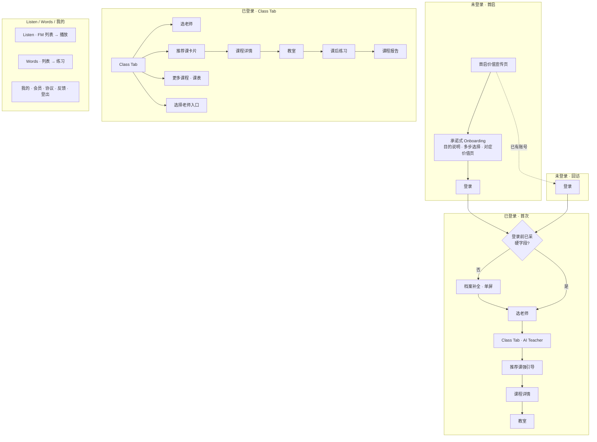
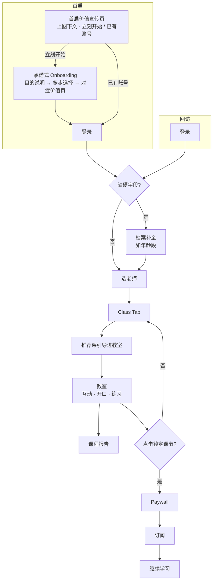

# Dino English — V1.1.0 产品需求文档（PRD）

> **版本**：V1.1.0（中间版本，以 Class 为核心）  
> **状态**：Draft  
> **Class 需求来源**：`V2.8新课内测.md`  
> **设计稿**：Figma「Dino AI（整体框架）」[node-id=12237-28881](https://www.figma.com/design/vzaxQm4aizefdbq4y4A15d/Dino-AI-%EF%BC%88%E6%95%B4%E4%BD%93%E6%A1%86%E6%9E%B6%EF%BC%89?node-id=12237-28881)  
> **更新日期**：2026-05-19  
> **交互 Demo（V1.1.0）**：[https://cyanlee888.github.io/cyan/dino-english/V1.1.0-ui-demo.html](https://cyanlee888.github.io/cyan/dino-english/V1.1.0-ui-demo.html)（本地同源文件：`V1.1.0-ui-demo.html`）

---

## 1. 版本范围

| 项 | 说明 |
|----|------|
| 版本定位 | 中间版本，**围绕 Class（AI 互动新课）** 交付可上架闭环 |
| 本期重点 | Class 课前课后全链路（选师、课表、详情、教室、报告） |
| 本期重设计 | 首启价值宣传、承诺式 Onboarding（登录前）、登录注册、登录后进课引导、支付链路（不复用历史留资/Paywall 栈） |
| 本期沿用 | Listen（FM）、Words、我的 — 保持现有能力，非本 PRD 展开范围 |
| 外部配置 | 老师话术《三位 AI 外教-所有场景的说话内容》；对标《课程与1V1、年龄的对标关系》；课名《Dino AI 所有课程名称&卡片副标题》 |

---

## 2. 产品概述

| 项 | 内容 |
|----|------|
| 目标用户 | 希望跟老师互动学英语的学习者（混龄） |
| 版本价值主张 | 选专属 AI 老师，按课纲实时互动，课上开口、课后巩固 |
| 对内标语 | English in your ears, every day. |
| 商店策略 | Education；不勾选 Kids Category |

### 2.1 版本目标

| 目标 | 指标 |
|------|------|
| Onboarding | 首启完成率；Onboarding 完成 → 登录成功率 |
| Class 到课 | 选师完成率；登录后 24h 推荐课 → 进教室转化率 |
| 完课 | 教室完课率；课中有效开口占比 |
| 商业 | 锁课 → Paywall → 订阅成功率 |
| 稳定 | 教室崩溃率、ASR 失败率、支付失败率 |

---

## 3. 信息架构

### 3.0 屏幕方向

| 阶段 | 方向 | 页面 |
|------|------|------|
| 获客 / 定制（登录前） | **竖屏** | 首启价值宣传、目的说明、承诺式 Onboarding 各题、登录 / OTP |
| 产品内（登录后） | **横屏** | 选老师、Class Tab、课表、详情、教室；Listen / Words 主流程 |
| 过渡 | 登录成功 → 选老师 | 建议轻提示旋转设备（可配合系统自动转横屏） |

Paywall：从 Class 横屏流程内弹出时，与 Class **同横屏**（与历史独立竖屏会员页区分，本期以 Class 内触点为准）。

### 3.1 底部 Tab（横屏）

| Tab | 职责 | V1.1.0 |
|-----|------|--------|
| **Class** | AI Teacher 首页、选师、课表、详情、进教室 | **默认 Tab** |
| **Listen** | FM：睡前 / 晨起 / 随时听 | 沿用 |
| **Words** | 词汇练习 | 沿用 |
| **我的** | 从头像侧边栏进入，不占 Tab | 沿用 |

Tab 顺序支持按国家配置下发。

### 3.2 全局 Header（一级页）

| 位置 | 元素 |
|------|------|
| 左上 | 头像 → 个人中心 |
| 左上 | Level / Unit 筛选（有则展示；Level 下拉或 Level-Unit 半屏） |
| 右上 | 会员中心入口；免费用户可展示学习倒计时（若启用） |

### 3.3 页面地图

---

## 4. 用户主路径（V1.1.0）

---

## 5. 首启价值宣传

> **布局**：竖屏单页、**上图下文**。上方价值展示区始终可见（自动轮播或多图并列）；下方固定操作区。**不提供 Skip**。

| ID | 需求 | 优先级 |
|----|------|--------|
| VAL-01 | **竖屏**单页；上方价值区展示 3 个核心价值点（见 §5.2）；可自动轮播，**无需**用户手动翻页才可操作 | P0 |
| VAL-02 | 页面**底部固定**双按钮：主「立刻开始」→ §6；次「已有账号」→ §7 登录 | P0 |
| VAL-03 | 文案与视觉突出 **Live / AI 互动**；不出现录播课、FM 主视觉、多 Tab 功能堆砌 | P0 |
| VAL-04 | 已登录用户冷启动不展示 | P0 |

### 5.1 文案（英文底稿，多语言可配）

| 元素 | 文案 |
|------|------|
| **主标题（推荐）** | *Practice English with an AI teacher who listens.* |
| 主标题备选 B | *Learn English step by step—with a teacher who adapts to you.* |
| 主标题备选 C | *Your AI English class starts here.* |
| **副标题** | *Live interactive lessons. Speak, get feedback, move forward.* |
| **价值点 1** | *Your AI teacher, always ready* |
| **价值点 2** | *Speak in class—not just watch* |
| **价值点 3** | *See progress after every lesson* |
| **主按钮** | 立刻开始 / *Get started* |
| **次按钮** | 已有账号 / *I already have an account* |

混龄：主标题主语用 *you*；副标题或脚注可加 *for learners of all ages*，不以 *your child* 为唯一主语。

### 5.2 设计方向

| 项 | 要求 |
|----|------|
| 结构 | 价值视觉区约 50–55% 屏高；品牌 + 主副标题 + 可选 3 icon 要点；底栏双 CTA |
| 画面 | ① Kym/Max/Leo 半身 + Live 感 ② 教室对话/麦克风 ③ 报告/Level 进度示意 |
| 调性 | 温暖、可信、略游戏化（Dino IP）；避免幼态低幼园专属视觉 |
| 背景 | 浅渐变或浅雾绿，可与商店首屏品牌色呼应 |

---

## 6. 承诺式 Onboarding

> **定位**：登录前、**竖屏**。通过「目的说明 + 一题一屏 + 学习目标全屏价值页 + 其余题轻反馈」完成价值对齐与推荐画像采集。题量默认 **7 步**（含目的说明与价值页），运营可配。

### 6.1 设计原则

| 原则 | 要求 |
|------|------|
| **目的可见** | 独立目的说明屏 + 每题一行题级说明 |
| **一题一屏** | 大选项 + 顶部进度（如 *Step 2 of 7*） |
| **价值分级** | **L 全屏价值页**：仅跟学习目标；**M 轻反馈**：年龄、水平等（勾选动画 + 1 句确认，不停留全屏营销） |
| **混龄文案** | 主语 *you / learner*；年龄题干可用 *Which age group fits you best?* |
| **登录节点** | Onboarding 在登录前完成；登录页动态文案见 §7.2 |

### 6.2 登录前步骤（默认编排）

| Step | 步骤 | 类型 | 价值回应 |
|------|------|------|----------|
| 1 | 目的说明 | 说明屏 | — |
| 2 | 学习目标 | 单选必填 | — |
| 3 | 对症价值页 | L 全屏 | §6.4 |
| 4 | 年龄段 | 单选必填 | M 轻反馈 §6.6 |
| 5 | 当前英语水平 | 单选 | M 轻反馈 |
| 6 | 每日可学时长 | 单选 | M 轻反馈（P1 可砍） |
| 7 | — | — | 进入 §7 登录 |

**年龄段**默认在 **Step 4（登录前）** 采集，用于 Level 锚定；登录后仅当未采集时单屏补全（§6.6）。

### 6.3 目的说明页

| 元素 | 文案（EN） |
|------|------------|
| 主标题 | *Let's personalize your first lesson* |
| 说明 | *Answer a few quick questions so we can recommend the right course and teacher for you.* |
| Bullet（可选） | *Takes about 1 minute* · *No account needed yet* · *You can change answers later* |
| CTA | *Continue* |

设计：白/浅灰底 + 步骤感；与题目页版式统一（顶进度 + 中内容 + 底 CTA）；插画为老师递课表/路径，不做第二遍全屏营销 Hero。

### 6.4 信息采集题目文案（EN 底稿）

**Q1 学习目标**  
- 题干：*What's your main goal right now?*  
- 题级说明：*We'll recommend your first lesson based on this.*

| key | 选项文案 |
|-----|----------|
| `speak_confidence` | *Speak more confidently* |
| `structured_progress` | *Follow a clear learning path* |
| `school_exam` | *Keep up with school / tests* |
| `daily_communication` | *Use English in daily life* |
| `listening_habit` | *Build listening habit*（置末；价值页强调 Class 为主） |

**Q2 年龄段**  
- 题干：*Which age group fits you best?*  
- 题级说明：*This helps us match the right course level.*  
- 选项：按《课程与1V1、年龄的对标关系》分档（如 *3–5* / *6–8* / *9–12* / *13–17* / *18+*）

**Q3 当前水平**  
- 题干：*How much English do you know today?*  
- 题级说明：*We'll pick a comfortable starting point.*  
- 选项：*I'm just starting* · *I know some words* · *I can have simple conversations* · *I'm intermediate or above*

**Q4 每日时长（P1）**  
- 题干：*How much time can you study most days?*  
- 选项：*5 min* · *10 min* · *15 min* · *20+ min*

### 6.5 学习目标 → 全屏价值页（L）

模板：勾选确认 → 主标题 → 副标题 → 示意卡片 → 2–3 bullet → *Continue*。仅讲 Class / AI 互动。

| key | 主标题 | 副标题 | Bullets（示例） |
|-----|--------|--------|-----------------|
| `speak_confidence` | *We'll help you speak—not just listen* | *Your AI teacher asks questions and waits for your answer.* | Practice speaking every lesson · Get instant feedback · Build confidence step by step |
| `structured_progress` | *A clear path from Lesson 1 onward* | *Level by level, with progress you can see.* | Structured curriculum · Recommended next lesson · Reports after class |
| `school_exam` | *Lessons that fit school expectations* | *Practice speaking and key skills in each unit.* | Align with learning goals · Track completion · Review anytime |
| `daily_communication` | *English you'll actually use* | *Role-play and dialogue in every class.* | Real-life topics · Speak in class · Short practice after class |
| `listening_habit` | *Listening helps—but speaking locks it in* | *We'll start with a short interactive class; use Listen anytime after.* | Start with a live lesson · Add listening on your schedule · One app, two habits |

`listening_habit`：Listen 仅辅助表述，主 CTA 仍为 *Continue* 进入后续题/登录。

### 6.6 轻价值反馈（M，非全屏）

| 触发 | 文案（EN） |
|------|------------|
| 选定年龄 | *Got it—we'll match courses for ages {band}.*（不写死具体 Level 数字） |
| 选定水平 | *We'll start where you're comfortable—no pressure.* |
| 选定时长 | *A {n}-minute daily goal works great.* |

呈现：同页底部滑入或 ≤1s 过渡，再自动进入下一题。

### 6.7 需求列表

| ID | 需求 | 优先级 |
|----|------|--------|
| ONB-01 | 登录前完成承诺式 Onboarding；默认 **7 步**（§6.2），运营可配 | P0 |
| ONB-02 | 目的说明屏 + 题级采集目的（§6.3–6.4） | P0 |
| ONB-03 | 学习目标 → §6.5 全屏价值页（L）；其余题 → §6.6 轻反馈（M） | P0 |
| ONB-04 | 竖屏、一题一屏 + 进度 | P0 |
| ONB-05 | 每步写入本地临时档案；登录后合并 | P0 |
| ONB-06 | **年龄段**登录前 Step 4 必填（P0）；登录后缺则单屏补全 | P0 |
| ONB-07 | 不采集：兴趣决定 Tab、多步留资、头像（本期） | P0 |
| ONB-08 | 「已有账号」从 §5 / Onboarding 内直达 §7 | P0 |

### 6.8 登录后档案补全与进课引导

| ID | 需求 | 优先级 |
|----|------|--------|
| POST-01 | 登录成功：合并 Onboarding 临时档案；若缺**年龄段**等硬字段，**单屏**补全后进选老师 | P0 |
| POST-02 | 首次完成选老师后进入 Class Tab；**推荐课大卡片**主引导，文案 *Start your first lesson* / 开始第一节课 | P0 |
| POST-03 | 用户从推荐课卡片或详情 **Go to Class / Continue** 进入教室；登录后 **24h 内**不以额外 Paywall 阻断首次进教室（试用策略见 §8） | P0 |
| POST-04 | 提交档案后用于 Level 锚定（逻辑同 §9.3.1） | P0 |

---

## 7. 登录注册

> **布局**：**竖屏**。Logo + 动态主文案 + 登录方式栈 + 协议底栏。不重复 §5 大 Hero；可用推荐摘要 chip（目标 + 年龄档）。

| ID | 需求 | 优先级 |
|----|------|--------|
| AUTH-01 | §6 完成后进入；竖屏登录页 + 协议链接 | P0 |
| AUTH-02 | 主文案与 `goal_key` 绑定（§7.2）；固定副文案 *Sign in to save your answers* | P0 |
| AUTH-03 | 可选展示 Onboarding 摘要 chip（如 *Goal: Speak confidently · Age: 9–12*） | P1 |
| AUTH-04 | 地区登录矩阵：Apple、Google；沙特/阿联酋手机号；韩国 Kakao 等 | P0 |
| AUTH-05 | 协议勾选（法务要求时） | P0 |
| AUTH-06 | OTP：4 位、60s 重发、5min 有效 | P0 |
| AUTH-07 | 成功写 Token，合并档案；**切换横屏**进入选老师（§6.8） | P0 |
| AUTH-08 | 失败统一 Toast | P0 |
| AUTH-09 | 登出清敏感数据；已登录用户不强制完整 Onboarding | P0 |

### 7.2 登录页动态主文案（EN）

| goal_key | 主文案 |
|----------|--------|
| `speak_confidence` | *Save your plan and start speaking in class* |
| `structured_progress` | *Save your learning path and start Lesson 1* |
| `school_exam` | *Save your plan and start your first lesson* |
| `daily_communication` | *Save your plan and start your first lesson* |
| `listening_habit` | *Save your plan and start your first class* |
| `default` | *Save your plan and continue* |

---

## 8. 支付链路

### 8.1 商品与权益

| 商品 | 说明 |
|------|------|
| Pro 月订 | 主 SKU |
| Pro 年订 | 主 SKU |
| 免费试用 | 3 天试用 + 绑月订（按地区配置） |

| 用户 | Class 权益 |
|------|------------|
| **免费** | 每个 Level、每个 Unit 的 **Lesson 1** 解锁；已解锁课节**可无序**体验；Unit 内其余课节锁定 |
| **订阅** | 全部课节解锁；**Unit 内 Lesson 顺序解锁**（前一节「已完成」才可上下一节） |
| **Unit 之间** | 无序切换 |

Listen、Words：本期 **不** 作为付费墙主因；权益与 Class 解锁独立配置（默认保持全量可用）。

### 8.2 Paywall

| ID | 需求 | 优先级 |
|----|------|--------|
| PAY-01 | 触点：点击锁定课节、课程详情进教室（无权益）、会员中心 | P0 |
| PAY-02 | 展示 Pro 权益：Class 全路径、AI 互动课 | P0 |
| PAY-03 | 支持购买、恢复购买；成功后刷新课节解锁态 | P0 |
| PAY-04 | 返回栈：Paywall 关闭回到触发页 | P0 |
| PAY-05 | 试用仅在 Paywall / 会员中心提供，**不在** Onboarding / 登录后首次进教室前强制弹 | P0 |

### 8.3 会员中心

| ID | 需求 | 优先级 |
|----|------|--------|
| VIP-01 | 入口：Header 右上 + 我的 | P0 |
| VIP-02 | 展示订阅状态、价格、权益说明、恢复购买 | P0 |

---

## 9. Class 模块（对齐 V2.8）

### 9.1 名词

| 名词 | 定义 |
|------|------|
| **AI Teacher** | Class Tab 一级页：当前老师 + 语音 + 推荐课 |
| **Lesson** | 最小上课单元；状态：未开始 / 进行中 / 已完成 |
| **教室** | 实时 AI 数字人互动；按大纲与课件推进 |
| **课程报告** | 完课数据页 |

### 9.2 选老师

| ID | 需求 | 优先级 |
|----|------|--------|
| TCH-01 | 首次进入默认打开选老师页（`source=first_time`） | P0 |
| TCH-02 | 老师：**Kym、Max、Leo**；顺序 Kym—Max—Leo；支持滑动切换 | P0 |
| TCH-03 | 首次默认选中 **Kym**；非首次默认上次选中 | P0 |
| TCH-04 | 顶部语音框展示介绍文案；喇叭可重播 | P0 |
| TCH-05 | 切换老师自动播该老师**自我介绍** TTS（每次切换播一次，多语言） | P0 |
| TCH-06 | 头像右上喇叭：播放中点击暂停，播完点击重播 | P0 |
| TCH-07 | 展示老师名、标签、简介（文案见外部表） | P0 |
| TCH-08 | 吸底确认：回 Class Tab，刷新老师，播「切换成功」语音 | P0 |
| TCH-09 | Class Tab 内「选择老师」入口（`source=ai_teacher_page`） | P0 |

### 9.3 AI Teacher 首页（Class Tab）

| ID | 需求 | 优先级 |
|----|------|--------|
| AT-01 | 当日**首次**进入（切 Tab 或冷启动）：播「当日首次引导」语音 | P0 |
| AT-02 | 当日非首次且有新推荐课：播「新推荐课程」语音 | P0 |
| AT-03 | 当日非首次且无新推荐课：不自动播语音 | P0 |
| AT-04 | TTS 失败：播兜底语音 | P0 |
| AT-05 | 展示**推荐课大卡片**（字段见 §9.5） | P0 |
| AT-06 | 「更多课程」→ 课表页 | P0 |
| AT-07 | 「选择老师」→ 选老师页 | P0 |

#### 9.3.1 推荐课逻辑

| 条件 | 规则 |
|------|------|
| 有 1V1 对标 | 按对标表定 Level |
| 无 1V1 | 按年龄对标表定 Level |
| 首次 | 展示该 Level 的 Lesson 1 |
| 非首次·无记录 | 仍展示 Lesson 1 |
| 非首次·有记录 | 进行中 → 展示进行中 Lesson；已完成 → 展示下一节（Unit 内有序） |
| 当前 Level 全部完成 | 推荐下一 Level；若已是最高级最后一节 → 引导去 Words（话术见外部表） |

### 9.4 课程状态与解锁

| 状态 | 定义 |
|------|------|
| 未开始 | 未进教室 |
| 进行中 | 进过教室未完成 |
| 已完成 | 课中完课逻辑达成 |

| 解锁 | 规则 |
|------|------|
| 免费 | 每 Level 每 Unit 的 Lesson 1 解锁；解锁课可无序上 |
| 订阅 | 全解锁；Unit 内按顺序；前一节须已完成才可上下一节 |
| 不可上课 | 前一节未完成 → Toast：`Please complete the previous lesson to unlock this one`（多语言） |

### 9.5 推荐课 / 列表课卡片

| 字段 | 说明 |
|------|------|
| 占位图 | |
| 课程名称 | 本地语 |
| 单词 | |
| 句子 | |
| 学习目标 | |

| 按钮状态 | 文案 | 行为 |
|----------|------|------|
| 未开始 | Go to Class | 进课程详情 |
| 进行中 | Continue Learning | 进课程详情 |
| 已完成 | Try Again | 进课程详情；**状态保持已完成** |

### 9.6 更多课程（课表）

| ID | 需求 | 优先级 |
|----|------|--------|
| LST-01 | 一屏展示一个 Unit，其他 Unit 收起，可切换 | P0 |
| LST-02 | Level 选择；Unit 选择（Unit 下无上架 Lesson 则不展示该 Unit） | P0 |
| LST-03 | 首次进入：按 1V1 或年龄锚定 Level 的 Unit1 Lesson1 | P0 |
| LST-04 | 非首次：锚定第一节「可上课且未完成」；无记录用首次锚定；全完成则下一 Level Lesson1；最高级全完成锚定最后一节 | P0 |
| LST-05 | 卡片字段、按钮、锁课 Toast 同 §9.5 | P0 |

### 9.7 课程详情

| 字段 | 说明 |
|------|------|
| 课标 | Level - Unit - Lesson |
| lesson name | |
| 课程名称 | 本地语 |
| 单词 / 句子 / 学习目标 | |
| 按钮 | 同 §9.5，进教室 |
| 课程报告 | 已完成展示 Report，进报告页 |

| ID | 需求 | 优先级 |
|----|------|--------|
| DET-01 | **无预习、无复习** | P0 |
| DET-02 | 视觉风格与 Class Tab 一致 | P0 |

### 9.8 教室（AI 互动课）

| ID | 需求 | 优先级 |
|----|------|--------|
| ROOM-01 | 按**课程大纲 + 课件**逐步推进；老师讲解、提问、等待用户开口 | P0 |
| ROOM-02 | 用户开口：录音交互（最短/最长、取消、ASR 失败提示） | P0 |
| ROOM-03 | 根据回答给予反馈并进入下一节点 | P0 |
| ROOM-04 | 退出保留进行中；完课记已完成 | P0 |
| ROOM-05 | 完课后进入**课后练习**（题型由教研配置） | P0 |
| ROOM-06 | 进教室语种：界面英语 → 按 App 国家映射语种；非英语 → 传界面语言 | P0 |
| ROOM-07 | 麦克风系统授权与说明 | P0 |

### 9.9 课程报告

| ID | 需求 | 优先级 |
|----|------|--------|
| RPT-01 | 入口：详情页 Report | P0 |
| RPT-02 | 展示开口与练习相关指标（与教研/数据约定字段） | P0 |
| RPT-03 | 支持再学一次 / 继续学习（已完成再学不改变已完成状态） | P0 |

### 9.10 TTS

| ID | 需求 | 优先级 |
|----|------|--------|
| TTS-01 | 按国家动态下发就近 TTS 节点 | P0 |

---

## 10. 埋点（Class）

| action | event | 触发 | 主要属性 |
|--------|-------|------|----------|
| page_choose_teacher | page_view_viptrack | 进入选老师 | source: first_time / ai_teacher_page |
| click_teacher_voice | page_click_viptrack | 点头像喇叭 | action_type, teacher_name |
| switch_teacher | page_click_viptrack | 切换老师 | teacher_name |
| click_confirm_teacher | page_click_viptrack | 确认选老师 | teacher_name |
| page_ai_teacher | page_view_viptrack | Class Tab 曝光 | has_new_course, is_first_today |
| play_ai_teacher_voice | page_trigger_viptrack | 播语音 | voice_type |
| click_more_course | page_click_viptrack | 点更多 | |
| click_choose_teacher | page_click_viptrack | 点选老师 | |
| click_home_course_card | page_click_viptrack | 点推荐卡片 | course_status, level_id, lesson_id |
| page_course_list | page_view_viptrack | 课表曝光 | |
| switch_level / switch_unit | page_click_viptrack | 切换 | level_id / unit_id |
| click_list_course_card | page_click_viptrack | 点列表卡片 | course_status, ids |
| page_course_detail | page_view_viptrack | 详情曝光 | level_id, unit_id, lesson_id |
| click_detail_course_btn | page_click_viptrack | 点上课按钮 | course_status |
| click_course_report | page_click_viptrack | 点报告 | lesson_id |

### 10.1 Onboarding / 登录 / 支付（待与数据组对齐命名）

| 阶段 | 建议事件（占位） | 主要属性 |
|------|------------------|----------|
| 首启价值宣传 | page_launch_welcome / click_start / click_has_account | value_frame_index（若上方自动轮播） |
| Onboarding | page_onboarding_step / click_option / page_value_prop | step_id, goal_key, question_key |
| 登录 | page_login / login_success / login_fail | method, from: onboarding / shortcut |
| 进课 | click_recommended_lesson / enter_classroom_first_24h | goal_key, level_id, lesson_id |

完整属性表与支付链路事件单独对齐后补充。

---

## 11. 功能范围

### 11.1 P0

- §5 首启价值宣传  
- §6 承诺式 Onboarding（登录前多步 + 对症价值页 + 目的说明）  
- §6.8 登录后档案补全与推荐课进课引导  
- §7 登录  
- §8 支付与 Class 解锁  
- §9 Class 全模块（选师、AI Teacher、课表、详情、教室、报告）  
- 全局 Header  
- 麦克风权限、隐私政策与商店物料  

### 11.2 P1

- 最高级完课引导 Words  
- Onboarding 扩展题（如每日可学时长，不影响 P0 主路径）  
- 免费用户 Header 倒计时（若启用）  

### 11.3 本期不做

- Explore、365、智学双师、Dino 闲聊  
- 预习 / 复习  
- 以 Home「今日计划」替代 Class Tab  
- Pro Max 独立 SKU  

---

## 12. 验收标准

1. **新用户首启**：竖屏价值宣传 → 目的说明 → 学习目标 + 全屏价值页 + 年龄/水平/时长 → 竖屏登录（动态文案）→ 横屏选老师 → Class 推荐课进教室。  
2. **方向**：登录前竖屏、Class 起横屏；价值宣传无 Skip；底部「立刻开始」「已有账号」。  
3. **Onboarding 体验**：每题有进度与题级目的说明；仅学习目标为全屏价值页；年龄/水平为轻反馈；`speak_confidence` 价值页不讲 FM/录播。  
4. **已有账号**：从价值宣传或 Onboarding 内「已有账号」直达登录，不强制重做全部步骤。  
5. **档案**：年龄段写入用户档案并参与 Level 锚定；登录前后档案合并无丢失。  
6. **免费用户**：Unit 的 Lesson 1 可进教室；下一节锁课 Toast；Paywall 可订阅解锁；首次进教室前无强制 Paywall。  
7. **订阅用户**：Unit 内顺序解锁；进行中/继续/再学按钮正确。  
8. **教室**：大纲课件推进、至少 1 次开口、课后练习、完课出报告。  
9. **选老师**：切换播自我介绍；确认后回 Class Tab 播切换成功语音。  
10. **再学已完成课**：状态仍为已完成。  

---

*文案表、对标表、SKU 价格以运营/法务/财务配置为准。*
