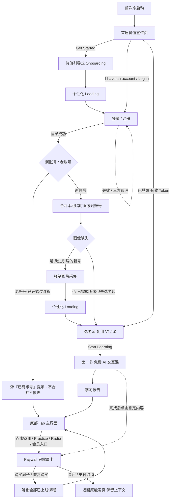

# Dino English — V1.2.0 产品需求文档（PRD）

> **版本**：V1.2.0（Pre-login growth + auth + payment）  
> **状态**：Draft  
> **更新日期**：2026-06-10（按飞书云文档第五章评审定稿文案反向同步）  
> **依赖关系**：复用 `V1.1.0` 登录后开始流程（选老师后直接进入第一节课，课后进入学习报告，点击返回回到 Class Tab 页面）；`V1.3.0` 游戏化单独讨论，不在本文范围

---

## 1. 版本范围

| 项 | 说明 |
| --- | --- |
| 版本定位 | 低成本验证版：首发只上 **6 节 AI 交互课**，用最小投入验证「课程体验是否够好」与「是否有真实付费意愿」，**非完整商业化上线**（完整课程体系为 6 Level × 12 Unit × 12 Lesson，共 864 节；规模化变现在后续版本展开） |
| 默认入口 | 竖屏首启价值宣传页 |
| 本期页面 | 首启价值宣传页、价值引导式 Onboarding（含价值页 / Loading）、登录 / 注册页、Paywall、会员中心；登录后复用 `V1.1.0` 的选老师、首课与学习报告返回链路 |
| 本期目标 | 让首次打开 App 的用户走完 价值宣传 → Onboarding → 登录 → 首课，并理解「为什么值得付费继续学」；在 6 节课的小内容量下低成本验证体验与付费意愿 |
| 核心能力 | 首启价值宣传、登录前价值引导式 Onboarding、登录 / 注册、支付 / Paywall / 会员中心，并接回 `V1.1.0` 首课与学习报告返回链路（选老师后直接进课，课后进入学习报告，点击返回回到 Class Tab 页面） |
| 不包含 | `V1.3.0` 游戏化；教室内部新玩法 / 新课件机制；Listen / Words 独立商业化改版；对 `V1.1.0` 登录后进课页面做大幅重构 |
| 验收标准 | 1. 新用户首启时能看到清晰的价值宣传页，并可进入 Onboarding 或直接登录。 2. 登录前 Onboarding 能完成画像采集，并用 Loading 承接到登录。 3. 登录成功后直接进入 `V1.1.0` 选老师页，而非无关页面。 4. 选老师后沿用 `V1.1.0` 直接进课链路，课后进入学习报告，点击返回回到 Class Tab 页面，不被 `V1.2.0` 重新打散。 5. 锁课或会员触点可稳定拉起 Paywall，并支持购买与恢复购买。 |

---

## 2. 产品概述

### 2.1 用户与版本价值

| 项 | 内容 |
| --- | --- |
| 目标用户 | ①冷启动新用户（不了解产品价值与教学方式）；②已有学习目标但还没注册的用户；③试过首课、准备继续学的用户。覆盖混龄，不只面向低龄儿童 |
| 版本价值主张 | 把冷启动 → 登录 → 首课 → Paywall 连成一个可测量的验证闭环：用户可直接开始 AI 互动上课、开口被回应，且免费 / 付费权益边界清晰 |
| 本期核心问题 | `V1.1.0` 已收敛登录后进课链路，但仍缺 冷启动说服、登录前画像采集、登录承接、支付闭环 四段；且需在全量内容重投入前先低成本验证体验与付费意愿 |
| 产品方案 | 竖屏段承接登录前转化与画像采集（价值宣传 + 价值引导式 Onboarding + 登录），横屏段复用 `V1.1.0` 进课链路并叠加 支付 / Paywall / 会员中心；商品架构与全量共用，零返工 |

### 2.2 本期成功指标

| 目标 | 指标 |
| --- | --- |
| 指标定位 | 验证版：以**验证信号**为主、规模指标为辅；**营收非核心目标**（6 节课不足以验证留存 / LTV） |
| 冷启动转化 | 首启价值宣传页 `Get Started` 点击率 |
| Onboarding 完成 | 登录前 Onboarding 完成率 |
| 登录成功 | Onboarding 完成后登录成功率 |
| 首课转化 | 登录成功 → 选老师页 `Start Learning` 转化率 |
| 体验信号（重点） | 免费课完播率、复玩率、课程评分 |
| 付费意愿信号（重点） | Paywall 曝光 → 购买率、退款率（维持在可接受范围内） |
| 稳定性 | 登录失败率、支付失败率、页面崩溃率 |

---

## 3. 信息架构

### 3.1 屏幕方向

| 阶段 | 方向 | 页面 |
| --- | --- | --- |
| 登录前转化与采集 | 竖屏 | 首启价值宣传页、价值引导式 Onboarding（含价值页 / Loading）、登录 / 注册页 |
| 登录后进课 | 横屏 | 选老师页、第一节课、Class 首页（复用 `V1.1.0`）、个人中心（含资料 / 会员中心） |
| 商业化承接 | 横屏 | 锁课触点、Paywall、会员中心 |

### 3.2 页面职责

| 页面 | 职责 | 本期要求 |
| --- | --- | --- |
| 首启价值宣传页 | 冷启动说服未登录用户 | 强调 Personalized AI teacher / Live interactive classes / Graded level-up curriculum / Stress-free English Speaking；提供 `Get Started` 与 `I have an account`；已登录不再展示 |
| 价值引导式 Onboarding | 登录前采集画像并传递价值 | 每题一屏；编排 目的 → 谁来学 → 姓名 → 年龄段 → 年龄价值页 → 水平 → 目标 → 目标价值页 → Loading；答案存本地临时画像；不做断点续填，未完成或已完整但未登录的次启均从头采集（详见第 5 章「价值引导式 Onboarding」） |
| 登录 / 注册页 | 复用 V1.1.0 登录能力并承接画像合并 | 复用 V1.1.0 登录页；登录页回显已填资料标签（最多 3 个；`goal` 完整展示不截断、`name` 超 16 字符截断）；登录成功后：新账号合并临时画像；老账号不合并、不覆盖并弹「已有账号」提示；随后进入 `V1.1.0` 选老师页 / Class 首页 |
| 选老师 / 进课 / 学习报告返回 | 登录后进课落点 | 复用 `V1.1.0`，选老师后直接进入第一节课，课后进入学习报告，点击返回回到 Class Tab 页面 |
| Paywall | 锁课 / 会员触点的付费承接 | 只露周卡一档、权益直接罗列（不做 Free vs Premium 对比）；支持购买 / 恢复购买；返回原触发页 |
| 个人中心 · 资料 | 展示并可编辑账号画像 | 展示 name / 身份 / 年龄段 / 水平 / 目标；支持编辑，保存前二次确认弹窗；缺失画像（老用户）可在此补全 |
| 会员中心 | 展示订阅状态（App 内不做订阅管理） | Profile → `Membership`：Free 用户不进入会员中心，直接拉起 Paywall（`trigger_source=membership_entry`）；已订阅用户进入会员中心，展示当前订阅状态 / 权益清单 / 下一期续费日期，仅保留 `Restore`（不展示 `Manage subscription`）；取消 / 变更 / 升级 / 订阅管理一律由用户自行到 App Store / Google Play |

---

## 4. 关键流程与状态

### 4.1 端到端主流程

### 4.2 状态规则

| 场景 | 规则 |
| --- | --- |
| 默认入口 | 未登录默认进入竖屏首启价值宣传页；已登录不再展示 |
| 已有账号 | `I have an account` 直达登录页，不强制重做 Onboarding |
| 临时画像 | Onboarding 答案写入本地临时画像，仅承接「本次采集 → 登录合并」；不做断点续填、不跨启动保留：用户中途退出、或完成采集但未登录就退出，下次启动均从头重新采集；临时画像在登录合并（仅新账号）或重新开始采集时清除（卸载重装等本地数据丢失场景按全新冷启动处理） |
| 已采集未登录次启 | 已完成全部信息采集但未登录的用户再次启动：仍按登录态判定，无 Token → 进首启价值宣传页；点击 `Get Started` 从头重新走完整 Onboarding（不再跳过已答题目、不保留上次答案）；`I have an account` 照常直达登录页；登录成功后按账号新老分别处理（新账号合并、老账号弹「已有账号」不合并，见「登录成功 / 画像合并」） |
| 画像补采集（仅新用户） | 仅针对新账号：登录后若为新账号且画像缺失（点「已有账号」却登录 / 注册出新号、跳过了引导）→ 先展示目的说明页（不展示返回按钮），再强制进入画像采集（身份 / 姓名 / 年龄段 / 水平 / 目标），完成后进入个性化 Loading，再进首次选择老师页；老用户一律不提示、不强制；已有完整画像不重复采集。已登录用户从 Profile 退出后再点 `I have an account` 登录，因账号画像已完整，不再触发补采集 |
| 登录后落点 | 新用户完成画像后进入首次选择老师页；老用户 / 已从 Profile 退出后重新登录的账号，先弹「已有账号」提示弹窗（告知已有账号并引导继续上课），确认后默认进入 Class 首页；老账号本次登录前在本地采集的临时画像一律不合并、不覆盖账号资料 |
| 免费额度 | 免费 1 节完整 AI 交互课（含引导 / 分级）；已学完的免费课可无限复上；学习报告免费永久可看；完成首课后，第二节及后续未解锁课程展示锁态，按钮显示为 `Unlock`，点击拉起 Paywall |
| Paywall 触发时机（PAY 口径） | 锁课点击、Practice 锁定内容、Radio 锁定内容、课程详情权限不足、会员入口；选老师页之前**不强插** Paywall，不打断首课启动 |
| Paywall 返回 | 返回原触发页，不丢上下文 |
| 权益边界 | 用户侧表达为解锁当前已上线全部课程、全部 Practice、全部 Radio；首节课学习报告免费永久可看，订阅后可查看全部课程学习报告 |
| 恢复购买 | 支持恢复购买；购买 / 恢复成功后实时刷新锁课解锁状态 |
| 多账号订阅限制 | 同一商店账号（Apple ID / Google 账号）已有生效订阅且绑定到本系统其他用户时，禁止再次订阅，会员权益不跨账号共享；校验在支付回执后进行（不前置拦截，避免拖慢支付前流程），命中后弹窗引导登录对应账号（iOS 用我方文案，Android 复用 Google 自带文案） |
| 订阅管理与退款 | App 内不提供取消 / 变更计划 / 升级 / 订阅管理入口（不再提供跳商店的 `Manage subscription`）；用户自行到 App Store / Google Play 管理订阅；退款由商店处理并回调，App 据回调更新订阅状态与权益，无需 App 侧提供使用记录 |
| 登出 | 清理 Token 与敏感状态 |

---

## 5. 页面与模块需求

| 所属模块 | 功能点 | 展示内容 | 交互操作逻辑 | 数据 · 接口 | 优先级 |
| --- | --- | --- | --- | --- | --- |
| 首启价值宣传页（竖屏 · 登录前入口） | 页面整体 | • 布局：竖屏全屏；品牌视觉 + 价值主张区 • 主标题：`Meet Your Exclusive AI English Teacher` • 副标题：`Boost your child's English skills anytime, anywhere.` • 价值点： &nbsp;&nbsp;• `Personalized AI teacher` &nbsp;&nbsp;• `Live interactive classes` &nbsp;&nbsp;• `Graded level-up curriculum` &nbsp;&nbsp;• `Stress-free English Speaking` • 按钮： &nbsp;&nbsp;• 主按钮：`Get Started` &nbsp;&nbsp;• 次按钮：`I have an account` | • 进入路径：首次冷启动且未登录 → 默认进本页 • 已登录用户：直接跳过本页进登录后落点 • `Get Started` → 进价值引导式 Onboarding，从头开始采集（不保留上次答案、不跳过已答） • `I have an account` → 直达登录页（不强制重做 Onboarding） | 拉取：远程配置文案 / 图片资源（带本地兜底默认文案，保证空态 / 异常可显示） | P0 |
| 首启价值宣传页（竖屏 · 登录前入口） | 加载 / 异常态 | • 加载态：品牌占位 / 骨架屏 • 失败兜底文案：`Meet Your Exclusive AI English Teacher` • 按钮： &nbsp;&nbsp;• 主按钮：`Get Started` &nbsp;&nbsp;• 次按钮：`I have an account` | • 资源拉取超时 / 失败不阻断按钮可用 • 按钮防重复点击，点击后置灰至跳转完成 | 记录配置拉取失败（可并入通用错误日志，不单列事件） | P1 |
| 首启价值宣传页（竖屏 · 登录前入口） | 登录态判定 | 无前端展示 | • 启动时读取本地登录态 • 有有效 Token → 不展示本页，直接进登录后落点 • 无 Token → 展示本页 | 接口：本地 Token / 会话校验（沿用账号体系） | P0 |
| 价值引导式 Onboarding（竖屏 · 登录前画像采集） | 框架 / 编排 | • 题目页进度：`Step 1 of 5` 至 `Step 5 of 5` • 顶部返回： &nbsp;&nbsp;• 正常 Onboarding 的目的说明页、年龄价值页、目标价值页不展示 Step，仅展示返回箭头 / 内容 / `Continue` &nbsp;&nbsp;• 登录后补采集的目的说明页不展示返回按钮 • 主按钮：`Continue` • 完整 Onboarding 顺序： &nbsp;&nbsp;• 目的说明 → 谁来学 → 姓名 → 年龄段 → 年龄价值页 → 当前水平 → 学习目标 → 目标价值页 → Loading • 登录后补采集顺序： &nbsp;&nbsp;• 目的说明 → 谁来学 → 姓名 → 年龄段 → 当前水平 → 学习目标 → Loading &nbsp;&nbsp;• 跳过年龄价值页 / 目标价值页 | • 进入： &nbsp;&nbsp;• 首启价值宣传页 `Get Started` 触发 &nbsp;&nbsp;• 新账号登录后发现画像缺失时触发补采集 • 前进：答完 → 写临时画像 → 下一屏 • 后退： &nbsp;&nbsp;• 保留已填答案 &nbsp;&nbsp;• 补采集流程不可退回登录前欢迎页 &nbsp;&nbsp;• 补采集首屏和补采集后的 Loading 不展示返回 • 中途退出再进：不保留进度，从头重新采集（不做断点续填） | 临时画像仅本次会话使用、不跨启动保留；登录后补采集完成后提交账号画像 | P0 |
| 价值引导式 Onboarding（竖屏 · 登录前画像采集） | 目的说明屏 | • Dino 气泡文案：`Hi, I'm Dino! Just a few quick questions to understand your goals and preferences.` • 主按钮：`Continue` | 仅点击 `Continue` 进入下一步，无输入 | 无新增接口 | P0 |
| 价值引导式 Onboarding（竖屏 · 登录前画像采集） | 谁来学（身份选择） | • 标题：`Who's learning?` • 辅助文案：`We'll personalize lessons based on who's learning.` • 选项： &nbsp;&nbsp;• `For my child` &nbsp;&nbsp;• `For myself` • 主按钮：`Continue` | • 默认选中：`For my child` • 可切换选项 • 点击 `Continue` 写入并进入下一步 | 写临时画像 `learner`（child / self，默认 child） | P0 |
| 价值引导式 Onboarding（竖屏 · 登录前画像采集） | 姓名输入 | • For my child 标题：`What's your child's name?` • For myself 标题：`What's your name?` • 辅助文案：`We will call you by this name.` • 占位： &nbsp;&nbsp;• `Your child's name` &nbsp;&nbsp;• `Your name` • 建议 chip： &nbsp;&nbsp;• `Ethan` &nbsp;&nbsp;• `Emma` • 主按钮：`Continue` | • 点选姓名 chip → 填入输入框 • 输入非空 → 启用 `Continue` • 为空 → `Continue` 置灰 • `name` 作为昵称用于后续个性化称呼，所有页面直接读取该字段 | 写临时画像 `name` | P0 |
| 价值引导式 Onboarding（竖屏 · 登录前画像采集） | 年龄段选择 | • For my child 标题：`How old is your child?` • For myself 标题：`How old are you?` • 辅助文案：`This helps us create a proper account for you and your child.` • 选项： &nbsp;&nbsp;• `3–5` &nbsp;&nbsp;• `6–8` &nbsp;&nbsp;• `9–12` &nbsp;&nbsp;• `13–17` &nbsp;&nbsp;• `18+` • 主按钮：`Continue` | • 单选高亮 • 已选 → 写入并进入年龄价值页 | 写临时画像 `age_band` | P0 |
| 价值引导式 Onboarding（竖屏 · 登录前画像采集） | 年龄价值页 | • 不展示年龄标签（不回显已选年龄段） • For child 标题：`Speak from the very first lesson` • For myself 标题：`Speak from your very first lesson` • For child 文案：`Real conversations every lesson—child speaks, and the AI teacher responds.` • For myself 文案：`Real conversations every lesson—you speak, and the AI teacher responds.` • 要点： &nbsp;&nbsp;• `Speaking practice in every lesson` &nbsp;&nbsp;• `Instant feedback as they go` &nbsp;&nbsp;• `A learning report after every lesson` | • 点击 `Continue` → 进入当前水平选择 • 可后退修改年龄段 | 无新增接口 | P0 |
| 价值引导式 Onboarding（竖屏 · 登录前画像采集） | 当前水平选择 | • For my child 标题：`What's your child's current level?` • For myself 标题：`What's your current level?` • 辅助文案：`We'll pick a comfortable starting point.` • 选项： &nbsp;&nbsp;• `Beginner (just starting)` &nbsp;&nbsp;• `Basic (know few words)` &nbsp;&nbsp;• `Intermediate (say simple sentences)` &nbsp;&nbsp;• `Advanced (speaks with confidence)` • 主按钮：`Continue` | • 单选高亮 • 已选 → 写入并进入下一步 | 写临时画像 `level` | P0 |
| 价值引导式 Onboarding（竖屏 · 登录前画像采集） | 学习目标选择 | • For my child 标题：`What's your child's main goal right now?` • For myself 标题：`What's your main goal right now?` • 辅助文案：`We'll recommend the first lesson based on this.` • 选项： &nbsp;&nbsp;• `Speak with confidence` &nbsp;&nbsp;• `Do better in school` &nbsp;&nbsp;• `Follow a clear learning path` &nbsp;&nbsp;• `Daily conversation & travel` &nbsp;&nbsp;• `Build an easy daily habit` • 主按钮：`Continue` | • 单选高亮 • 已选 → 启用 `Continue` • 完整 Onboarding：点击 `Continue` → 进入目标价值页 • 登录后补采集：点击 `Continue` → 提交画像 → 进入个性化 Loading | 写临时画像 `goal`（单值） | P0 |
| 价值引导式 Onboarding（竖屏 · 登录前画像采集） | 目标价值页 | • 展示规则：按已选 `goal` 展示对应价值页；默认家长口吻（For my child），选 For myself 切换自己口吻 • 不展示目标标签（不回显已选目标） • 页面结构：插画 + 标题 + 说明 + 3 条要点 + 主按钮 • 文案（默认家长口吻；括号内＝自己学口吻，仅标差异）： &nbsp;&nbsp;• `Speak with confidence` &nbsp;&nbsp;&nbsp;&nbsp;• 标题：`Help your child speak—not just listen`（自己学：`Help you speak—not just listen`） &nbsp;&nbsp;&nbsp;&nbsp;• 说明：`In every lesson, the AI teacher asks questions and waits for a real answer.`（自己学：`In every lesson, the AI teacher asks questions and waits for your answer.`） &nbsp;&nbsp;&nbsp;&nbsp;• 要点：`Speaking practice in every lesson` / `Instant, encouraging feedback` / `Confidence that builds lesson by lesson` &nbsp;&nbsp;• `Follow a clear learning path` &nbsp;&nbsp;&nbsp;&nbsp;• 标题：`A clear path from Lesson 1 onward` &nbsp;&nbsp;&nbsp;&nbsp;• 说明：`Step-by-step levels, with progress you can track.` &nbsp;&nbsp;&nbsp;&nbsp;• 要点：`A structured curriculum` / `A recommended next lesson` / `A report after every class`（自己学末条：`Reports after class`） &nbsp;&nbsp;• `Do better in school` &nbsp;&nbsp;&nbsp;&nbsp;• 标题：`Stronger English for school` &nbsp;&nbsp;&nbsp;&nbsp;• 说明：`Every unit builds speaking and the skills that matter in class.` &nbsp;&nbsp;&nbsp;&nbsp;• 要点：`Aligned with school goals` / `Track lessons completed` / `Review anytime`（自己学：`Align with learning goals` / `Track completion` / `Review anytime`） &nbsp;&nbsp;• `Daily conversation & travel` &nbsp;&nbsp;&nbsp;&nbsp;• 标题：`English they'll actually use`（自己学：`English you'll actually use`） &nbsp;&nbsp;&nbsp;&nbsp;• 说明：`Role-play and real conversations in every class.` &nbsp;&nbsp;&nbsp;&nbsp;• 要点：`Everyday life topics` / `Speak up in all class` / `Quick practice after class`（自己学中条：`Speak in class`） &nbsp;&nbsp;• `Build an easy daily habit` &nbsp;&nbsp;&nbsp;&nbsp;• 标题：`Easy to start, easy to stick with` &nbsp;&nbsp;&nbsp;&nbsp;• 说明：`Begin with a bite-sized interactive lesson, enjoy on-demand listening practice anytime.` &nbsp;&nbsp;&nbsp;&nbsp;• 要点：`Bite-sized daily lessons` / `Fun enough to come back tomorrow` / `Progress that keeps them going` • 主按钮：`Continue` | 点击 `Continue` → 进入 Loading | 无新增接口 | P0 |
| 价值引导式 Onboarding（竖屏 · 登录前画像采集） | 个性化 Loading | • 默认文案：`Creating your plan…` • 过程文案： &nbsp;&nbsp;• `Hi {name}—setting up your first lessons…` &nbsp;&nbsp;• `Finding the right starting point for {name / your child / you}…` &nbsp;&nbsp;• `Choosing the AI teacher…` &nbsp;&nbsp;• `Building {name's / your child's / your} first lesson…` • 辅助文案：`This usually takes a few seconds` | • 完整 Onboarding：Loading 完成 → 自动进入登录页 • 登录后补采集：Loading 完成 → 自动进入首次选择老师页 | 无新增接口 | P0 |
| 登录 / 注册（竖屏 · 复用 V1.1.0） | 登录页复用 | • 已填资料标签回显（强化「已填好，登录即可继续」）： &nbsp;&nbsp;• 数据来源：本地临时画像（Onboarding 已采集字段）；无临时画像（首启页直接 `I have an account` 进入）不展示标签区 &nbsp;&nbsp;• 展示形式：chip 标签，回显已填字段值 &nbsp;&nbsp;• 展示字段（有值才显示，最多 3 个）：姓名 name → 年龄段 age_band → 学习目标 goal（不展示当前水平 level） &nbsp;&nbsp;• 长度规则：`goal` 完整展示不截断（较长时可换行 / 单独成行）；`name` 最多 16 字符、超出以 `…` 截断；`age_band` 原样展示 &nbsp;&nbsp;• 示例：`Emma` · `9–12` · `Build an easy daily habit` • 登录方式： &nbsp;&nbsp;• `Continue with Apple` &nbsp;&nbsp;• `Continue with Google` • 底部协议文案沿用 V1.1.0：`You agree to our Terms of Use and Privacy Policy` • 可点击链接： &nbsp;&nbsp;• `Terms of Use` &nbsp;&nbsp;• `Privacy Policy` | • 进入： &nbsp;&nbsp;• 完整 Onboarding 的个性化 Loading 结束 → 进入登录页 &nbsp;&nbsp;• 首启页 `I have an account` → 进入登录页 • 返回（回到进入登录页的来源页）： &nbsp;&nbsp;• 来自首启页 `I have an account` → 返回首启价值宣传页 &nbsp;&nbsp;• 来自完整 Onboarding（含已采集未登录次启走 `Get Started` 重走的完整流程，Loading 自动跳转而来）→ 返回 Onboarding 最后一个采集页（完整流程为目标价值页）；个性化 Loading 为自动中转页，不计入返回栈 | 接口：Apple / Google 登录（沿用 V1.1.0） | P0 |
| 登录 / 注册（竖屏 · 复用 V1.1.0） | 登录成功 / 画像合并 | • 新账号：成功后不展示新增页面 • 老账号：成功后弹「已有账号」提示弹窗 &nbsp;&nbsp;• 标题：`Welcome back!` &nbsp;&nbsp;• 正文：`We found your existing account. Your profile and progress are saved—let's keep learning.` &nbsp;&nbsp;• 主按钮：`Continue`（仅确认引导上课，无覆盖操作） | • 写入 Token • 按账号新老分流： &nbsp;&nbsp;• 新账号 → 将本地临时画像合并到账号画像 → 进入画像完整度判定 &nbsp;&nbsp;• 老账号（已有画像 / 已开始过课程）→ 不合并、不覆盖，丢弃本次临时画像，弹「已有账号」提示，确认后进 Class 首页 • 后续横屏链路统一读取账号画像中的 `name` 做个性化称呼；`name` 为空时使用通用文案 | • 接口：登录 / 注册 • 接口：是否老账号 / 画像完整度判定 • 接口：画像合并（仅新账号提交 `learner` / `name` / `age_band` / `level` / `goal`；老账号不调用） | P0 |
| 登录 / 注册（竖屏 · 复用 V1.1.0） | 登录后画像补采集（仅新用户） | • 新账号且画像缺失： &nbsp;&nbsp;• 先展示目的说明页，隐藏返回按钮 &nbsp;&nbsp;• 再进入画像采集，字段包含身份 / 姓名 / 年龄段 / 水平 / 目标 &nbsp;&nbsp;• 不展示年龄价值页 / 目标价值页 &nbsp;&nbsp;• 强制完成后进入个性化 Loading • 老用户 / 已有完整画像：无任何画像采集展示（老账号重新登录改为弹「已有账号」提示，见「登录成功 / 画像合并」） • 已登录用户从 Profile 退出后再次点击 `I have an account` 登录：按老用户处理，不再触发画像补采集，直接进 Class 首页 | • 登录后判定是否新账号且画像缺失 • 是 → 目的说明页 → 强制采集 → Loading → 首次选择老师页 • 否，且老用户 / 已完整且已上过课 → 直接进 Class 首页 • 否，且已完整但未选老师 / 未上首课 → 进入首次选择老师页 | 接口：账号画像完整度 / 是否新账号；画像提交（复用画像合并接口） | P0 |
| 登录后开始流程 | 进入选老师页 | • 复用 `V1.1.0` 选老师页（横屏） • 首次选老师标题： &nbsp;&nbsp;• 有昵称：`{name}, your first class is ready` &nbsp;&nbsp;• 无昵称：`Your first class is ready` • 辅助文案：`Choose a teacher and start learning now.` • 主按钮：`Start Learning` | • 新用户首次完成画像后进入选老师页 • 老用户重新登录默认进入 Class 首页 • 进入选老师页后复用 V1.1.0 老师选择链路 • 切换老师场景不使用昵称称呼，标题为 `Switch teacher` | 透传账号画像给 V1.1.0 链路；前端直接读取 `name` | P0 |
| 登录后开始流程 | 首课进课衔接 | 复用 `V1.1.0` 选老师后直接进课链路 | • 选老师页 `Start Learning` → 直接进入第一节免费课 • 本页之前不强插 Paywall | 无新增接口 | P0 |
| Class 课程卡片 / 锁态 | Class 首页推荐课程卡片 / 锁态 | • 复用 `V1.1.0` Class 首页推荐课程卡片 • 按钮： &nbsp;&nbsp;• 未开始推荐课：`Start Learning` &nbsp;&nbsp;• 进行中推荐课：`Continue` &nbsp;&nbsp;• 锁定推荐课：`Unlock` • 锁定标签：`Premium` • 首节报告状态：`Report available` • 首页推荐卡片不展示已完成课程，因此不出现 `Review` | • 学习报告页点击返回 → 回到 Class Tab 页面 • 锁定推荐课点击 `Unlock` → 拉起 Paywall（`trigger_source=lock_lesson`） • 未锁定推荐课点击 → 进入对应课程 | 课程解锁状态 / 课程进度状态需可被支付结果实时刷新（见支付 / Paywall 联动） | P0 |
| Class 课程卡片 / 锁态 | 课程列表课程卡片 / 锁态 | • 复用 `V1.1.0` 课程列表卡片 • 按钮： &nbsp;&nbsp;• 未开始且已解锁：`Start Learning` &nbsp;&nbsp;• 进行中且已解锁：`Continue` &nbsp;&nbsp;• 已完成课程：`Review`、`Report` &nbsp;&nbsp;• 锁定课程：`Unlock` • 锁定标签：`Premium` • 锁定课程不展示「未开始 / Not started」标签 | • `Start Learning` / `Continue` / `Review` → 进入对应课程 • `Report` → 打开课程报告 • 锁定课程点击 `Unlock` → 拉起 Paywall（`trigger_source=lock_lesson`） | 接口：课程列表 / 课程进度 / 课程解锁状态；支付结果需实时刷新列表锁态 | P0 |
| Practice 词汇练习 | Practice Tab 内容同步与锁态 | • Tab 位置：与 Class / Radio / Profile 并列 • 页面方向：横屏 • 内容同步： &nbsp;&nbsp;• 同步之前背单词的 lesson &nbsp;&nbsp;• lesson 名称改为贴合单词主题 &nbsp;&nbsp;• 去掉 `all` 分类，仅按 level 组织 • 列表呈现：本期不分页，单个 level 下课程（≤50 节）平铺展示 • 卡片分类： &nbsp;&nbsp;• 免费（每个 level 首个）：非会员可进入；未完成展示 `Free` 标签，已完成展示 `✓ Done` 标签 &nbsp;&nbsp;• 锁定（非 level 首个 + 无有效会员）：展示 🔒 Premium；会员过期后恢复锁态，已完成状态不影响锁定权限 • 锁定按钮：`Unlock` • 订阅后解锁全部 Practice 词汇练习 | • 点击底部 Practice Tab → 进入 Practice 页 • 复用 V1.1.0 Practice 交互 • 进入定位：默认定位到上次学习的 level 与具体 lesson（无记录则定位首个 level 首节） • 推荐定位：列表项带「是否当前推荐」标识，前端直接定位到推荐项（首次为首节，之后随学习进度顺推：学完第 N → 推第 N+1） • 免费（含已完成）内容点击 → 进入对应练习 • 锁定卡片点击 `Unlock` → 拉起 Paywall（`trigger_source=lock_practice`） • 订阅 / 恢复成功后刷新 Practice 解锁状态 | • 接口：Practice lesson 清单 / 解锁 / 权益状态（复用 V1.1.0） • 接口：定位 / 推荐能力先提供（返回定位 level+lesson 及推荐标识），具体定位 / 推荐规则后续再定 • 下发上限：单次最多下发 50 个，兼容老版本 • 需同步旧版背单词 lesson 并更新 lesson 名称 • 词表内容由研发对接内容开发 | P1 |
| Radio 英文电台 | Radio Tab 内容锁态 | • Tab 位置：与 Class / Practice / Profile 并列 • 页面方向：横屏 • 内容标题使用电台 / 故事名 • 去掉 `all` 分类，仅保留具体分类（goodnight / morning / anytime） • 免费内容：每个分类（goodnight / morning / anytime）下第一个，非会员可进入 • 锁定内容展示锁态：🔒 Premium • 锁定按钮：`Unlock` • 订阅后解锁全部 Radio 内容 • 本期范围：FM 保持现状，不新增业务数据存储 / 不做听到位置定位 / 不加「已播放 · 已听完」状态（视数据表现后续版本再评估） | • 点击底部 Radio Tab → 进入 Radio 页 • 复用 V1.1.0 Radio 交互 • 免费内容（每个分类首个）点击 → 进入对应 Radio 内容 • 锁定内容点击 `Unlock` → 拉起 Paywall（`trigger_source=lock_radio`） • 订阅 / 恢复成功后刷新 Radio 解锁状态 | 接口：Radio 清单 / 解锁 / 权益状态（复用 V1.1.0） | P1 |
| 支付 / Paywall（横屏 · 商业化承接） | Paywall 主体 | • 标题：`Unlock the FULL learning experience!` • 布局： &nbsp;&nbsp;• 左侧权益说明使用浅色价值区 &nbsp;&nbsp;• 右侧订阅区使用白底卡片与阴影，突出商品卡片和主按钮 • 商品：只露周卡一档（hero，默认选中、无切换） • 价格卡：商店返回的周卡本地化价格 + 计费周期 • 权益： &nbsp;&nbsp;• `Unlimited AI speaking lessons` &nbsp;&nbsp;• `Full vocabulary practice` &nbsp;&nbsp;• `All FM stories & songs` &nbsp;&nbsp;• `Progress report after every lesson` • 底部合规文案：`Auto-renews · cancel anytime · Terms of Service · Privacy Policy` • 按钮 / 入口： &nbsp;&nbsp;• 主按钮：`Subscribe now` &nbsp;&nbsp;• 次入口：`Restore` &nbsp;&nbsp;• 关闭按钮 | • 触发点： &nbsp;&nbsp;• 锁课点击 &nbsp;&nbsp;• Practice 锁定内容 &nbsp;&nbsp;• Radio 锁定内容 &nbsp;&nbsp;• 课程详情权限不足 &nbsp;&nbsp;• 会员入口 • 进入时记录 `trigger_source`：lock_lesson、lock_practice、lock_radio、detail_permission、membership_entry • 维持横屏 | • 拉取：当前地区商品（价格 / 周期 / 商品 ID，配置化 + 商店价对齐） • 拉取：当前解锁状态 | P0 |
| 支付 / Paywall（横屏 · 商业化承接） | 购买 / 恢复 | • 购买按钮 loading：`Processing...` • 恢复无结果提示：`No active subscription found` • 校验失败提示：`We couldn't verify your purchase. Please try again.` | • 点击 `Subscribe now` → 拉起商店支付 • 点击 `Restore` → 查询历史订阅并校验 • 成功 → 关闭 Paywall 并刷新解锁状态 • 取消 → 返回原触发页 | • 接口：商店内购下单 / 校验回执 • 接口：恢复购买 / 回执校验 | P0 |
| 支付 / Paywall（横屏 · 商业化承接） | 多账号订阅拦截 | • iOS 我方拦截弹窗：`This account already has an active subscription. Please log in with the account that owns it.` • Android 复用 Google 自带提示 | • 支付回执校验时发现同一商店账号已有生效订阅且绑定本系统其他用户 → 不发放权益、弹拦截弹窗 • 引导登录对应账号 • 不触发恢复购买 | 接口：订阅归属校验（商店账号 ↔ 系统用户绑定关系） | P0 |
| 支付 / Paywall（横屏 · 商业化承接） | 解锁状态联动 | 跨页解锁状态，无独立 UI | • 购买 / 恢复成功后，前后端联动刷新锁课卡片与课程详情权限 • 原锁课点变为可进入 • 返回触发页即时生效，无需重启 | 接口：解锁 / 权益状态查询（购买成功后主动刷新本地缓存 + 拉服务端最新态） | P0 |
| 支付 / Paywall（横屏 · 商业化承接） | 异常 / 边界 | • 无网络提示：`Check your connection and try again` • 价格加载失败提示：`Unable to load price. Try again` • 重试按钮：`Try again` | • 支付取消视为非错误静默返回触发页 • 校验失败不发放权益 • 防重复下单 • 价格拉取失败时不展示错误价 | 无新增接口 | P0 |
| 支付 / Paywall（横屏 · 商业化承接） | 返回 / 关闭 | 关闭按钮 | 关闭 → 返回 `trigger_source` 指向的原触发页，保留其上下文 | 无新增接口 | P0 |
| 个人中心 · 资料（横屏） | 资料展示 | • Profile 内「我的资料」区 • 展示字段： &nbsp;&nbsp;• 昵称 name &nbsp;&nbsp;• 年龄段 &nbsp;&nbsp;• 当前水平 &nbsp;&nbsp;• 学习目标 • 底部 Profile 入口优先展示 `name` • 缺失字段显示为「未设置」 • 不展示可编辑的 Who's learning / learner 字段 | • 进入 Profile → 展示当前账号画像 • 缺失字段可手动进入编辑补全，不主动提示 • 编辑昵称保存成功后，同步刷新后续个性化称呼 | 接口：账号画像查询 | P1 |
| 个人中心 · 资料（横屏） | 资料编辑 | • 可编辑字段： &nbsp;&nbsp;• 昵称 name &nbsp;&nbsp;• 年龄段 &nbsp;&nbsp;• 当前水平 &nbsp;&nbsp;• 学习目标 • 不可编辑字段：Who's learning / learner • 主按钮：`Save` • 二次确认弹窗： &nbsp;&nbsp;• 标题：`Save changes?` &nbsp;&nbsp;• 主操作：`Confirm` &nbsp;&nbsp;• 次操作：`Cancel` | • 点击个人资料入口 → 直接进入编辑态 • 点击 `Save` → 弹二次确认 • 点击 `Confirm` → 提交并刷新展示 • 点击 `Cancel` → 不保存本次修改 | 接口：账号画像更新（字段 `name` / `age_band` / `level` / `goal`，不更新 `learner`） | P1 |
| 会员中心（横屏） | 会员中心入口 | Profile → `Membership` 入口 | • Free 用户：点击后直接拉起 Paywall（`trigger_source=membership_entry`），不先展示会员中心卡片 • 已订阅用户：点击后进入会员中心页 | 拉取：订阅状态 / 权益状态 | P0 |
| 会员中心（横屏） | 会员中心页 | • 进入条件：仅已订阅用户进入 • 标题：`Membership` • 状态： &nbsp;&nbsp;• `Active` &nbsp;&nbsp;• `Expired` • 字段： &nbsp;&nbsp;• `Plan` &nbsp;&nbsp;• `Next billing date`（下一期续费日期） • 权益： &nbsp;&nbsp;• `Unlimited AI speaking lessons` &nbsp;&nbsp;• `Full vocabulary practice` &nbsp;&nbsp;• `All FM stories & songs` &nbsp;&nbsp;• `Progress report after every lesson` • 操作：仅 `Restore` • 不展示入口：`Manage subscription` • 不提供 App 内升级 / 变更 / 取消 / 订阅管理入口 | • 已订阅用户点击 `Restore` → 走恢复流程 • 展示态随支付结果 / 商店回调刷新 • 如状态变为 Free，再次从 Profile 点击 Membership 直接进入 Paywall | • 接口：订阅状态查询（含下一期续费日期） • 接口：恢复购买 | P0 |
| 会员中心（横屏） | 空 / 异常态 | • Free / 未订阅用户：从 Profile 点击 `Membership` 直接进入 Paywall，不展示会员中心空态 • 状态拉取失败提示：`Unable to load membership status` • 重试按钮：`Try again` | • 状态拉取失败不展示错误权益，给重试入口 • 确认未订阅后进入 Paywall | 无新增接口 | P1 |

---

## 6. 会员与定价方案

**核心原则：商品架构零返工** —— MVP 与全量共用同一套 订阅组 / 商品 ID / 权益逻辑 / 支付链路，全量上线只切换主推商品与内容门槛。

**订阅组与 SKU 架构（首次创建即规划到位）：**

- **一个订阅组**：所有会员商品建在同一订阅组下，便于后续同组内升级 / 变更计划。
- **SKU 矩阵**：按 档位 × 周期 预规划（如 Pro / Max 各含 周 / 月 / 年），命名与序号体现层级（例：Pro = 1week / 1month / 1year，Max = 2week / 2month / 2year）。
- **升级 / 变更规则**：仅同一订阅组内可升级；Apple 用订阅组内升级 / 降级优先级（123 排序）控制，Google 按价格判定（目标价不低于当前价才算升级）；跨订阅组不可升级。
- **本期范围**：V1.2.0 **只售周卡一档**，但订阅组与未来 SKU（月 / 年、Max 档）一次性提前创建、占好坑位；客户端 / 后端按配置控制是否展示某 SKU。后续改计划只改 SKU 价格与展示开关，**不动商品结构**。
- **创建时机**：建 SKU 前先与前后端对齐订阅组 ID / SKU 命名规则，避免后期返工（参考 DemoAI 三独立 SKU 后期合并的教训）。

> 成本核验与定价决策依据见 [《V1.2.0-定价方案分析》](https://qjphu5vphyf4.jp.larksuite.com/docx/TXhRdDx0foLUpMxOxx5jZlyxpFc)。

### 6.1 MVP 当前确定方案（首发只上 6 节课的验证期）

- **目的**：验证体验是否够好、是否有真实付费意愿；6 节课**无法验证留存 / LTV**（内容太少），留存待全量上线再测。
- **入口漏斗**：免费 **1 节**完整 AI 交互课（含引导 / 分级）→ Paywall **只露自动续订周卡**解锁剩余课程 → **无试用期**（直接付费，WTP 信号最干净）。
- **商品架构**：MVP 支付页只露周卡；后端沿用同一套订阅与权益逻辑，后续完整课程定价另行评审。
- **订阅配置**：无试用期、立即付费；**不开启宽限期**（Apple 关闭 Billing Grace Period；Google 不设 Grace Period、保留 Account Hold）；续费扣款失败即时收回会员权益，平台后台自动计费重试，扣费成功后自动恢复，宽限 / 重试期间权益不可用；App 内不做取消 / 变更 / 退款入口，统一跳 App Store / Google Play 自助。
- **权益口径**：免费用户可反复学习首节免费课，并永久查看首节课学习报告；订阅后解锁**当前已上线所有 AI 交互课**、**全部 Practice 词汇练习**、**全部 Radio 内容**、**全部课程学习报告**。用户侧文案只表达“所有课程 / 全部内容”，不强调课次限制，也不使用“无限”表述。
- **MVP 上线周卡价格**：

| 档 | 代表市场 | 周卡 |
| --- | --- | --- |
| T0 | 沙特、韩国 | ~$9.99/周 |
| T1 | 欧美发达 | ~$8.99/周 |
| T2 | 中等市场 | ~$8.49/周 |
| T3 | 越南 / 印尼 / 土耳其 / 泰国 | ~$7.99/周 |
| T4 | 价格敏感市场 | ~$7.49/周 |

- **周卡自动续订风险与应对**：

| 风险 | 应对 |
| --- | --- |
| 退款 / 拒付高、商店审查严 | Paywall 使用商店返回的本地化价格，清晰展示计费周期、自动续订、可在商店管理 / 取消订阅，并提供隐私政策 / 服务条款入口 |
| Apple 3.1.2(a)「持续价值」过审风险（周订阅 + 仅 6 节固定内容） | 清晰披露自动续订与取消路径，权益包含 Practice、Radio 与学习报告，并说明内容将持续更新 |
| 6 节课 1–2 周刷完即取消 | 属预期；MVP 看**首次解锁率**而非续费率 |
| 一周内异常高频消耗 | 本版不设置用户侧课次限制；如后续成本侧需要限制，另行评审并补充规则 |
| 周卡 WTP ≠ 订阅 WTP | 外推需打折看，不能直接等同长期订阅意愿 |

- **验证看板**：体验（免费课完播率 / 复玩 / 评分）；付费（Paywall → 周卡购买率、退款率、解锁后课程消耗）；价格（真实价为主 + 小流量折扣 A/B 看弹性）。

### 6.2 全量上线后的会员定价方案

全量课程上线后，将基于完整内容规模、成本与转化数据另行给出完整定价方案。定价测算与候选方案见 [《V1.2.0-定价方案分析》](https://qjphu5vphyf4.jp.larksuite.com/docx/TXhRdDx0foLUpMxOxx5jZlyxpFc)。

---

## 7. 附录

- **交互 Demo（V1.2.0）**：本地同源文件 `V1.2.0-ui-demo.html`；线上预览：[V1.2.0 UI Demo](https://cyanlee888.github.io/cyan/dino-english/V1.2.0-ui-demo.html)
- **配套文档**：[《V1.2.0-定价方案分析》](https://qjphu5vphyf4.jp.larksuite.com/docx/TXhRdDx0foLUpMxOxx5jZlyxpFc)（价值锚定 / 竞品对比 / 成本核验与定价决策）
- **配套文档**：[《V1.2.0-家庭档市场调研》](https://qjphu5vphyf4.jp.larksuite.com/docx/O2LcdQiqRo2fBIxvLS3jhKpdp5f)（家庭档需求与市场背景）
