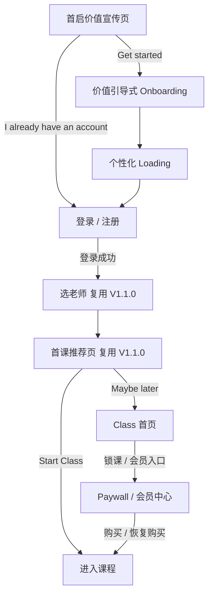
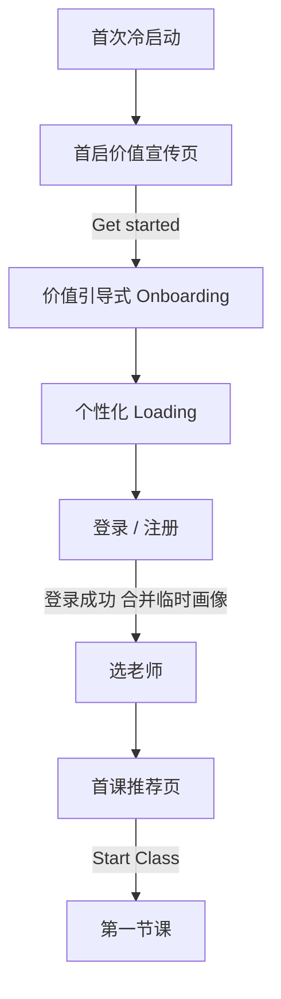
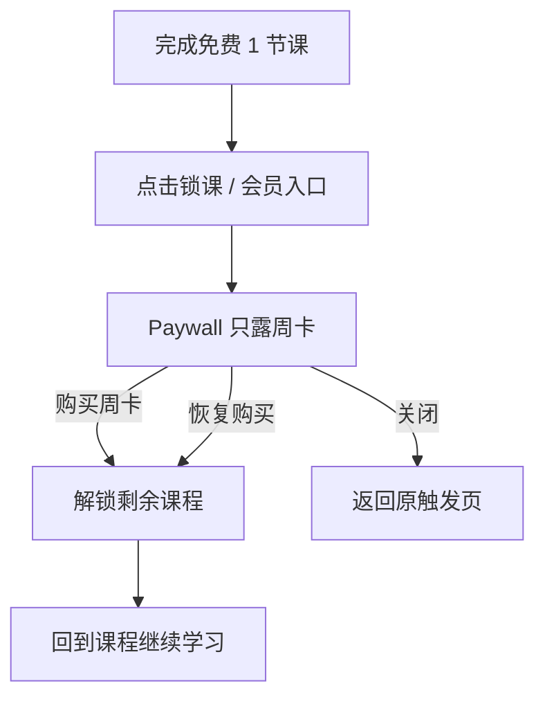

# Dino English — V1.2.0 产品需求文档（PRD）

> **版本**：V1.2.0（Pre-login growth + auth + payment）  
> **状态**：Draft  
> **更新日期**：2026-06-04  
> **交互 Demo（V1.2.0）**：本地同源文件 `V1.2.0-ui-demo.html`  
> **依赖关系**：复用 `V1.1.0` 登录后进课链路（选老师 / 首课推荐页 / Class 首页）；`V1.3.0` 游戏化单独讨论，不在本文范围  
> **配套文档**：《V1.2.0-定价方案分析》《V1.2.0-家庭档市场调研》

---

## 1. 版本范围

| 项 | 说明 |
| --- | --- |
| 版本定位 | 低成本验证版：首发只上 **6 节 AI 交互课**，用最小投入验证「课程体验是否够好」与「是否有真实付费意愿」，**非完整商业化上线**（完整 12 Level × 144 节与规模化变现在后续版本展开） |
| 默认入口 | 竖屏首启价值宣传页 |
| 本期页面 | 首启价值宣传页、价值引导式 Onboarding（含价值页 / Loading）、登录 / 注册页、Paywall、会员中心；登录后复用 `V1.1.0` 的选老师 / 首课推荐页 / Class 首页 |
| 本期目标 | 让首次打开 App 的用户走完 价值宣传 → Onboarding → 登录 → 首课，并理解「为什么值得付费继续学」；在 6 节课的小内容量下低成本验证体验与付费意愿 |
| 核心能力 | 首启价值宣传、登录前价值引导式 Onboarding、登录 / 注册、支付 / Paywall / 会员中心，并接回 `V1.1.0` 首课链路 |

---

## 2. 产品概述

### 2.1 用户与版本价值

| 项 | 内容 |
| --- | --- |
| 目标用户 | ①冷启动新用户（不了解产品价值与教学方式）；②已有学习目标但还没注册的用户；③试过首课、准备继续学的用户。覆盖混龄，不只面向低龄儿童 |
| 版本价值主张 | 把冷启动 → 登录 → 首课 → Paywall 连成一个可测量的验证闭环：用户可直接开始 AI 互动上课、开口被回应，且免费 / 付费权益边界清晰 |
| 本期核心问题 | `V1.1.0` 已收敛登录后进课链路，但仍缺 冷启动说服、登录前画像采集、登录承接、支付闭环 四段；且需在全量内容重投入前先低成本验证体验与付费意愿 |
| 产品方案 | 竖屏段承接登录前转化与画像采集（价值宣传 + 价值引导式 Onboarding + 登录），横屏段复用 `V1.1.0` 进课链路并叠加 支付 / Paywall / 会员中心；商品架构与全量共用，零返工 |

### 2.2 本期成功指标

| 目标 | 指标 |
| --- | --- |
| 指标定位 | 验证版：以**验证信号**为主、规模指标为辅；**营收非核心目标**（6 节课不足以验证留存 / LTV） |
| 冷启动转化 | 首启价值宣传页 `Get started` 点击率 |
| Onboarding 完成 | 登录前 Onboarding 完成率 |
| 登录成功 | Onboarding 完成后登录成功率 |
| 首课转化 | 登录成功 → 首课推荐页 `Start Class` 转化率 |
| 体验信号（重点） | 免费课完播率、复玩率、课程评分 |
| 付费意愿信号（重点） | Paywall 曝光 → 购买率、退款率（维持在可接受范围内） |
| 稳定性 | 登录失败率、支付失败率、页面崩溃率 |

---

## 3. 信息架构

### 3.1 屏幕方向

| 阶段 | 方向 | 页面 |
| --- | --- | --- |
| 登录前转化与采集 | 竖屏 | 首启价值宣传页、价值引导式 Onboarding（含价值页 / Loading）、登录 / 注册页 |
| 登录后进课 | 横屏 | 选老师页、首课推荐页、Class 首页（复用 `V1.1.0`） |
| 商业化承接 | 横屏 | 锁课触点、Paywall、会员中心 |

### 3.2 页面地图

### 3.3 页面职责

| 页面 | 职责 | 本期要求 |
| --- | --- | --- |
| 首启价值宣传页 | 冷启动说服未登录用户 | 强调 AI Teacher / Live lessons / Speak + feedback；提供 `Get started` 与 `I already have an account`；已登录不再展示 |
| 价值引导式 Onboarding | 登录前采集画像并传递价值 | 每题一屏；编排 目的 → 谁来学 → 姓名 → 年龄段 → 年龄价值页 → 水平 → 目标 → 目标价值页 → Loading；答案存本地临时画像（详见 5.2） |
| 登录 / 注册页 | 顺滑建立账号并合并画像 | 主文案绑定用户目标；地区化登录矩阵；成功后合并临时画像并直接接 `V1.1.0` 选老师页 |
| 选老师 / 首课推荐页 / Class 首页 | 登录后进课落点 | 复用 `V1.1.0`，不重新定义 |
| Paywall | 锁课 / 会员触点的付费承接 | 只露周卡一档、权益直接罗列（不做 Free vs Premium 对比）；支持购买 / 恢复购买；返回原触发页 |
| 会员中心 | 展示与管理订阅 | Profile → `Membership`：当前权益、权益清单、升级 / 恢复购买 |

---

## 4. 关键流程与状态

### 4.1 首次冷启动 → 首课

### 4.2 锁课 / 会员触点 → Paywall → 周卡解锁

### 4.3 状态规则

| 场景 | 规则 |
| --- | --- |
| 默认入口 | 未登录默认进入竖屏首启价值宣传页；已登录不再展示 |
| 已有账号 | `I already have an account` 直达登录页，不强制重做 Onboarding |
| 临时画像 | Onboarding 答案先写本地临时画像，登录成功后合并到账号 |
| 登录后落点 | 不进复杂首页，直接接 `V1.1.0` 选老师页 |
| 免费额度 | 免费 1 节完整 AI 交互课（含引导 / 分级）；当前课 / 已学完课可进，未开始的新课锁定 |
| Paywall 触发时机（PAY 口径） | 锁课点击、课程详情权限不足、会员入口；首课推荐页之前**不强插** Paywall，不打断首课启动 |
| Paywall 返回 | 返回原触发页，不丢上下文 |
| 权益边界 | 解锁当前已上线全部课程 + 每月 N 节 fair-use 上限；**不写「无限」**（单节成本 ≈ $0.43） |
| 恢复购买 | 支持恢复购买；购买 / 恢复成功后实时刷新锁课解锁状态 |
| 登出 | 清理 Token 与敏感状态 |

---

## 5. 页面与模块需求

> 🔗 **交互 Demo**：[V1.2.0 UI Demo](https://cyanlee888.github.io/cyan/dino-english/V1.2.0-ui-demo.html)

### 5.1 首启价值宣传页（竖屏 · 登录前入口）

| 功能点 | 展示内容 | 交互操作逻辑 | 数据 / 接口 | 优先级 |
| --- | --- | --- | --- | --- |
| 页面整体 | 竖屏全屏；品牌视觉 + 价值主张区（围绕 `AI Teacher` / `Live interactive lessons` / `Speak + feedback` 三点，不堆功能）；底部主次双按钮 `Get started`（主）/ `I already have an account`（次）；文案与视觉同时服务混龄用户，不只对家长说话 | **进入路径**：首次冷启动且未登录 → 默认进本页；**已登录用户直接跳过本页**进登录后落点。`Get started` → 进 5.2 Onboarding；`I already have an account` → 直达 5.3 登录页（不强制重做 Onboarding） | 拉取：远程配置文案 / 图片资源（带本地兜底默认文案，保证空态/异常可显示） | P0 |
| 加载 / 异常态 | 资源加载中显示骨架或品牌占位；远程文案拉取失败时回退本地默认文案，仍可点两个 CTA | 资源拉取超时 / 失败不阻断按钮可用；按钮防重复点击（点击后置灰至跳转完成） | 记录配置拉取失败（可并入通用错误日志，不单列事件） | P1 |
| 登录态判定 | —（无 UI） | 启动时读取本地登录态：有有效 Token → 不展示本页直接进登录后落点；无 → 展示本页 | 接口：本地 Token / 会话校验（沿用账号体系） | P0 |

### 5.2 价值引导式 Onboarding（竖屏 · 登录前画像采集）

| 功能点 | 展示内容 | 交互操作逻辑 | 数据 / 接口 | 优先级 |
| --- | --- | --- | --- | --- |
| 框架 / 编排 | 顶部进度（步骤 n/N）+ 返回箭头；每屏一题或一张价值页；统一「继续」主按钮。**默认编排**：目的说明 → 谁来学 → 姓名 → 年龄段 → 年龄价值页 → 当前水平 → 学习目标 → 目标价值页 → 个性化 Loading；核心提问克制在 3–5 屏（谁来学 / 姓名 / 年龄段 / 水平 / 目标） | 进入：由 5.1 `Get started` 触发。前进：答完 → 写临时画像 → 下一屏；后退：保留已填答案；中途退出再进 → 凭本地暂存断点续答（按暂存策略） | 临时画像本地持久化（退出不丢） | P0 |
| 目的说明屏 | 一句话引导（如「几个问题后，即可从第一节课开口」，**体验向、不过度承诺按画像定制内容**；口吻中性，尚未分叉） | 仅「继续」；无输入 | — | P0 |
| 谁来学（身份选择） | 轻量单选「Who's learning?」：**For my child（给孩子学，默认主路径、预选）** / **For myself（我自己学）** + 一句辅助说明。并入流程的一题，非独立沉重身份页，**不挡在任何价值页之前** | 默认预选 For my child，可改选 → 「继续」。该选择**驱动后续姓名 / 年龄 / 水平 / 目标的问法及价值页 / Loading 口吻分叉（家长 vs 本人）** | 写临时画像 `learner`(child/self，默认 child) | P0 |
| 姓名输入 | 问法随身份分叉：For my child →「What's your child's name?」（占位 Your child's name）；For myself →「What should we call you?」（占位 Your name）。文本框，必填一个昵称；输入框下方**提供默认姓名建议（1 个男孩名 Ethan + 1 个女孩名 Emma）可点选快速填入**，与现有老师名（Kim / Max / Leo）不重复 | 点选默认姓名建议 chip → 即填入输入框（可再自行输入覆盖）；输入合法（非空 / 长度上限）→ 启用「继续」；为空禁用或走默认昵称 | 写临时画像 `name` | P0 |
| 年龄段选择 | 问法随身份分叉：For my child →「How old is your child?」；For myself →「How old are you?」。混龄分段单选（如 学龄前 / 小学 / 青少年 / 成人）。**年龄保留采集，用于后续分级 / 分析（本版不按年龄定制内容、不分 level）；口吻由身份决定** | 单选高亮 → 「继续」；未选禁用 | 写临时画像 `age_band` | P0 |
| 年龄价值页 | **改为体验向价值页**（如「Speak from your very first lesson」「真实对话 + 即时反馈 + 每节课学习报告」），**不再承诺按年龄定制课程 / 分级内容**；可保留年龄轻量标识，但不把「年龄定制内容」作为卖点；**口吻随身份分叉**（child → 「your child」、self → 「you」） | 仅「继续」；可后退修改 | — | P0 |
| 当前水平选择 | 问法随身份分叉：For my child →「What's your child's current level?」；For myself →「What's your current level?」。**中性表述**单选（如 零基础 / 入门 / 进阶），**覆盖少儿与自学场景** | 单选 → 「继续」 | 写临时画像 `level` | P0 |
| 学习目标选择 | 问法随身份分叉：For my child →「What's your child's main goal right now?」；For myself →「What's your main goal right now?」。**中性表述**（单选或多选按产品定，如 日常对话 / 应试 / 兴趣 / 出国），**覆盖少儿与自学场景** | 选择 → 「继续」；多选至少选 1 项 | 写临时画像 `goal` | P0 |
| 目标价值页 | 结合所选目标说明「我们会怎样帮你达成」，强化继续动机；**口吻随身份分叉** | 仅「继续」 | — | P0 |
| 个性化 Loading | 用临时画像 `name` / `age_band` / `goal` 动态文案，呈现「正在为你 / 为孩子准备第一节课」进度动效；**口吻随身份分叉** | 固定时长或等预备任务完成后自动跳 5.3 登录页；不可手动跳过（或允许继续，按产品定） | — | P0 |
| 已有账号快捷 | 各步可见轻量入口「已有账号？登录」 | 点击 → 直达 5.3 登录页，不强制做完全部题；已填答案保留在本地临时画像 | — | P1 |

### 5.3 登录 / 注册（竖屏 · 账号承接）

| 功能点 | 展示内容 | 交互操作逻辑 | 数据 / 接口 | 优先级 |
| --- | --- | --- | --- | --- |
| 页面整体 | 主文案绑定用户目标（如「保存你的学习计划并开始第一节课」，可读取临时画像 `goal` 个性化）；地区化登录方式矩阵；隐私政策 / 服务条款入口 | 进入：5.2 Loading 结束或 5.1/5.2 的「已有账号」入口；返回：可回上一步 | 拉取：按地区返回可用登录方式列表（配置化） | P0 |
| 地区化登录矩阵 | 按地区呈现 Apple / Google / 手机号 OTP / Kakao 等（**矩阵需配置化**，不同地区展示不同集合与排序） | 点击某方式 → 拉起对应授权 / OTP 流程；展示顺序与可用项由远程配置驱动 | 接口：地区→登录方式矩阵配置；各三方登录 / OTP 接口 | P0 |
| 手机号 OTP | 手机号输入 + 区号选择；获取验证码按钮（含倒计时）；验证码输入 | 发送验证码（频控 / 倒计时禁用重发）；校验通过 → 登录成功；错误 / 超时有提示并可重试 | 接口：发送 OTP / 校验 OTP | P0 |
| 登录成功 / 画像合并 | 成功后短暂过渡，不展示复杂首页 | 写入 Token；将本地临时画像合并到账号画像（字段级合并策略：账号已有值的处理规则需后端约定）；合并完成 → **直接进入 5.4 选老师页** | 接口：登录 / 注册、画像合并（提交临时画像） | P0 |
| 失败 / 异常态 | 统一错误提示（凭据错误、网络异常、三方取消、OTP 失效、频控等区分文案） | 失败保留在登录页可重试；三方授权取消视为非错误静默返回；无网络给重试入口；按钮防重复点击 | — | P0 |
| 登出（关联） | —（入口在 Profile，非本页） | 登出清理 Token 与敏感状态；不清除本地非敏感缓存策略由产品定 | 接口：登出 / 清理会话 | P1 |

### 5.4 登录后桥接 V1.1.0（横屏 · 复用，不重构）

| 功能点 | 展示内容 | 交互操作逻辑 | 数据 / 接口 | 优先级 |
| --- | --- | --- | --- | --- |
| 进入选老师页 | 复用 `V1.1.0` 选老师页（横屏） | 登录 + 画像合并成功后默认落到此页；首次进入可结合画像做老师推荐排序（若 `V1.1.0` 已支持则透传画像，不新增页面） | 透传账号画像给推荐逻辑 | P0 |
| 首课推荐页衔接 | 复用 `V1.1.0` 首课推荐页 | 选老师后进入；`Start Class` → 进入第一节（免费）课；`Maybe later` → 进入 Class 首页。**本页之前不强插 Paywall** | — | P0 |
| Class 首页衔接 | 复用 `V1.1.0` Class 首页 | 作为 `Maybe later` 与课后回流落点；锁课卡片 / 会员入口在此承接 Paywall（见 5.5） | 课程解锁状态需可被支付结果实时刷新（见 5.5 联动） | P0 |

### 5.5 支付 / Paywall（横屏 · 商业化承接）

| 功能点 | 展示内容 | 交互操作逻辑 | 数据 / 接口 | 优先级 |
| --- | --- | --- | --- | --- |
| Paywall 主体 | **只露周卡一档**（hero，默认选中、无切换）；**明确「每周 $X 自动续订」「一键取消」**，不用 dark pattern、**无试用期**，并强调内容将持续更新（支撑 Apple 3.1.2(a)「持续价值」过审）。**标题与权益均混龄通用、不分对象**（如标题「Unlock everything in Dino English」，**去掉「your child / 你的小孩」措辞、不对家长单独喊话**）。权益**卖结果地直接罗列**（**去掉 Free vs Premium 对比**）：解锁全部 AI 口语课（当前已上线全部课程）、全部词汇练习（Practice）、全部英文电台 / FM（Radio）、**每节课学习报告**、一个订阅·随时取消；**不出现「无限 / unlimited / without limits」**（支付页不再展示地区档位与 fair-use 角注） | 触发点（PAY 口径）：锁课点击 / 课程详情权限不足 / 会员入口；**首课推荐页之前不强插**。进入时记录 `trigger_source`(lock_lesson / detail_permission / membership_entry) 以便返回原触发页；维持横屏 | 拉取：当前地区商品（价格 / 周期 / 商品 ID，配置化 + 商店价对齐）、当前解锁状态 | P0 |
| 商品选择 / 购买 | 支付页**只露周卡一档**（无切换档位）；**购买主按钮文案为「Subscribe now」（不带价格）**；**整屏金额只出现一次**（保留在价格卡片，按钮下方条款行仅留「自动续订 · 一键取消」披露、不重复金额，合规披露仍在） | 点击购买 → 拉起商店支付；支付中按钮置 loading 防重复点击；成功 → 关闭 Paywall 并**实时刷新解锁状态** → 返回原触发页且上下文不丢 | 接口：商店内购下单 / 校验回执（订阅组 周 / 月 / 年 商品 ID 后端均建好，本版仅下单周卡）；服务端校验后下发权益 | P0 |
| 恢复购买 | 「恢复购买」入口 | 点击 → 查询商店历史订阅 → 校验有效 → 刷新解锁状态；无可恢复项给明确提示 | 接口：恢复购买 / 回执校验 | P0 |
| 解锁状态联动 | —（跨页效果） | 购买 / 恢复成功后，**前后端联动**刷新锁课卡片与课程详情权限：原锁课点变为可进入；返回触发页即时生效，无需重启 | 接口：解锁 / 权益状态查询（购买成功后主动刷新本地缓存 + 拉服务端最新态） | P0 |
| 异常 / 边界 | 加载失败 / 无网络 / 商店不可用 / 支付取消 / 校验失败 各有区分提示 | 支付取消视为非错误静默返回触发页；校验失败不发放权益并提示重试 / 联系支持；防重复下单；价格拉取失败时不展示错误价（兜底隐藏购买或重试） | — | P0 |
| 返回 / 关闭 | 关闭按钮 | 关闭 → 返回 `trigger_source` 指向的原触发页，保留其上下文 | — | P0 |

### 5.6 权益边界 / 会员中心（横屏）

| 功能点 | 展示内容 | 交互操作逻辑 | 数据 / 接口 | 优先级 |
| --- | --- | --- | --- | --- |
| 免费额度边界 | 免费用户：可上**免费 1 节**完整 AI 交互课（含引导 / 分级）+ 可见部分基础入口；当前课 / 已学完课可进，未开始的新课显示**锁定态**（锁标 / 蒙层）；**Practice 与 Radio 加锁**，仅保留极少量免费样例作钩子 | 点击锁定课 / Practice / Radio / 权限不足详情 → 拉起 5.5 Paywall（带 `trigger_source`） | 接口：课程解锁 / 权益状态 | P0 |
| 锁课展示规则 | 锁课卡片**只展示锁态（🔒 Premium）+ 时长**，不再显示「未开始 / Not started」标签；已解锁卡片正常显示**当前 / 进行中 / 已完成**状态 | 锁课卡片点击 → 拉起 5.5 Paywall；已解锁卡片点击 → 进入对应课程 | 接口：课程解锁 / 进度状态 | P0 |
| 订阅用户权益 | 订阅用户：解锁已上线全部课程 + fair-use 上限内连续学习、**Full Practice & Radio access**、**学习报告**；达 fair-use 上限时给明确说明（非「无限」话术） | 达上限 → 友好提示与下一可用时间 / 升级建议；不静默失败 | 接口：fair-use 计数 / 上限校验 | P1 |
| 会员中心入口 | Profile → `Membership` 入口 | 点击进入会员中心页 | — | P0 |
| 会员中心页 | 当前订阅状态（档位 / 周期 / 下次续费日 / 价格）、权益清单（直接罗列、与 5.5 一致：解锁全部 AI 口语课 + 每月 fair-use 角注、全部词汇练习 Practice、全部英文电台 / FM Radio、每节课学习报告、一个订阅·随时取消）、升级 / 续订入口、恢复购买入口；免费用户展示升级引导 | 升级 / 订阅 → 拉起 5.5 Paywall（`trigger_source=membership_entry`）；恢复购买 → 走 5.5 恢复流程；展示态随支付结果刷新 | 接口：订阅状态查询、恢复购买 | P0 |
| 空 / 异常态 | 未订阅时展示「当前为免费」状态与升级位；状态拉取失败给重试 | 状态拉取失败不展示错误权益，给重试入口 | — | P1 |

---

## 6. 会员与定价方案

**核心原则：商品架构零返工** —— MVP 与全量共用同一套 订阅组 / 商品 ID / 权益逻辑 / 支付链路，全量上线只切换主推商品与内容门槛。

### 6.1 MVP 当前确定方案（首发只上 6 节课的验证期）

- **目的**：验证体验是否够好、是否有真实付费意愿；6 节课**无法验证留存 / LTV**（内容太少），留存待全量上线再测。
- **入口漏斗**：免费 **1 节**完整 AI 交互课（含引导 / 分级）→ Paywall **只露自动续订周卡**解锁剩余课程 → **无试用期**（直接付费，WTP 信号最干净）。
- **商品架构（零返工关键）**：建一个**订阅组**含 **周 / 月 / 年**三档；MVP 支付页**只露周卡**，月 / 年卡同组、后端建好但不露出。全量上线只放开月 / 年卡露出与主推、放开内容门槛，**商品 ID / 权益逻辑 / 支付链路不变**。
- **权益口径**：①解锁**当前已上线全部 AI 交互课** + 每月 N 节 fair-use 上限（现 = 6 节、以后 = 144 节，逻辑不变）；②**Full Practice & Radio access**（免费用户加锁、仅留极少量免费样例作钩子，订阅用户全解锁）；③**每节课学习报告**。全程**不写「无限 / unlimited / without limits」**（单节成本 ≈ $0.43）。
- **MVP 周卡分层价**（保持「周 > 月 > 年化、年卡最划算」，周卡 ≥ 月卡年化 ÷ 52）：

| 档 | 代表市场 | 周卡 | 月卡 | 年卡 |
| --- | --- | --- | --- | --- |
| T0 | 沙特、韩国 | ~$9.99/周 | $39.99 | $249.99 |
| T1 | 欧美发达 | ~$8.99/周 | $37.99 | $229.99 |
| T2 | 中等市场 | ~$8.49/周 | $35.99 | $219.99 |
| T3 | 越南 / 印尼 / 土耳其 / 泰国 | ~$7.99/周 | $33.99 | $199.99 |
| T4 | 价格敏感市场 | ~$7.49/周 | $31.99 | $179.99 |

- **周卡自动续订风险与应对**：

| 风险 | 应对 |
| --- | --- |
| 退款 / 拒付高、商店审查严 | Paywall 清晰展示「每周 $X 自动续订」、不用 dark pattern、一键取消、续订前提醒 |
| Apple 3.1.2(a)「持续价值」过审风险（周订阅 + 仅 6 节固定内容） | 清晰披露自动续订与一键取消、强调内容将持续更新，并以更丰富权益（含 Full Practice & Radio access、学习报告）支撑「持续价值」论证 |
| 6 节课 1–2 周刷完即取消 | 属预期；MVP 看**首次解锁率**而非续费率 |
| 一周内被刷爆 | 用 fair-use 课次上限兜底 |
| 周卡 WTP ≠ 订阅 WTP | 外推需打折看，不能直接等同长期订阅意愿 |

- **验证看板**：体验（免费课完播率 / 复玩 / 评分）；付费（Paywall → 周卡购买率、退款率、解锁后课程消耗）；价格（真实价为主 + 小流量折扣 A/B 看弹性）。

### 6.2 全量上线后的会员定价方案

全量 = 12 Level × 12 节 = **144 节**交互课。届时切换为以**年卡为主推**的全球 T0–T4 分层定价：

| 档 | 代表市场 | 月卡 | 年卡 | 年付到手(抽30%) | 年付亏损拐点 |
| --- | --- | --- | --- | --- | --- |
| T0 | 沙特、韩国 | $39.99 | $249.99 | ~$175（≈$14.6/月） | ~34 节/月 |
| T1 | 欧美发达 | $37.99 | $229.99 | ~$161（≈$13.4/月） | ~31 节/月 |
| T2 | 中等市场 | $35.99 | $219.99 | ~$154（≈$12.8/月） | ~30 节/月 |
| T3 | 越南 / 印尼 / 土 / 泰 | $33.99 | $199.99 | ~$140（≈$11.7/月） | ~27 节/月 |
| T4 | 价格敏感市场 | $31.99 | $179.99 | ~$126（≈$10.5/月） | ~24 节/月 |

- **切换动作（支付几乎不动）**：① 同一订阅组主推从周卡切到**年卡**、弱化周卡；② 内容门槛从 6 节放开到 144 节；③ 新用户走完整分层正价，周卡老用户引导升年卡。
- 单节成本 ≈ $0.43、144 节内容封顶给「无限」兜底但回看仍有成本，故各档保留课次上限 / fair-use（越低档缓冲越薄）。

---

## 7. 其他

### 7.1 Technology / Operational Notes

- 登录前画像本地暂存（避免中断丢失），登录成功后与账号画像做字段级合并。
- 登录方式、支付商品、文案、地区登录矩阵均需配置化。
- Paywall 与解锁状态刷新需前后端联动（购买 / 恢复成功后实时刷新锁课状态）。
- 埋点沿用 `V1.1.0`「少事件多参数」模型；事件名与属性开发前与数据团队对齐。

### 7.2 Assumptions

1. 用户愿意在登录前完成较短的价值引导式 Onboarding，前提是每一步都能看懂为什么。
2. 登录后的最佳下一步仍是「先选老师，再开始第一节课」。
3. 首课之前不打断支付，能提高首课转化。
4. 付费转化主要发生在用户理解课程价值之后，而非首启阶段。
5. `V1.1.0` 登录后链路可直接复用，无需在 `V1.2.0` 重新设计。

### 7.3 Release

| 项 | 内容 |
| --- | --- |
| 包含 | 首启价值宣传页；登录前价值引导式 Onboarding；登录 / 注册；登录后桥接 `V1.1.0`（选老师 / 首课推荐 / Class 首页）；支付 / Paywall / 会员中心 |
| 不包含 | `V1.3.0` 游戏化；教室内部新玩法 / 新课件机制；Listen / Words 独立商业化改版；对 `V1.1.0` 登录后进课页面做大幅重构 |
| 实施建议 | 分三段推进：①前置转化段（价值宣传 + Onboarding）；②账号承接段（登录 / 注册 + 临时画像合并）；③商业化段（Paywall + 订阅 + 恢复购买） |

**验收标准**：

1. 新用户首启时能看到清晰的价值宣传页，并可进入 Onboarding 或直接登录。
2. 登录前 Onboarding 能完成画像采集，并用 Loading 承接到登录。
3. 登录成功后直接进入 `V1.1.0` 选老师页，而非无关页面。
4. 首课推荐页与 Class 首页沿用 `V1.1.0` 链路，不被 `V1.2.0` 重新打散。
5. 锁课或会员触点可稳定拉起 Paywall，并支持购买与恢复购买。
6. 全链路关键页面与按钮埋点齐全，可回看从首启到支付的漏斗。

### 7.4 配套文档

- 交互 Demo：`V1.2.0-ui-demo.html`
- [《V1.2.0-定价方案分析》](https://qjphu5vphyf4.jp.larksuite.com/docx/TXhRdDx0foLUpMxOxx5jZlyxpFc)：价值锚定 / 竞品对比 / 成本核验与定价决策
- [《V1.2.0-家庭档市场调研》](https://qjphu5vphyf4.jp.larksuite.com/docx/O2LcdQiqRo2fBIxvLS3jhKpdp5f)：家庭档需求与市场背景
