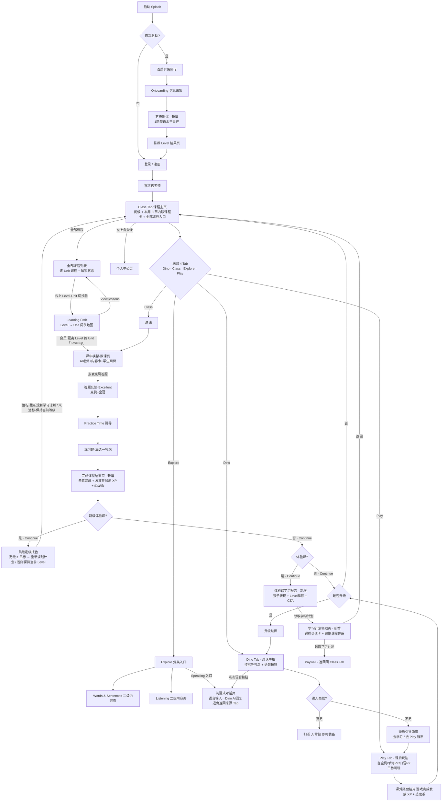

# Dino English — V1.3.0 产品需求文档（PRD）

> **版本**：V1.3.0（游戏化激励体系 + 功能性迭代版）  
> **创建日期**：2026-06-08  
> **依赖关系**：在 V1.2.0 已上线商业化闭环与主流程之上叠加；主流程（启动 / 首启 / Onboarding / 登录注册 / 选老师 / 进课）沿用 V1.2.0 不变  
> **飞书云文档**：[Dino English V1.3.0版本产品需求文档](https://qjphu5vphyf4.jp.larksuite.com/wiki/Axjzw82cRiHbQTkYvhmjazmkpXf)  
> **交互 Demo**：[V1.3.0 UI Demo](https://cyanlee888.github.io/cyan/dino-english/V1.3.0-ui-demo.html)（本地同源文件 `V1.3.0-ui-demo.html`）

---

## 前言

V1.3.0 在 V1.2.0 商业化闭环之上推进两条主线：

- **游戏化激励体系**：Dino 成长（XP / 等级）、恐龙币经济、商城 / 背包、课后 Play 游戏（盲盒机 / 单词 PK / 口语 PK）与课中学习奖励，配套会员升级引导。
- **功能性迭代**：定级测试（嵌入 Onboarding Step4，1 道英语水平自评单题 → 推荐 CEFR 档位）；体验课学习报告（竖屏，老师点评 + 定级 + 学习情况 + 课堂所学 + 发音分析 + 家长 CTA）；Dino Tab 对话重设计（打招呼气泡 + 大语音按钮 + 沉浸式对话页）；Explore 新架构（Words & Sentences / Listening / Speaking 分类入口 + 二级内容页）；每周解锁 & 学习计划（每周一一次性解锁本周 3 节 · 不按周几排课 + Learning Path 页）；Paywall 商品调整为月付 + 年付两档（年付默认选中）。

应用导航升级为底部 4 Tab（Dino / Class / Explore / Play，默认 Class）+ 左上角头像进入个人中心；进课后按设计稿模拟课中教学全流程；全应用界面文案为英文；主流程与免费 / 付费权益边界沿用 V1.2.0。

---

## 一、版本信息

| 项 | 内容 |
| --- | --- |
| 版本号 | V1.3.0 |
| 创建日期 | 2026-06-08 |
| 审核人 | — |

---

## 二、变更日志

| 时间 | 版本号 | 变更人 | 主要变更内容 |
| --- | --- | --- | --- |
| 2026-06-08 | V1.3.0 | 李双 | 新建需求文档 |
| 2026-06-15 | V1.3.0 | 李双 | 定级测试由 4 题听说读写自评改为 1 道英语水平自评单题（6 档递进 + 「I'm not sure」共 7 项，选项直接映射 CEFR）；体验课学习报告改为横屏展示（与完成课程结果页 → 报告 → 学习计划领取页方向一致）；Class 首页周计划标题凸显「This week's plan / 本周学习计划」；明确盲盒机本轮未得抽盒券时结果页不展示新宠物；Demo 状态机新增「体验课报告」快捷跳转 |
| 2026-06-15 | V1.3.0 | 李双 | 盲盒抽取改为概率玩法（新宠物 / 已有宠物 / 未抽中三结果，重复与未抽中以儿童化浮层提示、均不发不扣恐龙币，移除原「重复折返 50 恐龙币」）；Dino 升级仅展示新等级称号、不再发放升级奖励；背包皮肤 / 宠物两 Tab 换位（皮肤前置并默认选中，与商城一致）；口语 PK 每句先自动播放示范音频再跟读；全部课程页移除「All lessons in this unit」副标题；精简前部「名词解释 / 版本范围 / 状态规则」表达；新增埋点 `capsule_draw_result.draw_outcome`；Demo 状态机新增「Dino 升级」「盲盒抽取」快捷跳转 |
| 2026-06-15 | V1.3.0 | 李双 | 体验课学习报告由横屏改回竖屏，内容按 CT 体验课报告样式重做（庆祝 hero + 老师点评与定级 / 学习情况 / 课堂所学 / 发音分析卡片流 + 底部 sticky CTA），与横屏「跳级定级报告」拆分（后者仍承接横屏闯关地图）；学习计划领取页由横屏改为竖屏；Onboarding 首启价值页 / 信息采集问题 / 价值宣传页 / 登录页文案与 V1.2.0 对齐（定级测试单题除外）；去掉 Dino 首页右上角支付 / 会员入口；Explore 移除 Reading 占位入口（本期不上） |
| 2026-06-15 | V1.3.0 | 李双 | Play 出题规则改为「当前 Level 及以下、未答过优先、答过随机回灌」（替代原 70/30 已学新词配比）；Dino 对话本期不设轮次 / 每日上限（上线后按成本评估）；**宠物改为纯盲盒收集**——取消宠物商城兑换与装备、抽到重复宠物收集数 +1（背包按 ×N 展示）、商城仅售皮肤（付费 SKU = 10 皮肤），抽盒概率维持 新 55% / 已有 25% / 未中 20%；恐龙币新增「当日多内容递减」（W&S / Listening / 游戏按类别当日 100/80/60/40 递减、主课不递减、XP 不变）+ 全局每日 600 恐龙币上限 |

---

## 三、文档说明

### 名词解释

| 术语 / 缩略词 | 说明 |
| --- | --- |
| 游戏化机制 | 成长 / 经济 / 玩法 / 竞争 / 奖励等底层机制 |
| XP（经验值） | Dino 等级进度统计 |
| 恐龙币（Dino Coins） | 应用内统一货币，学习 / 游戏获取、商城消耗；纯外观（非 pay-to-win）|
| 成长体系 | Dino 形象 + 等级 + 称号 + 皮肤 / 场景的外显成长 |
| 商城 | 用恐龙币兑换 Dino Skins（皮肤）的页面；购买扣币入背包并自动穿戴，实时同步全应用 Dino 形象 |
| 背包 | 已获得物品入口：皮肤可穿戴、宠物为收集展示（已获得按 ×N 计数）|
| 奖励结算 | 课程 / 游戏完成后发放并展示 XP 与恐龙币；分课中（并入完成课程结果页）与课外（W&S / Listening / Play）|
| 盲盒机 | 课后 Play 游戏：每轮 5 题，终身累计答对每满 5 题得 1 枚盲盒币、当轮按概率抽宠物 |
| 盲盒币 | 盲盒机抽取凭证：累计答对每满 5 题得 1 枚（每轮至多 1 枚），当轮必抽、不留存 |
| 单词 PK / 口语 PK | 课后单机模拟对战（无真实对手）：匹配 AI 对手后按预设胜率判定胜负；均可玩、无每题倒计时、各展示累计胜率 |
| 对战胜率（Win rate） | 单词 / 口语 PK 累计胜率（wins / played），展示于 Play 入口与对战结果页 |
| 定级测试（Placement Test） | Onboarding 第 4 步：1 道家长代答自评单题（6 档水平描述 + I'm not sure），直接映射 CEFR 起始档（Pre-A1 ~ B1，不计分）写入 `level` |
| 体验课学习报告 | 完成免费体验课后的家长向报告，含 Level 推荐，底部 CTA 进学习计划领取页 |
| 对话功能（Dino Dialogue） | Dino 实时语音对话；入口为 Dino Tab 语音按钮与 Explore › Speaking，进同一沉浸式对话页 |
| Explore Tab | 原 Practice 改名；分类入口 + 二级页，顶层 Words & Sentences / Listening / Speaking 三入口 |
| Learning Path | 课程地图：自全部课程页「Level · Unit」切换器进入的 Level → Unit 两级地图（6 Level × 12 Unit × 12 Lesson）|
| 每周解锁（Weekly Unlock） | 付费后每周一一次性解锁本周 3 节、不按周几排课；1 Unit = 12 节 = 4 周；首节体验课不受此限 |
| 学习计划（Study Plan） | 本周 3 节以横向滑动课程卡内联 Class 首页（问候 +「📅 This week's plan」+ 当前课居中 + 课序 Unit X · Lesson Y）|
| 完成课程结果页 | 课中完成后结果页：恭喜 + 发放 / 展示本节 XP / 恐龙币（含升级动画）；Continue 后体验课 → 报告、正式课 → Class |
| 学习计划领取页 | 体验课报告 CTA 进入的竖屏价值页：定级 + 成长终点 + 三价值卡 + 完整课程体系；主按钮 → Paywall（trigger_source=trial_report）|
| 按年付费（Annual Subscription） | 新增年订阅 SKU，走 V1.2.0 支付链路；Paywall 露月付 / 年付两档，年付默认选中并标折扣 |

---

## 四、需求背景

### 产品愿景与定位

**愿景**：让孩子每天愿意主动开口，与 AI 老师在沉浸式教学故事里把英语说出来。

**定位**：对于 6-13 岁、缺少英语交流环境的儿童家庭，Dino English 是一个 AI 英语开口陪练产品，帮助孩子在互动中敢说、常说、说对。不同于传统录播课和真人外教课，以 AI 老师贯穿叙事与教学，游戏化机制为玩法和驱动承载，让孩子低压力、高频次地练习表达。

---

## 五、需求范围

> 本节在飞书云文档中以白板（Board）视图展示，详见云文档：[V1.3.0 PRD](https://qjphu5vphyf4.jp.larksuite.com/wiki/Axjzw82cRiHbQTkYvhmjazmkpXf)

---

## 六、版本内容详细说明

### 产品目标

**本次迭代版本目标 P0**：在 V1.2.0 已打通「冷启动 → 登录 → 首课 → 付费」闭环的基础上，为 Dino English 加入游戏化激励体系，把「学完一节课」变成「想继续玩、想收集、想变强」的长期循环。

- **对产品**：用 XP / 等级成长、恐龙币经济、课中教学模拟与课后 Play 游戏复玩，提升次日 / 周留存与单次使用时长。
- **对业务**：通过会员升级引导（奖励对比等触点）提升付费转化；恐龙币不足不引导付费（改为引导赚币）。
- **对用户（孩子）**：想玩、想赢、想收集——课后玩法 + 装扮收集 + 等级外显。

### 版本范围

| 项 | 说明 |
| --- | --- |
| 版本定位 | 游戏化激励首发版：在 V1.2.0 商业化闭环之上叠加成长 / 经济 / 课后玩法，验证游戏化对留存与付费的拉动；主流程沿用 V1.2.0，导航升级为底部 4 Tab（Profile 改左上角头像入口）+ 课中教学模拟 + 课后 Play 游戏 |
| 基线依赖 | V1.2.0 已上线（首启价值宣传、Onboarding、登录、Paywall、会员中心、Class / Practice / Radio）；V1.1.0 进课链路 |
| 默认入口 | 冷启动 → 首启 → Onboarding → 定级测试（新增）→ 登录 / 注册 → 首次选老师 → 进课（课中教学模拟）；首节体验课后展示体验课学习报告（新增）；入应用为底部 4 Tab + 左上角头像入口，默认 Class Tab |
| 本期页面 | 新增流程页：定级测试（竖屏）、课中教学模拟（横屏：教课 / 答题反馈 / Practice Time / 练习题）、完成课程结果页（横屏）、体验课学习报告（竖屏）、学习计划领取页（竖屏）；底部 4 Tab（Dino / Class / Explore / Play）+ 商城 / 背包 / Learning Path / 个人中心（左上角头像入口）等承接页；界面文案全英文。各页详见「页面职责」与「页面与模块需求」 |
| 本期目标 | 见上「产品目标」 |
| 核心能力 | 游戏化：4 Tab 导航 + Dino 成长（XP / 等级 / 升级动画）+ 恐龙币经济 + 商城 / 背包 + 课后 Play 三游戏（盲盒机 / 单词 PK / 口语 PK，按 Level 出题）+ 课中 / 课外奖励结算 + 会员升级引导（恐龙币不足仅引导赚币）。进课体验：课中教学模拟。功能迭代：定级测试、体验课学习报告、Dino 对话重设计、Explore 三入口、学习计划 & 每周解锁。定价：Paywall 月付 + 年付（年付默认选中）|
| 不包含 | 课中教学内核重构（本期仅前端流程模拟，无真实 AI 教学引擎 / 实时语音评测）；Dino 对话不接入课程内容、不设对话轮次 / 每日上限（上线后按成本评估）；定级测试仅推荐 Level、不影响课程权益；不改动 V1.2.0 主流程与免费 / 付费权益边界。已移入需求池、本期不展开：连胜打卡 / 周排行榜 / 成就徽章、恐龙币单独购买、课后错题、背包道具 Tab、Explore Reading、头像框 |
| 验收标准 | 逐页验收口径见「页面与模块需求」；核心结果： • 主流程沿用 V1.2.0 正常 • 课中教学模拟跑通 → 完成课程结果页发奖（达阈值播升级动画）→ 首节体验课进体验课报告 → 学习计划领取页 → Paywall（trigger_source=trial_report），返回均回 Class • 底部 4 Tab 切换正常、默认 Class；左上角头像入口进个人中心独立页（隐藏底部导航、可返回） • Explore 三入口（Words & Sentences / Listening 进二级页、Speaking 直达对话页），免费每分类首个可试用、其余 🔒 Premium • Dino 沉浸式对话语音输入 → AI 回复文字 + TTS 播放可用 • Play 三游戏均可玩、答题页不展示恐龙币余额、按 Level 出题；PK 展示累计胜率并进合并对战结果页；盲盒机累计答对满 5 题得币、当轮按概率抽宠物 • 课中 / 课外奖励按分级正确发放并展示、等级实时刷新、升级播动画 • 商城仅皮肤，购买 / 穿戴闭环完整、恐龙币不足引导赚币（不跳付费页） • 每周解锁与学习计划：Class 首页本周 3 节内联课程卡 + 全部课程页（Level · Unit 切换器）+ Learning Path 地图；Paywall 月付 / 年付两档（年付默认）|

---

### 产品概述

#### 用户与版本价值

| 项 | 内容 |
| --- | --- |
| 目标用户 | 已完成首课、有继续学习意愿的用户；尤其 6–13 岁儿童——想玩、想赢、想收集 |
| 版本价值主张 | 把「学习」包装成「成长 + 收集 + 对战」，用 XP / 等级 / 恐龙币 / 课后玩法把单次学习转化为持续回访 |
| 本期核心问题 | V1.2.0 已验证体验与付费意愿，但学习动力仍主要依赖内容本身，缺少长期激励与回访驱动 |
| 产品方案 | 以 Dino 成长为中枢、恐龙币经济为驱动、课中教学模拟 + 课后 Play 游戏为内容承载、会员升级引导为变现；全部建立在 V1.2.0 账号 / 权益 / 支付体系之上 |

#### 本期成功指标

| 目标 | 指标 |
| --- | --- |
| 指标定位 | 留存与活跃为主、付费为辅 |
| 留存 | 次日留存、7 日留存、周活跃 WAU |
| 活跃 / 参与 | 人均 XP 获取、课中教学模拟完成率、课中练习答对率、单次使用时长 |
| 经济健康 | 恐龙币发放 / 消耗比、商城购买率、背包装备率 |
| 变现 | 由奖励对比 / 体验课报告触发的会员升级转化率 |
| 稳定性 | 结算 / 发放失败率、商城交易失败率、页面崩溃率 |

---

### 信息架构

#### 屏幕方向

| 阶段 | 方向 | 页面 |
| --- | --- | --- |
| 冷启动 / 首启 / 信息采集 / 定级测试 / 登录注册 | 竖屏 | 复用 V1.2.0：Splash、首启价值宣传、Onboarding 信息采集；**新增**：定级测试（Onboarding 末尾）、登录 / 注册 |
| 课中教学模拟（进课后） | 横屏 | 教课页 / 答题反馈（Excellent）/ Practice Time 引导 / 练习题（三选一气泡） |
| 体验课学习报告 / 学习计划领取页 | 竖屏 | 完成首节体验课后竖屏全屏接管：体验课报告（按 CT 报告样式：老师点评 + 定级 + 学习情况 + 课堂所学 + 发音分析）→ 学习计划领取页（竖屏）→ Paywall（横屏）；会员向上跳级的跳级定级报告仍为横屏（承接横屏闯关地图）|
| 应用主界面（4 Tab + 头像入口） | 横屏 | Dino / Class / Explore / Play（默认 Class）；左上角头像 → 个人中心独立页 |
| 课中 / 玩法 / 结算 | 横屏 | 课中教学模拟、盲盒机 / 单词 PK / 口语 PK、课中 / 课外奖励结算 |
| 变现承接 | 横屏 | 会员升级引导、复用 V1.2.0 Paywall |

#### 页面职责

| 页面 | 职责 | 本期要求 |
| --- | --- | --- |
| 定级测试（竖屏 · Onboarding Step 4） | 评估初始英语水平 | 替代原「英语水平」自选题，以信息采集题形式融入 Onboarding（Step 4 of 5、单一进度条）；1 道家长代答自评单题（option-list 整行卡片）+ 6 档水平描述 +「I'm not sure」，每项直接映射 CEFR 起始档（不计分）；选中即进结果页展示推荐档位、继续进 Step5，结果写入 `level`（选项与映射见「页面与模块需求」）|
| 完成课程结果页（横屏 · 课后新增） | 课程完成 + 奖励发放 | 课中教学完成后展示：恭喜 + 发放并展示本节 XP / 恐龙币（含升级动画）；Continue——首节体验课 → 体验课报告，正式课 → 返回 Class |
| 体验课学习报告（竖屏） | 体验课结果 + Level 推荐 + 家长 CTA | 完成首节体验课后竖屏全屏接管（庆祝 hero + 卡片流 + 底部 sticky CTA，按 CT 报告样式）：老师点评 + 定级 / 学习情况（时长 · 答题 · 开口）/ 课堂所学 / 发音分析；name 与推荐 Level 动态填充；CTA「领取学习计划」→ 学习计划领取页 |
| 学习计划领取页（竖屏 · 体验课报告后新增） | 课程价值传达 + 领取入口 | Plan hero（定级 + 一句成长终点条）+「Why it works」三价值卡（按当前 Level 计数）+ 完整课程体系（6 Level 阶梯 + 当前 Level 的 Unit 主题）；主按钮底部悬浮 → Paywall（trigger_source=trial_report）；返回 → Class |
| Class Tab（横屏 · 默认） | 学习主入口（含每周解锁） | 顶部个性化问候 +「📅 This week's plan」+ 老师卡（可换）+ 本周 3 节内联横向滑动课程卡（当前课居中、课序 Unit X · Lesson Y、按会员状态走 Start / Continue / Unlock）+ 右上「All courses」（先进当前 Unit 课程列表，Level · Unit 切换器进 Learning Path）；默认停留此 Tab |
| 课中教学模拟（横屏 · 进课后） | 课中教学全流程模拟 | 复用横屏课堂框架；教课页 → 答题反馈（Excellent + 皇冠）→ Practice Time → 练习题（三选一气泡）；跑完进完成课程结果页，Continue 后首节体验课 → 报告 / 正式课 → Class；任意页可返回退出。本期为前端流程模拟，不含真实 AI 教学引擎 / 语音评测 |
| Explore Tab（横屏，原 Practice） | 内容探索入口 | 顶层三入口卡：Words & Sentences（原 Practice）/ Listening（原 Radio）/ Speaking（直达 Dino 对话页）；前两者进各自二级页（横向滑动内容卡 + 筛选 chip，W&S 难度 L1–L6 默认 L1、Listening 主题 Goodnight / Morning / Anytime 默认 Goodnight，均不设 All）；免费每分类首个可试用、其余 🔒 Premium |
| Dino Tab（横屏） | AI 对话中枢 + 成长外显 | 主屏：Dino 居中 + 打招呼气泡 + 底部语音按钮；商城 / 背包顶角小图标弱化；等级 + XP 进度条在 Dino 形象下方。沉浸式对话二级页（入口：语音按钮 / Explore › Speaking）：左 Dino 舞台 + 右对话气泡流 + 底部大麦克风 +「Try saying」chip，回复自动 TTS；返回回来源 Tab |
| 商城（Dino Tab 入口） | 恐龙币消耗 + 即时装扮 | 仅 Dino Skins（皮肤）；商品平铺、未获得在前 / 已获得标 Owned 沉底；购买 → 扣币 → 入背包 → 自动穿戴；已拥有未装备可直接「Wear」、已穿戴「Worn ✓」，穿戴实时同步全应用 Dino 形象；余额不足弹窗引导赚币（不跳付费页）|
| 背包（Dino Tab 入口） | 已获得物品集合 | 布局与商城一致：左侧 Dino 大图预览 + 右上恐龙币与「Go to Shop」+ 皮肤 / 宠物两 Tab（默认皮肤）。皮肤 Tab：已获得卡片、未装备「穿戴」/ 已穿戴「Worn ✓」，切换实时同步。宠物 Tab：仅展示已获得宠物（×N 数量角标、无装备按钮、纯展示）；未获得不展示，无宠物时显示空状态提示（引导去 Play 抽盒）|
| 个人中心（横屏 · 左上角头像入口） | 账号与个人中心（复用 V1.2.0）| Profile 不作为底部 Tab：主界面左上角常驻头像入口，点击进入个人中心独立页（隐藏底部导航、可返回，返回回原 Tab）；页内复用 V1.2.0：资料 / 语言 / 会员 / 反馈 / 关于 / 邀请 / 退出 |
| Play Tab（横屏） | 课后玩法聚合 | 盲盒机 / 单词 PK / 口语 PK 三入口均可玩；PK 入口各展示累计胜率（不展示段位），完成后进合并对战结果页（Continue 回 Play）；免费每日限次（各 1 轮 / 局），会员不限 |
| Learning Path（横屏 · 全部课程页 Level · Unit 切换器入口） | Level → Unit 课程地图 + 会员向上跳级 | 自全部课程页右上「Level · Unit」切换器进入；左侧 6 个 Level 卡（能力简介 + 状态 Completed / You are here / Up next / Not started，低于定级起点且未学标 Not started）+ 右侧所选 Level 的 Unit 卡（主题 / 课程数 / 进度 + View lessons）；已完成低 Level 可 Review；会员在更高 Level 首 Unit 可「🚀 Level up」进目标 Level 体验课，其余更高 Level 置灰带锁；返回回全部课程页 |
| 会员升级引导 | 变现承接 | 免费 vs 付费奖励对比引导开通会员（复用 V1.2.0 Paywall / 订阅） |

---

### 关键流程与状态

#### 端到端主流程

#### 状态规则

| 场景 | 规则 |
| --- | --- |
| XP / 等级 | 完成主课 +50 XP、其他课 +30、完成游戏 +20；10 级英文称号（Dino Egg → Dino Legend），阈值见「经济与奖励专题」；升级后下次返回首页播升级动画，**升级仅解锁并展示新等级称号、不额外发放奖励（不发恐龙币 / 道具）** |
| 恐龙币发放 | 主课 120（区间 100–150 运营配置）、Words & Sentences 40、Listening 每听完 1 条 +12（每日上限 5 条）、Pet Capsule 每轮 30（抽中**新宠物**额外 +30；**抽到已有宠物（收集数 +1）/ 未抽中均不发不扣**）、单词 / 口语 PK 胜 50 / 平 · 负 20；经课中 / 课外奖励结算发放并写后台流水（完整分级见「XP 与恐龙币发放总表」） |
| 恐龙币消耗 | 仅在商城（**仅皮肤**）；购买前校验余额，不足弹窗提示并引导去学习 / Play 赚币（不跳转任何付费页）；扣币 → 入背包 → 即时穿戴（皮肤）。宠物不消耗恐龙币（盲盒收集） |
| 商城展示 / 装扮 | **仅皮肤（Dino Skins）**；商品**平铺展示、未获得在前、已获得标 Owned 沉底**（不设筛选按钮）；皮肤卡使用真实 Dino 形象图；选中即在左侧预览；购买成功即自动穿戴；已拥有未装备商品直接穿戴（**「Wear」**）、已穿戴显示「Worn ✓」；穿戴后左侧 Dino 预览、主界面左上角 Dino 与课中 Dino 形象实时同步 |
| 背包 / 收集 | 布局与商城一致：左侧 Dino 大图预览 + 右上恐龙币与「Go to Shop」+ 皮肤 / 宠物两 Tab（默认皮肤）。皮肤 Tab：已获得卡片、未装备「穿戴」/ 已穿戴「Worn ✓」，单选即时换上并同步全应用 Dino 形象。宠物 Tab：仅展示已获得宠物（×N 数量角标、无装备按钮、纯展示）；未获得不展示，无宠物时空状态提示引导去 Play 抽盒 |
| 盲盒机 | 规则页（规则 + 终身累计答对进度条 + Start）→ 答题页每轮 5 题、按 Level 取题、进度按终身累计答对（5 格 pip，答对填金、跨轮不清零，「N / 5 → 下一枚盲盒币」）。累计答对每满 5 题得 1 枚盲盒币（每轮至多 1 枚）→ 直接进盲盒机页、当轮必抽（不留存）：Draw（概率玩法、非必得）→ 大浮层①新宠物（庆祝 + 入背包 + 抽取奖励）/ ②已有宠物（收集数 +1）/ ③未抽中（②③不发不扣恐龙币）→ 结果页（本轮 X / 5 + 本轮 XP / 恐龙币，仅新宠物额外展示宠物缩略 + 抽取奖励）；得币当题 pip 填金 + 兑换券 🎟️ 点亮（不弹 toast）。未满 5 题进轮次结果页只发本轮 XP / 恐龙币；两类结果页均可再来一轮；免费每日 1 轮、会员不限 |
| 单词 PK / 口语 PK（假 PK） | 两个独立入口、单机模拟对战（对手池随机取一名 AI），均可玩；点击先展示约 2 秒匹配页（可返回）→ 答题页按 Level 取题；胜负在匹配完成时按预设胜率预判、对手分回填（详见「假 PK 对战专题」）；完成进合并对战结果页（双方头像 + WIN / LOSE / TIE + 累计胜率（不展示段位）+ 最终比分 + 本局 XP / 恐龙币同屏发放：胜 +30XP/+50、平 / 负 +15XP/+20）→ Continue 回 Play；免费每日各 1 局、会员不限。单词 PK：每轮 5 题、四选一；口语 PK：每轮 3 句、录音完成判定；两款均无逐题倒计时 |
| 课中 / 课后奖励 | 课中教学完成发放 XP + 恐龙币（课中奖励结算）；课后 Words & Sentences / Listening / Play 游戏完成发放 XP + 恐龙币（课外奖励结算）；Listening 为连播流，按**听完单个音频**逐条发放并设每日上限（见经济专题），离开未听完不发奖；各功能数值分级见「经济与奖励专题」，均写后台流水（按 `source` 区分功能） |
| 游戏开放规则（免费 / 会员） | 免费用户每日：Pet Capsule 1 轮、Word PK 1 局、Speaking PK 1 局（超出引导升级会员，不强制付费）；会员三款不限次；盲盒币累计与开盒不限会员；免费用户设每日游戏获币上限以防刷币 |
| 会员升级引导 | 在奖励对比 / 体验课报告等触点引导开通会员，复用 V1.2.0 Paywall（trigger_source 扩展）；恐龙币不足不触发升级引导（改为赚币引导） |
| 经济一致性 | 发放 / 消耗均写后台流水；消耗为事务（扣币 → 入包 → 失败回滚），避免双花 / 丢币 |
| 与权益解耦 | 游戏化不改 V1.2.0 免费 / 付费课程权益边界 |
| 课程结构 | 共 6 个 Level；每个 Level 12 个 Unit；每个 Unit 12 节 Lesson（按每周解锁节奏 = 4 个自然周完成，每周 3 节）；Level 由定级测试推荐，Unit 内课程按序解锁，不可乱序 |
| Level 状态 / 定级起点 | 闯关地图按「定级起点 Level」判定状态：**定级起点以下且从未学习的 Level 显示「Not started（未学）」而非 Completed**（如定级直接进 Level 2，则 Level 1 为未学）；定级起点至当前进度之间已学完的 Level 为 Completed；当前 Level 为 You are here；更高 Level 为 Up next |
| 会员向上跳级 | 仅会员：在闯关地图更高 Level（Up next）首个 Unit 卡右侧提供「🚀 Level up」入口 → 进入该**目标 Level 的体验课** → 课后展示**跳级定级报告**；**定级 ≥ 目标 Level 即可跳级**（按钮「Re-plan study plan / 重新规划学习计划」，确认后目标 Level 成为当前 Level、回 Class Tab）；**定级 < 目标 Level 则保持当前等级**（按钮「Keep my current plan / 保持当前等级学习计划」）；跳级体验课中途返回视为取消、保持当前 Level |
| 本周课程展示（方案二） | Class 首页顶部个性化问候 +「📅 This week's plan」（不放促销标题）；本周 3 节横向滑动课程卡内联：每卡 = 课序「Unit X · Lesson Y」+ 标题 + 状态 / 主按钮（已完成 ✓ Review / 当前 ▶ Start · Continue / 待学 • Start，本周全解锁可随时开始）；不标星期、不设休息日卡；进入 Tab 当前课自动居中。全部课程页头部仅 Back +「Level · Unit」切换器（进 Learning Path），无节奏条 / 日历 / 副标题；会员 / 解锁状态统一落课程卡 |
| 每周解锁节奏 | 付费用户每周一 0 点（本地周一零点触发，时区方案与后端对齐）一次性解锁本周 3 节，本周内自行安排（不按周几、不设休息日）；1 Unit = 12 节 = 4 周；周中入订阅者当周立即解锁本周 3 节、下周起按周；首节体验课不纳入节奏；不可提前获取后续批次 |
| 解锁推送 | 每周一解锁时发「本周课程已解锁」推送（默认本地 08:00，可设置）；当日未学可于 20:00 发学习提醒（P1，不绑定固定上课日）；周日可发新课预告（可选，P2）；可在设置关闭 |
| 课程消耗控制 | 本周已解锁课程可多次重播（review），但不提前解锁下一批次；已完成课程可自由复习；Unit 内课程按序学习，不可乱序 |
| 免费用户边界 | 免费用户可在 Class 首页查看本周 3 节、经 Learning Path 浏览全部课程，仅第 1 节可试学，点击已锁课跳 Paywall（trigger_source=lock_lesson）；本周课程卡完整可见（首节带 Free），非首节以课程卡 🔒 Premium + Unlock 呈现；Explore 每分类首个可试（W&S 每 Level 首个、Listening 每主题首个，带 Free），其余 🔒 Premium 跳 Paywall |
| 课程卡状态标识 | 同一课程卡只出现一个状态标识，锁形图标只表达「需要付费」：免费用户锁定课 →「🔒 Premium」标签 + Unlock CTA；会员未来批次课 →「📅 Opens [周一日期]」标签 + 灰色「Opens [日期]」CTA（时间门控，非付费锁）；本周已解锁课按学习状态展示——当前 / 进行中 → Start / Continue，已完成 → Completed + Review / Report |
| 按年付费 | 新增年度订阅 SKU，走 V1.2.0 订阅链路；年付用户权益与月付相同，仅计费周期不同；Paywall 仅露出月付与年付两档（同一订阅组内以配置开关切换），默认选中年付并显示折扣标签 |

---

### 页面与模块需求

| 所属模块 | 功能点 | 展示内容 | 交互操作逻辑 | 数据 · 接口 | 优先级 |
| --- | --- | --- | --- | --- | --- |
| 首页（Dino 成长 · 横屏） | 页面整体 / Dino 形象与场景 | • 左侧展示 Dino 主形象 + 装饰 + 场景 • 底部展示当前等级对应称号 • 顶部展示恐龙币余额 • 左上角用户头像入口（主界面各 Tab 常驻） | • 进入：登录后进入横屏首页 • 恐龙币仅展示余额（商城经右上商城图标进入） • 点击左上角头像 → 进入个人中心页（隐藏底部导航，提供返回） • 一期静态展示，3D / 旋转 / 打招呼等交互后续评估 | 接口：用户成长档案（等级 / XP / 称号 / 当前装扮 / 场景）、恐龙币余额 | P0 |
| 首页（Dino 成长 · 横屏） | 等级与称号 | • 当前等级 + 称号（展示在 **Dino 形象下方**） • 当前等级 XP 进度条（**紧随等级 / 称号，位于 Dino 形象下方**） | • 升级后下次返回首页播放升级动画（**仅展示新等级 + 称号，不发放升级奖励**） • 阈值与发放见「经济与奖励专题」 | 接口：XP / 等级查询 | P0 |
| 首页（Dino 成长 · 横屏） | 恐龙币余额 | • 顶部恐龙币数量（余额展示） | • 仅展示余额；商城经右上商城图标进入 | 接口：恐龙币余额查询 | P0 |
| 商城（横屏） | 商城主体 | • 夜空场景背景（与 Dino 主屏统一设计语言），左上返回、右上恐龙币余额 • 左侧 Dino 形象大图（按选中皮肤 / 当前装扮预览）+ 状态标签（Wearing / Preview） • 右侧商品面板：**单一 Dino Skins 列表**（宠物不在商城售卖，改为盲盒收集） • 商品卡：**皮肤用真实 Dino 形象图** + 名称 + 状态行；**平铺展示、未获得在前、已获得标 Owned 角标沉底**（不设筛选按钮）；未拥有显示恐龙币价格 + 🔒 锁定态；已装备显示 ✓ 角标；选中卡黄色描边 • 底部操作按钮按选中商品态切换：未拥有「Buy · 价格」、已拥有未装备「Wear」、已穿戴「Worn ✓」（置灰） | • 进入：Dino Tab 右上商城图标 / 背包商城入口 • 选中皮肤 → 左侧预览换装 • 点击「Buy」→ 校验余额，充足则扣币 + 入背包 + **自动穿戴** • 选中已拥有未装备皮肤点击「Wear」→ **在商城内直接穿戴**（不跳背包）；穿戴后左侧 Dino、主界面左上角头像、课中 Dino 形象**实时同步** | 接口：皮肤清单（价格 / 拥有态 / 形象图资源）、装备更新 | P0 |
| 商城（横屏） | 购买与穿戴流程 | • 操作按钮（Buy / Wear / Worn ✓） • 余额不足弹窗：「Not enough Dino Coins」+ 引导文案（完成课程 / 玩游戏赚币）+ 主按钮「Earn coins in Play」+ 次按钮「Maybe later」 • 购买成功 toast：「Purchased & now wearing: [名称] 👕」；穿戴 toast：「Now wearing: [名称] 👕」 | • 点击 Buy → 校验余额 • 充足 → 扣币 + 入背包 + **自动穿戴** + 成功 toast（左侧 Dino 即时换装） • 已拥有未装备 → 点击「Wear」即时穿戴 + toast • 不足 → 弹出赚币引导弹窗：主按钮跳转 Play Tab，次按钮关闭留在商城；**不跳转 Paywall 或任何付费页** | 接口：购买事务（扣币 → 入背包，失败回滚）+ 流水写入；装备更新 | P0 |
| 商城（横屏） | 价格规则 | • 皮肤按基础（200）/ 进阶（500）两档定价（宠物为盲盒收集、无售价） | • 价格随商品配置展示 | 接口：商品价格配置 | P0 |
| 背包（横屏） | 背包主体（布局与商城一致） | • 顶部：左上返回 + 右上恐龙币 +「Go to Shop」（紧邻金币） • 左侧 Dino 大图预览（随选中皮肤更新）+ 状态标签 • 右侧皮肤 / 宠物两 Tab（默认皮肤） • 皮肤 Tab：已拥有皮肤平铺卡片（真实形象图）；选中未装备 → 底部「穿戴」；已穿戴「Worn ✓」 • 宠物 Tab：仅展示已获得宠物 emoji 卡 +「×N」数量角标（重复抽取累加）；无穿戴 / 装备按钮、纯展示 • 无宠物时显示空状态提示（引导去 Play 抽盒） | • 皮肤：选中 → 左侧预览换装；点「穿戴」→ 即时换上 + toast → 全应用同步；已穿戴置灰「Worn」 • 宠物：仅查看收集与数量，不可装备、不改变 Dino 形象 • 点「Go to Shop」→ 进入商城 | 接口：背包清单（皮肤拥有 / 装备态；宠物拥有 / 收集数量）、装备更新 | P0 |
| 个人中心（横屏） | 个人中心页（左上角头像入口） | • 复用 V1.2.0 账号资料与菜单（资料 / 语言 / 会员 / 反馈 / 关于 / 邀请 / 退出） • 左上角头像入口为纯头像（无装饰框） | • 主界面左上角点击头像 → 进入个人中心独立页（隐藏底部导航，提供返回，返回回到原 Tab） | 接口：账号画像（复用 V1.2.0）| P1 |
| 个人中心（横屏） | 头像编辑（待定） | • 拍照 / 选择相册设置头像 | • 待与端能力 / 合规确认后实现 | 接口：头像上传（待确认） | P2 |
| Play（横屏） | Play 页框架 | • 三个游戏入口：盲盒机（Pet Capsule）/ 单词 PK（Word PK）/ 口语 PK（Speaking PK），界面文案全英文，**均可玩** • 单词 PK / 口语 PK 入口各展示**累计胜率（Win rate XX%，不展示段位）** • 无跳转 Explore 的互导 • **免费用户每日限次**：Pet Capsule 1 轮 / Word PK 1 局 / Speaking PK 1 局（会员不限玩、每日计币上限），入口可标注剩余次数 | • 点击任一入口 → 进入对应玩法（免费用户超出当日次数则提示并引导升级，trigger_source=game_limit） | 接口：Play 入口配置、胜率查询（wins / played）、免费 / 会员限次配置 | P0 |
| Play（横屏） | 宠物盲盒机 · 前置规则页 | • Dino 吉祥物插图 + 标题「Quiz for Pet Capsule!」 • 规则说明卡（虚线框）：「Get 5 answers right — added up across rounds — to earn a Capsule Coin 🎟️」 • **终身累计答对进度条**：5 格条 + 文案「N / 5 correct to your next coin」+ **兑换券 🎟️ 图标（未得置灰、已得点亮）**（开始前即展示当前累计进度） • 提示文案「Your correct answers add up — keep going!」 • 主按钮「Start Game! 🚀」 | • 点击 Play 入口 → 先进入本规则页 • 点击 Start Game → 进入答题页 • 返回 → 回到 Play Tab | 接口：游戏规则配置；终身累计答对进度查询 | P0 |
| Play（横屏） | 宠物盲盒机 · 答题页（终身累计进度条） | • 每轮固定 5 题 • 题目卡：题干 + 四选一选项 + 本轮题号（Question n / 5） • 进度区：**终身累计答对 5 格 pip**（表示「距下一枚盲盒币还差几题」= 累计答对 mod 5，答对即填金、跨轮不清零）+ **兑换券 🎟️ 图标**（未得置灰、满 5 题得券即**点亮 + pop，不弹 toast**）+ 提示「N / 5 correct → your next Capsule Coin 🎟️」 • **不展示恐龙币余额、不展示「自适应 / 目标答对率」类文案** | • 每题作答即时反馈（对：高亮 + 累计 +1、pip 填金；错：标红并回显正确项，累计不变） • 出题按用户当前 Level 取题（规则见「Play 游戏出题规则」章节） • 答完 5 题 → 本轮**累计答对跨过 5 的倍数**（得币）直接进盲盒机页、否则进轮次结果页 | 接口：按 Level 出题（题库按 Level 分层）；终身累计答对计数（持久化）；内容补充需内容团队（待确定） | P0 |
| Play（横屏） | 宠物盲盒机 · 轮次结果页（本轮未得币） | • 仅本轮**未跨过 5 的倍数**（本轮未得盲盒币）时展示 • 结果卡：本轮答对数 + 本轮奖励（+XP / +恐龙币） • **不展示盲盒币 / 宠物（不展示 New pet）**，主按钮「Continue」返回 Play Tab + **复用答题页同款 5 格进度条**（N / 5 → 下一枚盲盒币、跨轮保留，替代原长句提示） • 次按钮「Play another round」 | • 发放并展示本轮金币与 XP（写流水） • 点 Continue → 返回 Play Tab • 点 Play another round → 回到答题页开始新一轮（累计进度延续） | 接口：轮次结算 + 流水（source=capsule） | P0 |
| Play（横屏） | 宠物盲盒机 · 盲盒机页（达阈值直接进入，必抽） | • 本轮答对达阈值答完后**直接进入**（不经轮次结果页） • 盲盒机视觉主体 + 「Draw」按钮（**本轮盲盒币必须当场抽取，不可留存**） • **抽取为概率玩法（非必得，新 55% / 已有 25% / 未中 20%，可配置）**，分两步：**(a) 大浮层**按结果区分——① 抽中新宠物（大图 + New pet! + Got it）；② 抽到已有宠物（**收集数 +1**，儿童化温和文案，如「Another friend joins! Now ×N 🐣」）；③ 未抽中（儿童化温和文案，如「The capsule was empty this time! 🌱」）→ 点 Got it →**(b) 完整结果页**合并展示**本轮答题结果（X / 5 答对）+ 本轮 XP / 恐龙币**，**仅抽中新宠物时额外展示宠物缩略**（重复 / 未抽中不展示 New pet；恭喜完成本轮，与浮层视觉区分、浮层宠物更大） • 结果页按钮：Continue（返回 Play）、Play another round（继续下一轮答题） | • 抽取消耗本轮盲盒币（每轮 1 枚），**按概率判定结果**：抽中新宠物 → 入背包（收集展示）+ 发放抽取奖励（+XP / +恐龙币）；抽到已有宠物 → **收集数 +1（不重复占格、背包按 ×N 展示）、不发不扣恐龙币**；未抽中 → **不发不扣恐龙币**；与本轮 XP / 恐龙币一并结算（写流水） • 点击 Continue → 返回 Play Tab；点击 Play another round → 回到答题页 | 接口：抽取结算（含概率判定 miss / dup / new）、合并奖励发放 + 流水（source=capsule / capsule_draw） | P0 |
| Play（横屏） | 单词 PK（假 PK） | • 独立入口（由原合并 PK 拆出），入口展示**累计胜率（Win rate）** • **匹配页**（约 2 秒）：己方头像 + 对手头像轮播 +「Finding your rival…」+ 加载动效，匹配成功展示对手昵称 + 头像（对手来自固定对手池，名 + 卡通头像） • **答题页**：题号 Question n / 5 + 比分（You vs 对手）+ 四选一选项；**不设每题倒计时**；不展示恐龙币余额 • **合并对战结果页（对战卡片）**：双方头像 + WIN / LOSE / TIE 标签 + 累计胜率（**不展示段位**）+ 最终比分（含对手名）+ 本局 XP / 恐龙币（同屏） | • 点击入口 → 匹配页（约 2 秒匹配，匹配中可返回退出）→ 自动进入答题页 • 出题按用户当前 Level 取题（见「Play 游戏出题规则」） • **答题无逐题倒计时**：选项作答后即时反馈并进入下一题 • 对手为 AI 模拟：比赛**胜负在匹配完成时按预设胜率预先判定**，答题中对手分实时跳动制造紧张、最终分按预判结果回填（详见「假 PK 对战专题」） • 完成后 → **合并对战结果页**（同屏发放并展示 XP / 恐龙币：胜 +30XP/+50恐龙币、平 / 负 +15XP/+20恐龙币）→ 主按钮 Continue 回 Play Tab • 免费用户超出当日 1 局 → 提示并引导升级 | 接口：对手池配置、胜率 / 新手保护参数配置、按 Level 取题、结算 / 奖励、胜率统计（wins / played）、免费限次 | P0 |
| Play（横屏） | 口语 PK（Speaking PK） | • 独立入口，入口展示**累计胜率（Win rate）** • **匹配页**（约 2 秒）：己方头像 + 对手头像轮播 +「Finding your rival…」+ 加载动效，匹配成功展示对手昵称 + 头像（来自固定对手池） • **答题页**：句子序号 Sentence n / 3 + 比分（You vs 对手）+ 口语跟读题（朗读提示句）+ **「🔊 Play audio」示范音频按钮（每句进入时自动播放一次、可点击重听）** +「Hold to record」录音按钮 + 发音反馈；**每句先播示范音频再让用户跟读、接入发音评分模型打分（复用课中能力）、无逐题倒计时** • 合并对战结果页（对战卡片）：双方头像 + WIN / LOSE / TIE 标签 + 累计胜率（**不展示段位**）+ 最终比分（含对手名）+ 本局 XP / 恐龙币 | • 点击入口 → 匹配页（约 2 秒，可返回退出）→ 自动进入答题页 • 出题按用户当前 Level 取题（见「Play 游戏出题规则」） • **每句进入答题页时先自动播放示范音频（句子 / 单词），用户听后再「Hold to record」跟读** • 对手为 AI 模拟：**胜负在匹配完成时按预设胜率预先判定**，最终分按预判回填（详见「假 PK 对战专题」） • 完成后 → **合并对战结果页**（同屏发奖：胜 +30XP/+50恐龙币、平 / 负 +15XP/+20恐龙币）→ Continue 回 Play Tab • 免费用户超出当日 1 局 → 提示并引导升级 | 接口：对手池配置、胜率 / 新手保护参数配置、按 Level 取题、结算 / 奖励、胜率统计（wins / played）、免费限次 | P0 |
| 课中奖励（横屏） | 课中奖励结算 | • 课中教学完成后发放 XP + 恐龙币 • **结算并入「完成课程结果页」展示**（恭喜 + 奖励行，见页面与交互章节） • 等级刷新 / 升级动画；如有概率奖励 / 新装扮一并展示 | • 完成课中 → 完成课程结果页发放并展示 XP / 恐龙币 → 等级刷新 → 升级则触发升级动画 • Continue：首节体验课 → 体验课学习报告；正式课 → 返回 Class | 接口：课中结算 / 奖励发放 + 流水（source=in_class） | P0 |
| 课后奖励（横屏） | 课后奖励结算（Words & Sentences / Listening / Play） | • 覆盖三类课后玩法，**各功能 XP / 恐龙币分级**（见「经济与奖励专题」）：W&S +30XP / +40恐龙币、**Listening 每听完 1 条音频 +8XP / +12恐龙币（每日上限 5 条）**、Pet Capsule 每轮 +20XP / +30恐龙币（**抽中新宠物**额外 +40XP / +30恐龙币 + 入背包；**抽到已有宠物（收集数 +1）/ 未抽中不发不扣**）、Word PK / Speaking PK 胜 +30XP / +50恐龙币 · 平 / 负 +15XP / +20恐龙币 • 防刷分层：免费用户每日限次（不另设币上限）；会员不限次玩、每类每日计币上限（超出可玩不发币）；**重复学已通关主课 / W&S 仅发减半 XP、不发恐龙币**（见「重复使用奖励规则」）；**W&S / Listening / 游戏当日按 100/80/60/40 递减恐龙币、全局每日 600 上限**（主课不递减，见「当日多内容奖励递减与每日封顶」） • 升级 / 概率奖励一并展示 | • 完成对应内容 → 课外奖励结算发放并展示（按 `source` 区分功能）→ 等级刷新 / 升级动画 • **Listening 为连播流，奖励按听完单个音频逐条发放（每条听完弹小浮层「+8 XP +12 恐龙币」约 1.5s 后消失），离开 Explore Tab / 离开播放页 / 暂停 / 拖动 / 切歌即停止播放且不发奖；达每日上限后仍可自由收听但不再发奖** • 重复内容判定：按 lesson_id / story_id 是否已通关 | 接口：课外结算 / 奖励发放 + 流水（source=words_sentences / listening / capsule / capsule_draw / word_pk / speaking_pk）；Listening 每日已奖励条数计数；内容首次完成 / 复习标记 | P0 |
| 会员升级引导（横屏 · 变现） | 会员升级引导 | • 免费 vs 付费奖励对比 • 引导文案 + 升级按钮 | • 触点：奖励对比 / 体验课报告 • 点击 → 复用 V1.2.0 Paywall（trigger_source 扩展，如 reward_compare / trial_report） | 接口：复用 V1.2.0 订阅 / Paywall | P0 |
| **定级测试**（竖屏 · Onboarding Step 4） | 测试主体（信息采集题形式） | • **不做成独立模块**：完全复用其它信息采集题（谁在学 / 年龄 / 目标）的页面骨架 • 顶部仅 **Onboarding 单一步骤进度条**（Step 4 of 5，80%），**不再出现第二条题内进度条** • **共 1 道英语水平自评单题**（家长代答）：题干作为页面标题「Which best describes {name}'s English right now?」，hint 行「Pick the one that fits best — Dino adjusts the level as {name} learns.」 • 选项采用与其它信息采集题一致的纵向 **option-list 整行卡片**（承载较长的自评描述文案，左对齐多行），非 2×2 图文卡片 • **7 个选项**（前 6 项由低到高水平描述 + 第 7 项「I'm not sure」），每项**直接映射一个 CEFR 起始档位（不计分）**：   ① Beginner — knows "hello" and "bye" → **Pre-A1**   ② Knows common words, can't make sentences yet → **A1**   ③ Reads simple sentences, gives short answers → **A1+**   ④ Reads short stories, can describe things → **A2**   ⑤ Reads full stories alone, talks about experiences → **A2+**   ⑥ Reads longer texts, gives opinions with reasons → **B1**   ⑦ I'm not sure → **Pre-A1（温和起步）** • 选中后高亮 + 约 0.3s 自动进入结果页（不显示对错，降低压力）| • 进入：年龄信息采集（Step 3）后，**替代原英语水平自选题**直接展示 • 单选，选中后约 0.3s 自动进入推荐 CEFR 档位结果页 • 选「I'm not sure」→ 结果页按 **Pre-A1** 起步，标题「We'll start gently」，文案安抚（先打基础、变简单即升档） • Back 返回上一信息采集步（年龄 Step 3）| 接口：定级题目 / 选项配置（1 题 × 7 选项，每项绑定一个 CEFR 起始档位）；提交所选选项 → 后台映射 CEFR 档位并写入 `level` | P0 |
| **定级测试**（竖屏 · Onboarding Step 4） | 结果页（onboarding value 页样式） | • **复用 onboarding value 页样式**（与年龄 / 目标价值页一致），不做成独立模块视觉 • Dino 插图 + 「Recommended · [CEFR 档位]」标签（如 A2）+ 标题 + 1 句推荐说明（含孩子姓名）+ 要点列表（3 条该档位学习方向） • 按钮：「Continue」→ Step5（学习目标） • Back 可返回最后一道测试题 | • 展示推荐 CEFR 档位并写入 `level` 字段；内部按档位映射到产品 Level（Pre-A1 / A1 → L1，A1+ / A2 → L2，A2+ / B1 → L3）做内容分配 • 点击继续 → Step5（学习目标页），完成后续步骤再跳登录 / 注册 | 接口：推荐档位结果查询；`level` 字段写入用户档案 | P0 |
| **登录 / 注册页**（竖屏） | 用户信息标签（chips） | • 复用 V1.2.0 登录页框架与 chips 形式 • 本期新增**定级结果 chip**（如「📊 Level A2」），插在学习目标标签之前 • chips 顺序：姓名 → 年龄段 → 定级结果 → 学习目标 | • chips 内容来自 Onboarding 信息采集 + 定级测试结果，纯展示不可点击 • 其余登录注册逻辑沿用 V1.2.0 | 接口：Onboarding 档案（name / age_band / level / goal）回显 | P0 |
| **登录 / 注册页**（竖屏） | 更多登录方式（新增） | • Apple / Google 之外新增 `More login options` 入口（弱化文字按钮，置于 Google 按钮下方、协议文案上方） • 点击展开二级选择面板（底部半屏弹窗），并列：手机号 / Facebook / Kakao • 详细展示与处理逻辑见子文档：[V1.3.0 更多登录方式](https://qjphu5vphyf4.jp.larksuite.com/wiki/CBh9wuZ0WiRfHfka0M6jbN23pIb) | • 点击 `More login options` → 二级选择面板 • 手机号走验证码校验，Facebook / Kakao 走 OAuth 授权回调 • 各方式登录成功后统一接入 V1.2.0 新老账号判定（新账号合并画像 / 老账号弹「已有账号」） • iOS 端 Sign in with Apple 展示不弱于「其他」内第三方登录（满足 App Store 4.8） | 接口：登录方式露出配置；发码 / 验证码校验；第三方授权换取 Token（详见子文档） | P0 |
| **完成课程结果页**（横屏 · 课后新增） | 完成结果 + 奖励发放 | • 庆祝视觉（🎉 + 结果卡） • 标题：「Lesson complete!」/ 首节体验课「Trial lesson complete!」 • 副标题：一句鼓励（含孩子姓名） • 奖励行：+XP pill + 恐龙币 pill（本节发放数值） • 主按钮：「Continue」 | • 课中教学（练习题）完成后展示，**原课中奖励结算并入此页** • 进入即发放并展示本节 XP / 恐龙币（写流水 source=in_class），达阈值触发升级动画 • 点 Continue：首节体验课 → 体验课学习报告；正式课 → 返回 Class（经升级判定） | 接口：课中结算 / 奖励发放 + 流水（source=in_class） | P0 |
| **体验课学习报告**（竖屏） | 体验课学习报告 | **详细逻辑见文档**：[体验课学习报告](https://qjphu5vphyf4.jp.larksuite.com/wiki/DONawTPH9igbBbkS47DjrYQFpth) | 完成首节体验课后**竖屏全屏接管**展示（庆祝 hero + 卡片流：老师点评 + 定级 / 学习情况 / 课堂所学 / 发音分析 + 底部 sticky CTA，按 CT 体验课报告样式）；底部 CTA「领取学习计划」→ 学习计划领取页 | 见外部文档 | P0 |
| **学习计划领取页**（竖屏 · 体验课报告后新增，价值导向：Hero + 两个区块） | 课程价值传达（定级 + 价值卡 + 完整课程体系） | • 头部：返回（左）；**右上不展示「Custom plan」标识** • **Plan hero（精简，仅 3 行）**：标题「[name]'s English plan」+ 一行 chip「Start · Level X」+「CEFR X」+ **唯一一句成长终点条**「🎯 Finish Level X → [name] can …」（verb-first，家长一眼懂；成长终点条仅此处出现一次）；不再单列大段定级 / CEFR 说明 • **区块 1 · Why it works（三张价值卡，替代原本周清单）**：① 📚 丰富内容——**按当前 Level 计数**「N themed units · M lessons」（听说为主：songs / stories / games / live class）；② 🦕 节奏——「3 lessons a week · ~10 min each」（约一个月推进一个主题 Unit，少而精、不赶）；③ 🎯 目标——「~X months to finish Level X」（清晰终点，可见进步）；**不展示周几 / 本周节奏条 / 本周真实课清单** • **区块 2 · The full course system（完整课程体系，无展开）**：块标题「The full course system」+ 副标「6 Levels · N units in Level X」；① 6 个 Level 横向阶梯（当前高亮、过往 ✓）；② 当前 Level 各 Unit 的**单行 chip**（编号 +「Unit N · 主题」+ 状态：Done / This week / Soon / Later）；**底部不再重复成长终点条**（已在 Plan hero 呈现） • **底部悬浮主按钮**「Unlock the full plan →」（sticky 固定页底、无需滚到页尾即可见）+ 小字「Unlock the full path · cancel anytime」 | • 体验课报告点「领取学习计划」进入（竖屏报告 → 竖屏本页，整页可滚动） • **本页为纯展示 + 滚动，无展开 / 收起交互** • 价值卡数值由真实课程结构换算（**当前 Level 的 Unit / lesson 数**、3 节/周、约 X 月学完当前 Level） • 点「Unlock the full plan」（底部悬浮）→ Paywall（trigger_source=trial_report） • 点返回 → Class Tab；自 Paywall 返回亦回到 Class Tab | 接口：定级结果（推荐 Level + CEFR）；课程结构（Level / Unit / lesson 总数用于价值卡换算）；当前 Level 的 Unit 主题与状态；复用 V1.2.0 Paywall / 订阅 | P0 |
| **Dino Tab 对话重设计**（横屏） | 主屏整体 | • Dino 的世界观场景 • 左上：头像入口 + 昵称 • 右上：恐龙币余额、「商城」小图标按钮 • 左侧：「Backpack」卡片入口（半透明小卡） • 中部：Dino 角色（较大，静态 + 轻微循环动画）+ 名牌（Dino · 等级称号）+ **Dino 形象下方：等级 + 当前等级 XP 进度条** • Dino 右侧：**打招呼气泡**（内容动态生成） • 气泡下方居中：圆形白色**语音按钮**（麦克风 icon，脉冲动效提示可互动） | • 进入 Tab → Dino 气泡出现（入场动画） • 打招呼内容规则：首次进入当天 = 早安 / 下午 / 晚上问候（根据时段）；非首次进入 = 随机一条鼓励 / 复习相关短语（基于上一次学习） • 商城 / 背包入口点击跳转对应页 • 点击语音按钮 → 进入沉浸式对话页 | 接口：Dino 状态查询（等级 / XP / 恐龙币 / 装扮）；打招呼文案生成（时段 + 用户档案 + 上次学习摘要）| P0 |
| **Dino Tab 对话重设计**（横屏） | 沉浸式对话页（入口：Dino Tab 语音按钮 / Explore › Speaking） | • 点击语音按钮或 Explore 的 Speaking 卡 → 过渡动画 → 进入同一沉浸式对话页 • 横屏儿童友好布局：   - 左侧 Dino 舞台：Dino 大图（轻微浮动动画）+ 名牌，带情绪动画（思考 / 说话 / 倾听）   - 右侧对话流：用户 / Dino 气泡交替，大字号，可向上滑动查看历史   - 底部居中：大尺寸麦克风按钮（按住说话 / 松开结束）+ 状态提示文案   - 麦克风上方「Try saying」提示 chip：展示下一句可说内容，点击等同说出（降低开口门槛） • 左上角返回按钮；静音控制 | • 按麦克风 → STT（语音转文字）→ LLM 生成回复 → TTS 播放 • 录音中：Dino 展示「倾听」动画；回复中：展示「思考 → 说话」动画 • 用户可在任意时机再次按麦克风打断 • 对话话题：每日问候、学英语趣事、简单角色扮演（对应当前 Level） • 点击返回 → 退出对话 → 返回来源页（Dino 主屏或 Explore；保留本次对话历史，下次进入可继续） • **本期不限对话轮次 / 每日次数**（上线后按成本与使用情况再评估是否加上限）| 接口：STT（语音识别）；LLM 对话生成（Dino 人格 + Level 感知 + 话题限制）；TTS（文字转语音）；对话历史存储 | P0（基础版：文字对话 + TTS 播放）/ P1（全链路 STT + 打断机制）|
| **Explore Tab 新架构**（横屏） | Explore 主页 | • 顶部标题「Explore」+ 副标题「Read and listen — a little every day」（不提 play，避免与 Play Tab 混淆） • 三个大型分类入口卡（全宽）：   - **Words & Sentences** 卡（原 Practice）：封面插画 + 标题 + 内容数量 / 简介   - **Listening** 卡（原 Radio Listening）：封面插画 + 标题 + 内容数量 / 简介   - **Speaking** 卡：Dino 形象 + 标题 + 简介「Talk with Dino · Free speaking practice」 • 删除：原首页的筛选 chip 与故事卡片平铺（移入各自二级页） • 不设跳转 Play 的引导条与其他互导入口 | • 点击 Words & Sentences 卡 → 进入 Words & Sentences 二级页 • 点击 Listening 卡 → 进入 Listening 二级页 • 点击 Speaking 卡 → 直达沉浸式 Dino 对话页（与 Dino Tab 共用），退出返回 Explore | 接口：分类内容统计（各分类数量，用于首页入口展示）| P0 |
| **Explore Tab 新架构**（横屏） | Words & Sentences 二级内容页 | • 标题「Words & Sentences」+ 返回按钮（标题不带副文案） • 顶部筛选 chip（横向可滑动）：L1 / L2 / L3 / L4 / L5 / L6（不设 All） • 内容区：单行横向滑动卡片列表（故事封面图 + 标题 + Level 角标 + 时长） • 卡片交互：点击进入练习（复用现有 Practice story 流程） • 免费权益：非会员可打开每个 Level 下第一个内容（卡片带 Free 标）；其余付费内容带 🔒 Premium 标，点击跳 Paywall（trigger_source=lock_story） • 空状态：「该 Level 暂无内容，去试试其他 Level」 | • 进入页时默认 L1 • 点击 chip → 筛选刷新列表 • 点击卡片 → 进入练习（复用现有流程） • **自练习结果页 Continue 返回时：自动切到该课所属 Level 的 chip、滚动并高亮上次进入的卡片** • 横向滑动到末尾可分页 / 懒加载 | 接口：故事列表（分 Level 筛选，含免费首个标记）；复用现有 Practice story 内容接口 | P0 |
| **Explore Tab 新架构**（横屏） | Words & Sentences · 练习结果页（V1.3.0 改版） | • 顶部**去掉题目进度条**（答题中保留、结果页隐藏） • Dino 庆祝插图 + 标题「Great job!」 • **去掉星级展示**（原 ★★★） • **去掉「答对 X / Y 题」文案**，改为**「答题正确率 N%」**与「+XP」「+恐龙币」**三枚 pill 并排**展示（正确率在前） • 底部**仅 1 个主按钮「Continue」**（去掉「Practice again / Done」双按钮） | • 答完全部题 → 进结果页，发放并展示本次 W&S 奖励（+30XP / +40恐龙币，写流水 source=words_sentences） • 正确率 = 答对数 / 总题数（四舍五入百分比） • 点 Continue → **返回 Words & Sentences 二级内容页**，切到该课 Level 并滚动 / 高亮上次进入的卡片 | 接口：课外结算 / 奖励发放 + 流水（source=words_sentences）；返回定位参数（last_story_id） | P0 |
| **Explore Tab 新架构**（横屏） | Listening 二级内容页 | • 标题「Listening」+ 返回按钮（标题不带副文案） • 顶部筛选 chip：Goodnight / Morning / Anytime（不设 All） • 内容区：单行横向滑动卡片列表（电台封面图 + 节目名 + 集数 / 期号 + 时长） • 点击卡片进入电台播放（复用现有 Radio 流程） • 免费权益：非会员可打开每个主题下第一个内容（卡片带 Free 标）；其余付费内容带 🔒 Premium 标，点击跳 Paywall（trigger_source=lock_radio）| • 进入页时默认 Goodnight • 筛选 / 进入逻辑同 Words & Sentences 二级页 | 接口：电台列表（分主题筛选，含免费首个标记）；复用现有 Radio 内容接口 | P0 |
| **Explore Tab 新架构**（横屏） | Listening 播放页（连播 + 每条小浮层奖励） | • 封面 / 标题 / 副标题 + 播放进度条 + 播放 / 暂停 • **每条小浮层奖励**：每听完一条，于播放页顶部中央弹出小浮层「+8 XP +12 恐龙币」（本条所得），**约 1.5s 后自动淡出消失** • 播放页**连播**：当前音频自然播完自动续播同分类下一条 • **离开 Explore Tab 即停止播放**（切到其他底部 Tab 不在后台续播） | • 进入即从当前分类构建连播队列（跳过锁定项）并自动播放 • **音频自然播完 = 听完 1 条**：未达每日上限（后台静默 5 条防刷）则发 +8XP / +12恐龙币 并弹小浮层（1.5s 后消失）；达上限只续播不发奖、不弹浮层（**不向用户提示上限**） • 暂停 / 拖动 / 切歌 / 离开播放页 / **切走 Explore Tab** 均**不发奖且停止播放计时** • 点返回 → 回 Explore（Listening 页）| 接口：复用现有 Radio 播放；Listening 每日已奖励条数计数 + 发奖流水（source=listening） | P0 |
| **Class Tab 每周解锁 & 学习计划**（横屏） | 本周课程内联横向卡片（Class 首页 · 方案二） | • Class 首页展示 **个性化问候 + 周计划标题「📅 This week's plan」**凸显本周学习计划（**去掉「🎁 Free Lesson / Pick up your free lesson」促销标题**）+ 右侧 **All courses** 入口 + **本周 3 节课横向滑动课程卡**（scroll-snap，当前课默认居中） • 每张卡：「**Unit X · Lesson Y**」+ 课程标题（可换两行）+ 当前课标 Current + Start / Continue / Unlock CTA；**不标星期、不设休息日卡**（排课不按周几） • **完整决策逻辑（每张卡按会员 / 解锁状态判定 CTA）**：   - 免费用户 · 免费首节 → Start / Continue 进课；其余课卡 🔒 Premium + Unlock   - 会员 · 已解锁课 → 当前 / 进行中 Start / Continue、已完成 Completed + Review   - 会员 · 下一批未解锁 → 📅 Opens [周一日期]（置灰） • 进入 Class Tab 时自动滚动定位到「当前课」卡居中 | • 点卡 CTA Start / Continue → 进入课中流程（复用 V1.1.0 进课链路） • 免费锁定卡 / 升级 → Paywall（trigger_source=lock_lesson） • 点右上「All courses」→ **先进当前 Unit 课程列表页**（Level ↔ Unit 闯关地图经其右上 Level · Unit 切换器进入） | 接口：本周课程查询（`week_schedule`：本周已解锁 3 节 + 完成状态 + 会员态） | P0 |
| **Class Tab 每周解锁 & 学习计划**（横屏） | 本周节奏载体（方案二：Class 首页内联课程卡） | • 本周 3 节课以 **Class 首页内联横向课程卡**呈现（见上一行）；全部课程列表页按 Unit 展示课程，节奏在 Class 首页课程卡体现 • **排课不按周几**：本周 3 节每周一一次性解锁、学员自行安排（不设固定上课日 / 休息日） • 会员 / 解锁状态统一落到课程卡 | • 本周课程的查看与进课在 Class 首页课程卡完成；浏览全部课程经 Learning Path 地图进入 | 接口：`week_schedule`（本周已解锁 3 节 + 完成状态） | P0 |
| **Class Tab 每周解锁 & 学习计划**（横屏） | 全部课程列表 | • 页面头部：返回按钮（左）+ **Level / Unit 切换器**（右，如「Level 2 · Unit 1 ›」，随当前 Unit 联动，点击进 Learning Path 地图）；**不再展示本周学习计划条 / 节奏日历、不展示「All lessons in this unit」类副标题**（方案二） • 由 **Class 首页「All courses」**（锚定当前 Unit 首课）或 Learning Path 地图某 Unit「View lessons」进入并锚定该 Unit 首课 • 列表展示该 Unit 全部 12 节课（课程总结构：6 个 Level × 每 Level 12 个 Unit × 每 Unit 12 节课） • 课程卡单一状态标识（同卡不出现两个锁形图标）：   - 已完成：Completed 标签 + Review / Report   - 本周已解锁（当前 / 未学）：状态标签 + Start / Continue   - 未来批次（会员）：📅 Opens [周一日期] 标签 + 灰色「Opens [日期]」CTA（时间门控语义）   - 锁定（免费用户非首节）：🔒 Premium 标签 + Unlock CTA（付费语义） • 每张课程卡显示：课程名称 / Level · Unit · Lesson / 时长 / 状态 | • 已解锁课程点击进入课中 • 会员未来批次课程点击提示「📅 Opens on [周一日期]」不可进入；免费锁定课程点击跳 Paywall • 点击 Level / Unit 切换器 → Learning Path 地图 • 返回 → **按入口回到 Class 首页**（自 Class「All courses」进入）**或 Learning Path 地图**（自地图「View lessons」进入） | 接口：Unit 内课程列表 + 各课解锁日期 + 完成状态 | P0 |
| **Class Tab 每周解锁 & 学习计划**（横屏） | Learning Path 页（Level → Unit 地图 + 会员向上跳级） | • **入口：全部课程页右上「Level · Unit」切换器**（Class 首页不再直接进入地图） • 顶部：返回按钮 + 标题「Learning Path」+ 当前位置 pill（You are here: Level x · Unit y · Lesson z） • 左侧 Level 卡列表（共 6 个 Level，可滚动）：每卡展示 Level 名、该 Level 能力简介（配置化，如 L1「Says first words, greetings & polite replies」～ L6「Tells stories & handles longer conversations」，不展示 Unit / 课程数）、状态标签（Completed / You are here / Up next / **Not started**），当前 Level 默认选中；**低于定级起点且未学的 Level 标 Not started（未学）而非 Completed** • 右侧 Unit 卡列表（所选 Level 的 12 个 Unit，可滚动）：Unit 名 + 主题、**能力目标（🎯 一句 can-do，与学习计划页 Unit 站点同口径）**、课程数、进度条与 x/y done、当前 Unit 标 In progress；列表末尾**成长终点条**（🎓 完成 Level X → 能力，与学习计划页底部地图同口径） • 当前 Level 的 Unit 卡带「View lessons」按钮；已完成低 Level 的 Unit 带「Review」；**会员在更高 Level（Up next）首个 Unit 卡右侧带「🚀 Level up」向上跳级入口 + 一句引导（⚡ Try the [Level] trial — pass it and Dino moves you up）**；其余更高 Level 的 Unit 置灰（Review soon / Opens later） | • 点击 Level 卡 → 右侧刷新该 Level 的 Unit • 点击 View lessons → 进入该 Unit 课程列表（全部课程页）并锚定首课 • 点击非当前 Level 的置灰按钮 → 提示完成当前 Level • **会员点「🚀 Level up」→ 进目标 Level 体验课 → 课后跳级定级报告：定级 ≥ 目标 Level 则按钮「Re-plan study plan / 重新规划学习计划」（目标 Level 成为当前 Level、回 Class Tab）；定级 < 目标 Level 则按钮「Keep my current plan / 保持当前等级学习计划」** • 返回 → 回到全部课程列表页 | 接口：Level / Unit 结构与进度（按 Level 汇总完成数）+ Unit 能力目标 / Level 成长终点文案配置 + 定级起点 Level + 跳级体验课定级判定 | P0 |
| **推送提醒**（系统级） | 解锁提醒 | • 推送文案（示例）：「🦕 This week's lessons are ready! Tap to start.」 • 触发时机：每周一解锁本周 3 节时（默认本地时间 08:00，可用户设置） | • 点击通知 → 冷启动进入 Class Tab 并高亮推荐课程卡 | 接口：解锁推送任务（后端定时触发）；设备推送 token 注册 | P0 |
| **推送提醒**（系统级） | 学习提醒 | • 推送文案（示例）：「🦕 You haven't learned today yet — just 10 minutes!」 • 触发时机：每日 20:00 且当日尚未学习（**不再绑定固定上课日**） | • 点击通知 → 进入 Class Tab 推荐课程卡 | 接口：完成状态查询（后端每日 20:00 批量扫描）；推送发送 | P1 |
| **Paywall 商品档位**（竖屏 / 横屏） | 月付 + 年付两档 | • Paywall 仅展示月付与年付两个订阅选项（同一订阅组内以配置开关切换） • 年付为默认选中态，高亮折扣标签（如「Save 50%」） • 两档价格对比明确展示（月付价 vs 年付折算月价） | • 选择月付 / 年付 → 拉起对应商店订阅商品 • 其余支付链路复用 V1.2.0（取消 / 成功 / 失败处理） | 接口：年度订阅 IAP 商品（新增 SKU）；SKU 露出配置（同一订阅组）；复用 V1.2.0 订阅校验 / 回执链路 | P0 |

---

## 七、经济与奖励专题

> **核心原则**：游戏化不改动 V1.2.0 课程权益边界；恐龙币、XP 的发放与消耗均通过课中 / 课外奖励结算与后台流水，消耗为事务以避免双花 / 丢币。

### XP 与等级

> 称号统一使用儿童友好的英文命名（不使用中文称号），叙事为「恐龙蛋孵化并成长为传奇」。

| 等级 | 称号 | 所需累计 XP |
| --- | --- | --- |
| 1 | Dino Egg | 0 |
| 2 | Hatchling | 300 |
| 3 | Brave Dino | 800 |
| 4 | Super Dino | 1,500 |
| 5 | Star Dino | 3,000 |
| 6 | Mega Dino | 5,000 |
| 7 | Dino Hero | 8,000 |
| 8 | Dino Champion | 12,000 |
| 9 | Dino Master | 18,000 |
| 10 | Dino Legend | 25,000 |

> Demo 以 5 级精简梯度演示（Dino Egg / Hatchling / Brave Dino / Super Dino / Dino Legend），线上按本表 10 级配置。

### XP 与恐龙币发放总表（首次 / 复习 / 每日频次）

> 一张表统一列出每个行为的 XP 与恐龙币发放：「首次」为首次完成 / 单次对局口径，「复习 / 重复」为已通关内容重复使用口径，「每日频次 · 上限 · 防刷」为防刷与会员权益口径。XP 仅用于 Dino 等级成长（阈值见上「XP 与等级」），恐龙币为纯外观货币（非 pay-to-win）。

| 行为 | 触发时机 | XP（首次） | 恐龙币（首次） | 复习 / 重复奖励 | 每日频次 · 上限 · 防刷 |
| --- | --- | --- | --- | --- | --- |
| 完成主课 | 课中教学完成（完成课程结果页） | +50 | +120（默认；区间 100–150 由运营按课程时长配置，Demo 取 120） | 仅发减半 XP（+25）、不发恐龙币 | 按「该课是否已通关」（lesson_id）判定；每日复习 XP 上限建议 +75/天（约 3 节复习封顶） |
| 完成 Words & Sentences | W&S 练习结果页 | +30 | +40 | 仅发减半 XP（+15）、不发恐龙币 | 按 story_id 判定；并入每日复习 XP 上限统一计 |
| Listening 每听完 1 条音频 | 播放页单条自然听完（连播流） | +8 | +12 | 不区分首次 / 重复 | 每日发奖上限 5 条，超出可收听不发奖 |
| Pet Capsule 每轮（5 题） | 轮次结果页 / 盲盒机页结算 | +20 | +30 | 不区分首次 / 重复 | 免费每日 1 轮；会员每日计币 5 轮（超出可玩不发币） |
| Pet Capsule 开盒抽取 | 累计答对每满 5 题得 1 枚盲盒币、当场必抽（**概率玩法、非必得；新 55% / 已有 25% / 未中 20%，可配置**） | 抽中新宠物 +40 / 重复 · 未抽中 0 | 抽中新宠物 +30 + 宠物入背包 / 重复 · 未抽中 0 | 随本轮抽取按结果发放 | 跟随盲盒币产出（每轮至多 1 枚）；**抽到已有宠物 → 收集数 +1、未抽中 → 无所得；二者均不发不扣恐龙币**，以儿童化浮层提示 |
| 单词 PK 对局 | 合并对战结果页 | 胜 +30 / 平 · 负 +15 | 胜 +50 / 平 · 负 +20 | 不区分首次 / 重复 | 免费每日 1 局；会员每日计币 5 局（超出可玩不发币） |
| 口语 PK 对局 | 合并对战结果页 | 胜 +30 / 平 · 负 +15（与单词 PK 同口径） | 胜 +50 / 平 · 负 +20 | 不区分首次 / 重复 | 免费每日 1 局；会员每日计币 5 局（超出可玩不发币） |

> 速记：恐龙币只在「首次完成学习内容」与「游戏 / Listening 限额内」产出；重复学已通关的主课 / Words & Sentences 仅发减半 XP、不再发恐龙币；Listening 与游戏不区分首次 / 重复，靠每日条数 / 次数控制。完整防刷与上限规则见下「课后玩法开放与防刷规则」「重复使用奖励规则」「当日多内容奖励递减与每日封顶」。

> **当日多内容递减（恐龙币）**：Words & Sentences / Listening / 三款游戏按「类别当日完成次数」对恐龙币按 **100% / 80% / 60% / 40%** 递减（**主课不递减、XP 不受影响**）；另设**全局每日恐龙币上限 600**。详见「当日多内容奖励递减与每日封顶」。

### 课后玩法开放与防刷规则

| 项 | 免费用户 | 会员用户 |
| --- | --- | --- |
| Pet Capsule | 每日 1 轮（5 题） | 不限轮玩，**每日计币 5 轮**（超出可玩、不发币） |
| Word PK | 每日 1 局 | 不限局玩，**每日计币 5 局**（超出可玩、不发币） |
| Speaking PK | 每日 1 局 | 不限局玩，**每日计币 5 局**（超出可玩、不发币） |
| Listening 听力奖励 | 每日发奖上限 5 条（达上限后免费收听不发奖） | 每日发奖上限 5 条（达上限后收听不发奖） |
| 盲盒币累计与开盒 | 正常累计与开盒 | 正常累计与开盒 |
| 每日获币口径 | 已被每日次数（Capsule 1 轮 / Word PK 1 局 / Speaking PK 1 局）天然限制 | 由**每类每日计币上限**封顶（Capsule 5 轮 / Word PK 5 局 / Speaking PK 5 局）；仍兑现「不限次玩」——超额可继续玩、不发币 |

> 免费用户超出当日次数时提示并引导升级会员（trigger_source=game_limit），不强制付费；盲盒币（抽取凭证）与课程权益边界不受限次影响。会员「不限次玩」是核心付费卖点（随时可玩）；为让经济日上限可估算，对每类玩法设每日**计币上限**（Capsule 5 轮 / 各 PK 5 局 / Listening 5 条），超出仍可玩但不发币。恐龙币为纯外观货币（仅购皮肤，非 pay-to-win），该上限只影响外观解锁速度、不影响学习进度与 PK 平衡。

### 重复使用奖励规则（首次 vs 复习）与上限

> 核心原则：**奖励跟「学习进度」而非「重复次数」走**。学习内容首次完成发全额，重复使用已通关内容只发「复习奖励」以防刷；游戏与 FM 因本身可重复、随机或被动消费，靠「每日次数 / 每日发奖条数」控制，无需区分首次 / 重复。

> 数值不在此重复，统一见上「XP 与恐龙币发放总表」；本表只列复习 / 重复口径与防刷机制。

| 内容类型 | 复习 / 重复使用规则与防刷机制 |
| --- | --- |
| 主课程 | 重复学已通关：**仅发减半 XP（+25）、不发恐龙币**；按 lesson_id「是否已通关」判定，计入每日复习 XP 上限（建议 +75 XP/天，约 3 节复习封顶），复习不重复产币 |
| Words & Sentences | 重复学已通关：**仅发减半 XP（+15）、不发恐龙币**；按 story_id 判定，并入每日复习 XP 上限统一计 |
| Listening（FM） | **不区分首次 / 重复**，均在每日发奖上限 5 条内正常发；超出 5 条后只可收听不发奖（被动消费、刷动力低，靠每日 5 条封顶） |
| Pet Capsule | **不区分首次 / 重复**（题目随机、本就可重复）；免费每日 1 轮、会员每日计币 5 轮（超出可玩不发币） |
| 单词 PK / 口语 PK | **不区分首次 / 重复**（对局随机、本就可重复）；免费每日各 1 局、会员每日计币 5 局（超出可玩不发币） |

要点：

- **恐龙币只在「首次完成学习内容」与「游戏 / FM 限额内」产出**；重复学已通关的主课 / 练习**不再产币**，堵住「反复刷同一节课刷币」的唯一漏洞。
- **复习仍给少量 XP**（减半），保留「多练有正反馈」的鼓励，但用每日复习 XP 上限防止刷等级。
- **FM 与游戏不做首次 / 重复区分**：FM 靠每日 5 条上限、游戏靠每日次数（免费）/ 每类每日计币上限（会员）控制，规则更简单、研发成本更低。
- 是否「已通关 / 已学过」以内容完成记录（主课 lesson_id、W&S story_id）判定；复习奖励数值与每日复习上限均由运营后台配置。

### 当日多内容奖励递减与每日封顶（防「一天刷多内容」）

> 除「重复刷同一内容」外，对「一天内完成多个内容」也做温和的**恐龙币递减**，避免单日刷币；**学习主线（主课）不递减**，鼓励多上课。

- **适用对象（仅恐龙币递减、XP 不受影响）**：Words & Sentences、Listening、三款游戏（盲盒机 / 单词 PK / 口语 PK）。**主课不递减**——主课首次完成照常全额，重复学已通关主课仍按「减半 XP、不发币」。
- **递减口径（按「类别」当日完成次数，各类别独立计数、次日 0 点重置）**：每个类别当日第 1 次发全额，之后按 **100% / 80% / 60% / 40%（第 4 次起封 40%）** 折算**恐龙币**；**XP 始终按原值发放**（XP 仅成长节奏、非 pay-to-win）。
- **与每类每日计币上限叠加**：与既有「会员每类每日计币上限（Capsule / Word PK / Speaking PK 各 5、Listening 5 条）」叠加时取**更严者**（递减后若仍超该类上限则不再发币）。
- **全局每日恐龙币上限：600 / 天**（所有来源合计的兜底）——达上限后当日不再发币，但**仍可正常玩与学**；学习进度、PK 胜负、宠物收集均不受影响（恐龙币纯外观）。
- **示例**：当日玩 4 轮盲盒（每轮基准 30 币）→ 30 / 24 / 18 / 12 = 84 币；当日完成 3 篇不同 W&S（每篇 40 币）→ 40 / 32 / 24 = 96 币；主课无论当天上几节均全额发。
- 递减比例、封底档与全局上限均由**运营后台配置**。

### 恐龙币消耗规则（皮肤分款与款数；宠物为盲盒收集、不可购买）

| 类别 | 档位 | 单价（恐龙币） | 本期款数 | 美术方向（指导设计出图） |
| --- | --- | --- | --- | --- |
| 皮肤 Skins | 基础款 | 200 | 6 款 | 单主题换色 / 小配饰（帽子、围巾、眼镜等），在默认 Dino 上做轻量变化 |
| 皮肤 Skins | 进阶款 | 500 | 4 款 | 完整主题套装（如宇航员、恐龙骑士、小厨师），整体造型 + 道具 |
> 另含 **1 个默认免费皮肤**（新用户初始装扮）。本期**付费 SKU 仅皮肤：10 款（6 基础 200 + 4 进阶 500）**，分两档形成「攒币 → 兑换」阶梯；恐龙币为纯外观货币（非 pay-to-win）。**7 只宠物（4+3）改为「盲盒收集」**——仅可通过盲盒机概率抽取获得，**不可用恐龙币购买、不可装备**，纯收集与展示（背包按「×N」展示重复数量）。抽盒为概率玩法（新宠物 / 已有宠物 / 未抽中三种结果，**新 55% / 已有 25% / 未中 20%，可配置**）；抽到**已拥有宠物**时**收集数 +1**、**未抽中**时无所得，二者**均不扣不发恐龙币**（仅以儿童化浮层温和提示）。后续可按消耗数据再加更高价皮肤档（高级 / 稀有）。

### 升级引导

**会员升级引导**：免费用户在奖励对比 / 体验课报告触点，看到「会员可获更多奖励 / 更优兑换」引导，跳 V1.2.0 Paywall 开通会员；恐龙币不足不触发升级引导（弹窗引导去学习 / Play 赚币，不跳付费页）。

### 经济平衡校验（发放 ↔ 消耗）

> 本节对 V1.3.0 全量发放与消耗做一次平衡核对，确认皮肤定价梯度合理、活跃与非活跃用户体感分层清晰、防刷有上限，并与 Demo 数值对齐。

**1）发放 / 消耗口径已与 Demo 对齐**：经一致性核对，除「主课完成奖励」原 Demo 写 30 XP / 20 币、本版统一为 50 XP / 120 币外，其余（W&S 30/40、Listening 8/12·上限 5、Pet Capsule 20/30·开盒 +40/+30、Word PK 与 Speaking PK 同口径 50/20、皮肤 200/500 两档）发放口径与 Demo 一致；商城 SKU 仅皮肤、档位 / 数量按本 PRD 两档落地对齐（宠物改为盲盒收集、不进商城）。

**2）皮肤定价分两档，纯外观不影响学习能力（非 pay-to-win）**：定价对应「攒币天数」——基础 200（活跃会员约半天）、进阶 500（约 1–2 天）。冷却时间足够形成「下一个目标」牵引，又不至于遥不可及。皮肤为外观、宠物为盲盒收集陪伴，均不提供答题加成，因此对免费用户开放攒币兑换不会破坏会员的学习价值壁垒。后续可按消耗数据再加更高价皮肤档（高级 / 稀有）。

**3）日均获币模型（估算上界，未计「当日递减」与「全局 600 上限」，用于体感校验）**：

| 用户类型 | 典型每日行为 | 日均恐龙币 | 攒齐基础皮肤 200 | 攒齐进阶皮肤 500 |
| --- | --- | --- | --- | --- |
| 活跃会员（学习日） | 1 主课 120 + W&S 2 条 80 + Listening 5 条 60 + Capsule 2 轮 ~90 + PK（单词 / 口语）3 局 ~120 | ~470 | < 1 天 | ~1 天 |
| 活跃会员（非学习日 / 仅玩） | Listening 5 条 60 + Capsule 5 轮 150 + PK 各 5 局 ~400（均在每日计币上限内） | ~600（计币上限封顶） | < 1 天 | < 1 天 |
| 免费活跃用户 | 体验课首课 120（一次性）+ Capsule 1 轮 30 + 单词 PK 1 局 ~40 + 口语 PK 1 局 ~40 + Listening 5 条 60 | ~170（首日含 120 一次性） | ~2 天 | ~3 天 |
| 非活跃 / 偶尔登录 | 偶尔 Listening / 1 局游戏 | ~30–70 | ~3–6 天 | ~1–2 周 |

**4）防刷分层（不靠单一「游戏获币上限」）**：
- **学习内容（主课 / W&S）**：内容驱动、天然有限；**重复学已通关内容不再发恐龙币**（仅发减半 XP，见「重复使用奖励规则」），堵住「反复刷同一节课刷币」的唯一漏洞。
- **Listening**：每日发奖上限 5 条（= 60 币）天然封顶。
- **免费用户游戏**：靠每日次数（Capsule 1 轮 / 单词 PK 1 局 / 口语 PK 1 局）限制，无需额外币上限。
- **会员游戏**：兑现「不限次玩」承诺（随时可玩），但每类玩法每日**计币上限**（Pet Capsule 5 轮 / Word PK 5 局 / Speaking PK 5 局），超出可继续玩、不再发币 → 经济日上限可估算。恐龙币纯外观（非 pay-to-win），该上限只影响外观解锁速度、不影响学习与 PK 体验。
- **当日多内容递减**：W&S / Listening / 三款游戏按「类别当日完成次数」对恐龙币按 100/80/60/40 递减（**主课不递减、XP 不受影响**），抑制「一天刷多内容」（见「当日多内容奖励递减与每日封顶」）。
- **全局每日恐龙币上限 600 / 天**：所有来源合计的最终兜底，达上限当日不再发币、仍可正常玩与学。

**5）结论与原则**：
- 付费墙建立在**学习内容（主课）**而非外观上：免费用户可通过游戏慢速攒币兑换皮肤（提升打开率与留存），但持续学习价值仍需会员，经济模型与商业模型一致、不冲突。
- 活跃会员「每天都能买到点什么、几天就能攒出一个进阶款」，正反馈密度合理；非活跃用户攒币明显变慢，形成自然的活跃牵引而非硬付费门槛。
- XP 升级节奏：活跃会员日均约 170–190 XP，约 2 天到 Hatchling（300）、约 5 天到 Brave Dino（800），与攒币节奏同频，避免「等级 / 货币」两套进度互相拖累。

---

## 八、Play 游戏出题规则（与教研对齐用基础口径）

> 本章为产品侧基础规则，用于与教研团队对齐题库分层与出题口径；具体题目内容、词表与难度校准由教研侧产出。

### 总原则

- 三款游戏（盲盒机 / 单词 PK / 口语 PK）**统一按用户当前 Level（L1–L6，由定级测试推荐 + 课程进度）取题**，不做答题中实时自适应；答题页不展示难度 / 目标答对率等文案。
- 题库按 Level 分层维护：每题打 `level` 标签（L1–L6），与课程体系 6 个 Level 一一对应。
- **出题范围 = 用户当前 Level 及以下的全部题库（≤ 当前 Level）**：范围内均为已学 / 在学内容，不向上取更高 Level 的新题。
- **优先「未答过」的题**：后台维护每用户「已答题 ID 集合」，每轮**先在范围内随机抽取用户未答过的题**；未答过的题不足时，再从**已答过的题**中随机补足，自然形成复习回灌。
- 目标体感：单轮答对率约 70%–80%（由「≤ 当前 Level 范围 + 题库难度配比」实现，不做实时调整）；连续答错不降级、连续答对不升级，Level 仅随课程进度 / 定级更新。
- 同一轮内题目不重复；跨轮新鲜度由「已答题集合 + 未答优先」保证（已答过的题作复习随机回灌）。

### 各游戏题型与分层口径

| 游戏 | 题型（本期） | L1–L2（Pre-A1 / A1） | L3–L4（A1+ / A2） | L5–L6（A2+ / B1） |
| --- | --- | --- | --- | --- |
| 盲盒机 | 四选一选择题（图 / 词 / 句匹配） | 看图选词、听音选图：单词级（高频名词 / 颜色 / 数字 / 动物） | 词义配对、补全短句：短语与简单句（日常场景、一般现在时） | 选句补全对话、近义辨析：复合句与情景表达（时态扩展、常用功能句） |
| 单词 PK | 限轮次对战 · 四选一词汇题 | 高频基础词（拼写 ≤ 6 字母为主），干扰项差异大 | 课程主题词 + 常用搭配，干扰项同类词 | 低频词 / 多义词 / 搭配辨析，干扰项近义词 |
| 口语 PK | 跟读 / 朗读对战（**本期接入发音评分模型，复用课中已有发音评测能力**） | 单词与短语跟读（2–4 词） | 整句朗读（5–8 词，含目标句型） | 短段落 / 角色扮演句（8 词以上，含连读语调） |

### 出题流程（产品口径）

1. 进入游戏时读取用户当前 Level（无定级结果时默认 L1）。
2. 构建候选池 = **当前 Level 及以下全部题库**；**优先随机抽取未答过的题**，未答过的不足再随机抽已答过的题（盲盒机 / 单词 PK 每轮 5 题，口语 PK 每轮 3 句），同一轮不重复。
3. 候选池整体不足时才向上借题，并标记回填需求给教研。
4. 答题数据（按题 `level` / 正确率 + 已答标记）回流教研，更新用户「已答题集合」并用于难度校准与题库迭代。

### 需教研确认事项

- 各 Level 题库规模（建议每游戏每 Level ≥ 100 题起步）与词表来源；
- L1–L6 与课程 Unit 词汇的映射表；
- 口语 PK 发音评分维度（准确度 / 流利度 / 完整度）与达标线（**复用课中已有发音评测能力，本期接入**）；
- 「已答题 ID 集合」的口径与持久化（按 user × question_id 记录是否已答，支撑「未答优先、答过回灌」出题）。

---

## 九、假 PK 对战专题（单词 PK / 口语 PK）

> 单词 PK 与口语 PK 本期均为**假 PK**：单机模拟对战，**无真实对手、无实时联机匹配**。设计目标是给孩子「有对手、有输赢、有紧张感」的对战体感，同时通过预设胜率把结果控制在「以赢为主、偶有失败」的正向区间，保护低龄用户的积极性。本章定义匹配、胜负判定、答题与结算规则，参数均可由运营后台配置。

### 9.1 为什么做假 PK（设计动机）

- 冷启动阶段真实在线用户少，做真人实时匹配会出现「匹配不到人 / 等待过久 / 对手挂机」等破坏体验的情况。
- 低龄用户对「连续失败」非常敏感，需要可控胜率（新手保护）来维持成就感与留存。
- 假 PK 可在纯客户端完成，无需对战服务器与同步逻辑，研发成本低、体验稳定；后续如需真人 PK 可在保留同一套 UI 的前提下替换匹配与判定层。

### 9.2 对手匹配池（Rival Pool）

- 进入 PK 后展示**匹配页**（约 2 秒）：己方头像固定，对手头像在对手池中轮播 +「Finding your rival…」+ 加载动效；匹配完成定格为一名对手（名 + 卡通头像）。匹配中点返回可退出。
- 对手池为**固定配置的 AI 形象**（本期 8 名，可运营扩充）：Leo 🦊 / Mia 🐰 / Max 🐯 / Zoe 🐼 / Sam 🐸 / Lily 🐨 / Ben 🐵 / Ava 🐷；每次对局从池中随机取一名。
- 对手仅作展示与分数模拟，不关联任何真实用户数据。

### 9.3 胜率控制（核心规则）

胜负**在匹配完成时即按预设胜率一次性预先判定**（win / draw / loss），不依赖用户答题快慢；答题过程只决定「赢多少 / 输多少」的比分，不改变已判定的胜负方向（极端比分按边界回填，见 9.5）。

| 参数 | 含义 | 本期默认值 | 配置方 |
| --- | --- | --- | --- |
| 新手保护局数 `newbieMatches` | 前 N 局使用更高胜率 | 3 局 | 运营 |
| 新手胜率 `newbieWinRate` | 新手保护期内判定为「胜」的概率 | 90% | 运营 |
| 稳态目标胜率 `targetWinRate` | 新手保护期后判定为「胜」的概率 | 75% | 运营 |
| 平局占比 `drawShare` | 非胜空间中判为「平」的比例（其余为负） | 30% | 运营 |

- 判定逻辑：取当前胜率 `wr`（前 3 局 90%，之后 75%）→ 随机数 < `wr` 判**胜**；落在 `wr` 之上的剩余区间里，前 30% 判**平**、其余判**负**。
- 因此稳态期约：胜 75% / 平 7.5% / 负 17.5%（数值随配置变化）。
- 胜率按「已完成 PK 局数」推进新手保护窗口；该计数与每日限次相互独立（限次仅控制可玩次数）。

### 9.4 答题规则与「是否要倒计时」（已定：两款均不设倒计时）

> 用户提出「单词 / 口语 PK 是否需要每题答题倒计时」。**结论：单词 PK 与口语 PK 均不设每题答题倒计时**（`perQuestionSec=0`）。原因：本期为**假 PK**，胜负由预设胜率决定、倒计时并不影响输赢，仅影响体感；对低龄用户而言，去掉硬计时能降低焦虑、避免手速 / 语速差异带来的挫败，让孩子专注「答对 / 说清楚」本身。

| 维度 | 单词 PK（四选一，无倒计时） | 口语 PK（录音跟读，无倒计时） |
| --- | --- | --- |
| 节奏 | 选项作答后即时反馈（对：高亮 +1；错：标红并回显正确项）并进入下一题 | **先自动播放示范音频（句子 / 单词，可「🔊 Play audio」重听）→ 跟读录音 → 发音评分模型对该句打分**后点 Done 进入下一题 |
| 为什么不计时 | 假 PK 胜负预设，计时不改变输赢；低龄用户对倒计时压力敏感，去掉更友好 | 口语需思考 + 录音，硬计时影响发音质量、且语速差异大不公平 |
| 体感 | 轻松答题、靠对战比分与胜率制造「在比」的感觉 | 稳、低焦虑、专注表达质量 |

1. **每题是否限时？** 否。单词 PK 与口语 PK **均不设逐题倒计时**（`perQuestionSec=0`）；作答 / 录音完成即进入下一题。
2. **是否比拼答题速度？** **不是**：胜负由预设胜率决定，不做「谁先答完谁赢」的实时竞速，避免低龄用户因手速差距产生挫败。
3. **胜率如何控制？** 见 9.3：由 `newbieWinRate` / `targetWinRate` / `drawShare` 三参数预设并在匹配时判定，运营可配置。
- 单词 PK 题目：每轮固定 5 题、四选一，按用户当前 Level 取题（见第八章）；答题页展示题号 Question n / 5 + 实时比分（You vs 对手），不展示恐龙币余额。
- 口语 PK（本期可玩）：每轮 3 句跟读 / 朗读，**每句进入时先自动播放示范音频（让用户先听句子 / 单词的标准读音，可点「🔊 Play audio」重听）再提示跟读录音**，**接入发音评分模型（复用课中已有发音评测能力）对每句打分、按得分计入本局比分**，**无逐题倒计时**（`perQuestionSec=0`）；**胜负仍按预设胜率判定，评分只决定比分高低、不改变预设胜负方向**；其余匹配与胜率框架与单词 PK 一致。

### 9.5 对手分模拟与回填

- 答题过程中对手分**实时跳动**制造紧张感：每题按对手模拟正确率 `rivalAccuracy`（单词 0.62 / 口语 0.55）决定本题对手是否得分，仅用于过程动效。
- 结束时以**用户真实得分**为基准，按 9.3 预判结果回填对手最终分，保证展示结果与预判一致：
  - 判**胜**：对手最终分 = 用户分 − 1~2（下限 0）。
  - 判**平**：对手最终分 = 用户分。
  - 判**负**：对手最终分 = 用户分 + 1~2（上限为总题数）。
- 边界处理：用户满分仍判负时对手取满分（呈现「惜败」），用户 0 分仍判胜时对手取 0 分。

### 9.6 结算、胜负展示与限次（结果页与奖励页已合并）

- 完成后**直接进入合并的对战结果页**（不再单独经课外结算页）：以**对战卡片**形式同屏展示「双方头像 + WIN / LOSE / TIE 标签 + 累计胜率（**不展示段位**）+ 最终比分（含对手名）」与「本局奖励：胜 +30 XP / +50 恐龙币；平 / 负 +15 XP / +20 恐龙币」，进入即发放并写流水（单词 PK `source=word_pk`、口语 PK `source=speaking_pk`，两线同口径）。
- 结果页主按钮 **Continue → 回 Play Tab**。
- **累计胜率 = wins / played**（按该游戏线分别统计），是对战实力的唯一外显；假 PK 的胜负同样计入。**原段位 / 称号系统本期下线**（详见 9.7）。
- 免费用户每日各 1 局（单词 PK / 口语 PK 分别计）、会员不限玩（每日各计币 5 局，超出可玩不发币）；超限提示并引导升级（trigger_source=game_limit），不强制付费。

### 9.7 对战胜率展示（段位系统本期下线）

> 评审结论：**去掉段位 / 称号展示，入口与结果页只展示累计胜率**。原因：段位阶梯 + 升级门槛对低龄假 PK 来说信息过重，且与「假 PK 胜率预设」叠加易产生「为什么没升段」的困惑；用一个直观的「胜率 XX%」既体现实力外显、又简单易懂。

- **展示位置**：Play 入口卡（`🏅 Win rate XX%`）、对战结果页（对战卡片下方 `Win rate XX%`）。首局前无数据时显示「—」。
- **计算口径**：`win rate = wins / played`（该游戏线累计；单词 PK 与口语 PK 各自独立统计、互不影响）。胜 / 平 / 负中，仅「胜」计入 `wins`，平、负不计 `wins` 但都计入 `played`。
- **不再展示**：段位名称 / 图标、段位升级提示、升级门槛（场次 / 胜率阈值）。底层 `wins` / `played` 仍持久化（供数据分析、或日后恢复成长外显），但**不向用户呈现任何段位层级**。
- 后续如要恢复「成长感」外显，可在保留同一 UI 的前提下，用阶段性鼓励（如 hot streak）替代刚性段位阶梯，再行评审。

### 9.8 需对齐 / 配置事项

- 胜率四参数（新手局数 / 新手胜率 / 稳态胜率 / 平局占比）最终取值与是否随 Level 微调；
- 对手池规模与形象资源（名 + 头像）扩充计划；
- 胜率外显口径（本期仅展示累计胜率、段位已下线）后续是否随产品数据恢复某种成长外显（如阶段鼓励 / streak）。

---

## 十、学习计划页设计专题（依据会话结论）

> 本专题沉淀「体验课报告 → 学习计划领取页 → Paywall」这一临门一脚的设计结论，供研发 / 教研 / 设计对齐。核心判断：**这不是从零做新功能**——V1.3.0 已有「学习计划领取页 + 每周 3 节解锁」雏形，真正的增量只有一处：**把「只预览本周课程」升级为「让正在做付费决策的家长，信任孩子后续的系统学习安排」**。**最新口径**：领取页不再展示周几 / 本周清单，中部改为**「Why it works」三张价值卡**（丰富内容 / 每周 3 节·约 10 分钟 / 约 X 月学完当前 Level），更聚焦「价值」而非「这周日程」。

### 10.1 真实问题与价值

- **决策人是家长、使用者是孩子**；家长此刻卡在 Paywall 前，要回答的不是「有没有计划」，而是「**我付费后，孩子会得到一个什么样的、值得花这个钱的系统学习安排？**」
- 现状只露本周课程，**长期价值感不足**，撑不起付费理由。
- **学习计划页的本质**：把抽象的「订阅权益」翻译成家长看得懂、信得过的「我孩子的成长路径」——这是 Paywall 之外真正让家长动心的东西。

### 10.2 三层结构（为何这样分层）

| 层 | 内容 | 解决的家长疑问 |
| --- | --- | --- |
| 顶部 · 定级 + 成长终点 | 为 [孩子名] 定制 → 推荐 Level X（CEFR）+ 一句成长终点（完成 Level X 能做到什么） | 「这是为我家孩子定的吗？学完有什么结果？」承接体验课报告的定级，个性化 + 终点感 |
| 中部 · Why it works 价值卡 | 三张价值卡：① 丰富内容（**当前 Level 的主题 / 词句 / 听说读，按当前 Level 计数「N themed units · M lessons」**，不写 6 个 Level 总量）② 每周 3 节·每节约 10 分钟（轻量可坚持的节奏，**不绑定周几、不设休息日**）③ 约 X 个月学完当前 Level（预期完成时间）| 「节奏靠不靠谱？值不值？」**只讲价值不讲日程**：把「少而精、可坚持、能达成」讲清楚，不再暴露「周几 / 这周具体哪几节」 |
| 底部 · 整个 Level 闯关地图 | 6 Level 全景阶梯 → 12 Unit 主题站点（主题 + 能力目标 + 状态 + 里程碑 + 终点）| 「整体是个什么系统？内容够不够多？」用结构与成长故事传递系统性（领取页只读主题，不在此页逐节展开）|

### 10.3 粒度：默认 Unit 主题（12 站），不平铺 144 节

- **认知负荷 / 渐进式披露**：144 节（12 Unit × 12 Lesson）远超一屏可处理量，会从「系统感」变「过载焦虑」；12 个 Unit 主题站点可扫读即可（领取页只读主题；想看每 Unit 12 节细节去 Course Map 的 Level / Unit 页）——这是处理「完整但庞大」内容的标准解法。
- **JTBD**：家长要快速确认「路径清晰、订阅值」，不是逐节审 144 节；Unit 主题串起来是一条**能力成长故事**（打招呼 → 我的家 → …）。
- **峰终 / 情绪**：Unit 主题 + 阶段里程碑 = 旅程感、盼头；平铺长列表 = 作业感、压迫感，对 6–13 岁尤其负向。
- **数字锚点**：在「完整课程体系」概览层用「6 Levels · 当前 Level 12 个主题 Unit · 持续更新」回应「怕买了没几节课」，而非靠平铺证明「很多」；**价值卡只展示当前 Level 的 Unit / lesson 数**（不写 6 个 Level 的总量），口径须为「已上线 + 持续更新」，不得把全量架构当现货承诺。
- **三级渐进披露**：全景阶梯（价值感 + 内容量安全感）→ Unit 主题地图（成长故事 + 旅程感）→ 展开看课（真实细节），每层都可扫、不过载。

### 10.4 诚实即体验 & Level 闭环

- **不暴露空课位**：近期解锁课真实展示；Level 远端、暂未生产的部分用 Unit 主题地图承载（主题确定可见，具体 Lesson 随产能逐步点亮），既给「完整系统感」又不露空架子。
- **Level 闭环（关键）**：**每个 Level 配 1 节体验课**（该 Level 第 1 节，免费）。定级到 Level X → 上 Level X 的体验课 → 生成 Level X 的学习计划，三者锚定**同一个 Level**，「为我家孩子定制」的说服力一以贯之；6 个 Level 各 1 节 = 6 节体验课。

### 10.5 关键依赖与风险

- **课程产能 > 解锁节奏**（持续保持项）：必须撑得住「每周一解锁 3 节、Unit 按 4 周推进」。**解锁了却没课**是最大风险——这是跨内容 / 教研团队的依赖；产能跟上时本周及近周课可真实展示、地图稳步点亮。
- 复用现有「报告 → 计划 → Paywall → Class」全链路与周计划组件，**升级而非新建** Tab / 入口。
- 建议最低成本验证：价值卡版三层学习计划页 A/B 对比「现状只预览本周课程」，看 **trial→paid 转化率 + 首周开课率**。

---

## 十一、埋点

> 埋点事件以[《埋点事件汇总》](https://qjphu5vphyf4.jp.larksuite.com/wiki/MoKNwGM8QiPCnXkePCujxlfKpAb)云文档为准（沿用 V1.2.0 口径，事件名 / 参数 / 取值统一小写 `snake_case`）。本期新增游戏化事件按三类补充。

### 页面浏览（`screen_view`，用 `event_id` 区分页面）

| `event_id` | 触发时机 |
| --- | --- |
| `placement_test` | 进入定级测试页 |
| `placement_result` | 进入定级测试结果页（推荐 Level） |
| `login_phone` | 进入手机号输入页（登录页「More login options」→ 手机号） |
| `login_otp` | 进入验证码（OTP）校验页 |
| `class_teach` | 进入课中教学模拟·教课页 |
| `class_practice_intro` | 进入课中练习引导页（Practice Time） |
| `class_practice_quiz` | 进入课中练习题页 |
| `lesson_complete` | 进入完成课程结果页（课中练习完成后，恭喜 + 发放 XP / 恐龙币；带 `is_trial`：`true` / `false`） |
| `trial_report` | 进入体验课学习报告页 |
| `study_plan_claim` | 进入学习计划领取页（体验课报告点击「领取学习计划」进入） |
| `level_up_report` | 进入跳级定级报告页（会员向上跳级体验课完成后展示；复用体验课报告骨架，内容为跳级定级判断；带 `target_level`） |
| `dino` | 进入 Dino Tab 主屏（对话重设计版） |
| `dino_chat` | 进入沉浸式对话页（带 `trigger_source`：`dino_tab`、`explore_speaking`，区分 Dino Tab 与 Explore › Speaking 入口） |
| `all_courses` | 进入全部课程列表页（Class 首页「All courses」入口 / Learning Path 地图某 Unit「View lessons」进入；展示该 Unit 课程 + 解锁状态） |
| `learning_path` | 进入 Learning Path 页（Level ↔ Unit 闯关地图，由全部课程页右上「Level · Unit」切换器进入） |
| `explore` | 进入 Explore Tab 主页 |
| `explore_story` | 进入 Words & Sentences 二级内容页（原 Story，`event_id` 沿用不改） |
| `explore_radio` | 进入 Listening 二级内容页（原 Radio，`event_id` 沿用不改） |
| `home` | 进入横屏首页（Dino 成长主屏，沿用） |
| `shop` | 进入商城 |
| `backpack` | 进入背包 |
| `play` | 进入 Play 首页 |
| `capsule_intro` | 进入盲盒机前置规则页（点击 Play 入口后） |
| `capsule` | 进入盲盒机答题页 |
| `capsule_result` | 进入盲盒机轮次结果页（每轮 5 题答完、累计未满 5 题时） |
| `capsule_draw` | 进入盲盒机页（累计满 5 题答完直接进入抽盒页面，抽取后合并展示奖励） |
| `pk_match` | 进入 PK 匹配页（带 `category`：`word_pk` / `speaking_pk`） |
| `word_pk` | 进入单词 PK |
| `speaking_pk` | 进入口语 PK |
| `pk_result` | 进入 PK 合并结果页（单词 / 口语 PK 一局完成后，对战卡片：对战胜负 + 累计胜率 + 本局 XP / 恐龙币同屏、不展示段位；带 `category`：`word_pk` / `speaking_pk`） |

### 点击交互（`ui_click`）

| `event_id` | 触发时机 | 其他参数 |
| --- | --- | --- |
| `placement_test_answer` | 定级测试选择一道题的选项 | `question_index`（题号）、`answer_index`（选项序号）|
| `placement_test_skip` | 跳过整个定级测试 | 无 |
| `class_teach_answer` | 课中教课页点击麦克风作答 | 无 |
| `class_practice_option` | 课中练习题点击一个选项气泡 | `option_index`（选项序号）|
| `class_exit` | 课中任意页点击返回退出课堂 | `step`（`teach` / `practice_intro` / `quiz`）|
| `lesson_complete_continue` | 完成课程结果页点击「Continue」| `is_trial`（`true` / `false`）|
| `trial_report_cta` | 体验课报告点击「领取学习计划」（进学习计划领取页，不直接跳 Paywall）| 无 |
| `trial_report_back` | 体验课报告点击返回 | 无 |
| `study_plan_claim_cta` | 学习计划领取页点击「领取学习计划」（跳 Paywall）| `trigger_source=trial_report` |
| `study_plan_claim_back` | 学习计划领取页点击返回（回 Class Tab）| 无 |
| `dino_voice_entry` | Dino 主屏点击语音按钮进入对话 | 无 |
| `dino_chat_send` | 对话页发送一条语音消息 | `input_type`（`mic`、`chip`，chip 为点击「Try saying」提示）|
| `dino_chat_exit` | 退出沉浸式对话页 | `message_count`（本次对话消息条数）|
| `explore_category_tap` | Explore 主页点击分类入口卡（参数值沿用 `story` / `radio`，新增 `speaking`） | `category`（`story` / `radio` / `speaking`）|
| `explore_filter` | 二级页点击筛选 chip | `category`（`story` / `radio`）、`filter_value`（如 `L1`、`goodnight`）|
| `explore_content_tap` | 点击内容卡片 | `category`（`story` / `radio`）、`practice_id` / `radio_id` |
| `home_avatar` | 点击主界面左上角头像进入个人中心页 | 无 |
| `login_more_options` | 登录页点击「More login options」展开二级选择面板 | 无 |
| `login_method_select` | 二级面板点击一种登录方式 | `method`（`phone` / `facebook` / `kakao`）|
| `login_get_code` | 手机号输入页点击「Get code」发码 | 无 |
| `login_resend_code` | OTP 页点击「Resend」重新发码 | 无 |
| `shop_item_select` | 选中商城商品（皮肤） | `item_type`（`skin`） |
| `shop_buy` | 点击购买（成功即自动穿戴） | `item_type` |
| `shop_equip` | 商城内对已拥有未装备皮肤点击「Wear」直接穿戴 | `item_type`（`skin`） |
| `backpack_equip` | 背包穿戴皮肤（宠物为收集、不可装备） | `item_type`（`skin`） |
| `play_entry` | 点击 Play 内某玩法入口 | `category`（`capsule` / `word_pk` / `speaking_pk`） |
| `capsule_start` | 盲盒机前置规则页点击「Start Game」 | 无 |
| `capsule_draw_click` | 盲盒机页点击「Draw」抽取（满 5 题答完直接进入盲盒机页；旧 `capsule_open` 中间页已移除） | 无 |
| `capsule_again` | 盲盒机结果页 / 盲盒机页点击「Play another round」 | `from`（`result` / `draw`） |
| `play_limit_upgrade` | 免费用户达每日游戏次数上限点击升级引导 | `trigger_source=game_limit`、`category`（`capsule` / `word_pk` / `speaking_pk`） |
| `shop_earn_coins` | 恐龙币不足弹窗点击「Earn coins in Play」（跳转 Play Tab） | 无 |
| `pk_result_continue` | PK 合并结果页点击「Continue」回 Play Tab | `category`（`word_pk` / `speaking_pk`） |
| `upgrade_guide` | 点击会员升级引导 | `trigger_source`（`reward_compare` / `trial_report`） |

### 业务结果（`business_result`，必带 `result`）

| `event_id` | 触发时机 | 其他参数 |
| --- | --- | --- |
| `placement_test_complete` | 完成定级测试（全部答题） | `result=success`、`recommended_level`（CEFR 档位枚举：`pre_a1`、`a1`、`a1_plus`、`a2`、`a2_plus`、`b1`）、`question_count`（=4） |
| `class_practice_result` | 课中练习题作答结果 | `result`（`success` / `fail`）、`attempts`（尝试次数） |
| `in_class_complete` | 完成一次课中教学模拟全流程 | `result=success`、`is_trial`（`true` / `false`） |
| `trial_report_view_complete` | 体验课报告滚动至底部（完整浏览） | `result=success` |
| `dino_chat_complete` | 完成一次对话会话（主动退出） | `result=success`、`message_count` |
| `reward_grant_result` | 课程 / 游戏完成发放奖励 | `result`、`source`（`main_lesson` / `words_sentences` / `listening` / `capsule` / `capsule_draw` / `word_pk` / `speaking_pk` / `in_class`）、`xp`、`coins` |
| `level_up` | XP 达到下一等级阈值 | `result=success`、`level` |
| `coin_spend_result` | 商城购买扣币 | `result`（`success` / `fail`）、`item_type`、`price`、`description`（失败短码，如 `insufficient_balance`） |
| `capsule_coin_earn` | 盲盒机累计答对每跨过 5 的整数倍、获得 1 枚盲盒币 | `result=success`、`total_correct`（终身累计答对数）、`coins_balance`（当前盲盒币数） |
| `capsule_draw_result` | 盲盒机抽取（概率玩法） | `result=success`、`draw_outcome`（`new_pet` / `duplicate` / `miss`）；仅 `new_pet` 发放抽取奖励并入收集，`duplicate` 宠物收集数 +1（不发不扣恐龙币），`miss` 不发不扣恐龙币 |
| `word_pk_result` | 单词 PK 一局完成（假 PK，胜负按预设胜率判定） | `result=success`、`pk_outcome`（`win` / `draw` / `loss`）、`score`（己方得分）、`is_newbie_window`（`true` / `false`，是否处于新手保护期） |
| `speaking_pk_result` | 口语 PK 一局完成（假 PK，按录音完成 + 预设胜率判定） | `result=success`、`pk_outcome`（`win` / `draw` / `loss`）、`score`（己方得分）、`is_newbie_window`（`true` / `false`，是否处于新手保护期） |
| `login_result` | 登录结果（任一方式换取 Token；沿用并扩展 V1.1.0 口径） | `result`（`success` / `fail` / `cancel`）、`method`（`apple` / `google` / `phone` / `facebook` / `kakao`）、`description`（失败短码） |

### 新增页面浏览（每周解锁 & 学习计划）

| `event_id` | 触发时机 |
| --- | --- |
| `study_plan` | 进入 Class 首页「📅 This week's plan」本周课程区块（横向滑动课程卡；首次可见时触发；方案二已将本周课程内联回 Class 首页） |

### 新增点击交互（每周解锁 & 学习计划）

| `event_id` | 触发时机 | 其他参数 |
| --- | --- | --- |
| `class_today_lesson` | 点击 Class 推荐课程卡主按钮 | `lesson_id`、`action`（`start` / `continue` / `review`） |
| `study_plan_lesson_tap` | 点击 Class 首页本周课程卡（进课 / 查看） | `lesson_id`、`unlock_status`（`unlocked` / `locked`） |
| `study_plan_upgrade` | 免费用户点击本周课程卡的「升级解锁」 | `trigger_source=study_plan` |
| `class_all_courses` | 点击 Class 首页「All courses」进入全部课程列表页 | 无 |
| `all_courses_path_entry` | 全部课程页点击右上「Level · Unit」切换器进入 Level ↔ Unit 闯关地图 | 无 |
| `learning_path_level_tap` | Learning Path 页点击 Level 卡 | `level` |
| `learning_path_unit_view` | Learning Path 页点击 Unit 卡「View lessons」 | `level`、`unit_index` |
| `learning_path_level_up` | 会员点击更高 Level 首个 Unit 的「🚀 Level up」向上跳级入口（进目标 Level 体验课） | `target_level` |
| `paywall_annual_select` | Paywall 选择年付选项 | 无 |

### 新增业务结果（每周解锁 & 学习计划）

| `event_id` | 触发时机 | 其他参数 |
| --- | --- | --- |
| `lesson_unlock` | 系统触发每周课程解锁（周一批量） | `result=success`、`unlock_count`、`level`、`unit_index`、`week_index` |
| `push_notification_result` | 用户点击推送通知进入 App | `result=success`、`push_type`（`unlock` / `reminder`） |
| `annual_purchase_result` | 年付订阅下单结果 | `result`（`success` / `fail` / `cancel`）、`product_id`、`purchase_type=annual`、`description` |
| `level_up_result` | 会员向上跳级体验课定级结果 | `result`（`success`=定级 ≥ 目标 Level 跳级 / `fail`=定级 < 目标 Level 保持当前 / `cancel`=中途退出体验课）、`target_level`（想跳到的 Level）、`assessed_level`（体验课定级结果 Level） |

> 会员升级转化复用 V1.2.0 `purchase_result`，`trigger_source` 扩展 `reward_compare` / `trial_report`（`coin_shortage` 已移除——恐龙币不足改为赚币引导，不进 Paywall）；登录 `method` 在 `apple` / `google` 基础上扩展 `phone` / `facebook` / `kakao`（详见子文档《V1.3.0 更多登录方式》）；高基数 id（`item_id` / `pet_id` / `product_id`）照常上报供 BigQuery 明细分析，不在 Firebase 注册自定义维度；`recommended_level`、`filter_value`、`message_count`、`question_count`、`input_type`、`unit_index`、`from`、`method`、`pk_outcome`、`draw_outcome`、`is_newbie_window`、`target_level`、`assessed_level` 为低基数参数，可注册为自定义维度；`total_correct`、`coins_balance`、`score` 为计数型明细参数（不注册维度，仅供明细分析）；`dino_chat` 曝光与对话相关事件复用 `trigger_source` 区分入口（`dino_tab`、`explore_speaking`）。

---

## 附录

- **交互 Demo**：本地同源文件 `V1.3.0-ui-demo.html`；线上预览：[V1.3.0 UI Demo](https://cyanlee888.github.io/cyan/dino-english/V1.3.0-ui-demo.html)
- **配套文档**：[《Dino 游戏及激励体系产品需求文档》](https://qjphu5vphyf4.jp.larksuite.com/wiki/KzO3w7Xr0iJO94kjX4Gj91F6pEh)（游戏化原方案 / 竞品分析）
- **配套文档**：[《Dino English V1.2.0 版本产品需求文档》](https://qjphu5vphyf4.jp.larksuite.com/wiki/NTNMwe2SYihaPkkabFwj9BL9pTd)
