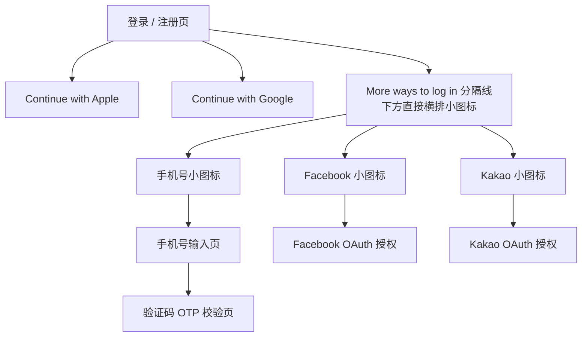
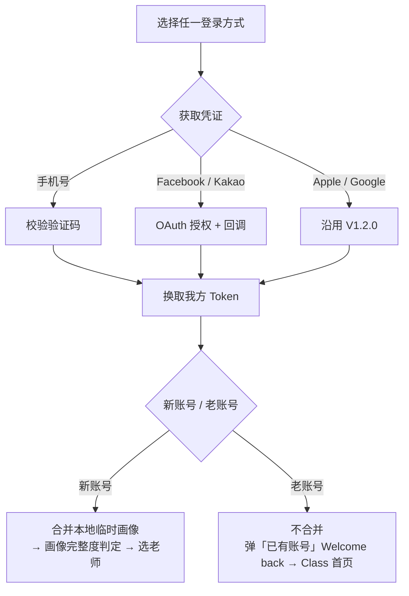

# Dino English — V1.3.0 更多登录方式

> **状态**：Draft
> **更新日期**：2026-06-23
> **飞书文档**：[Dino English V1.3.0 更多登录方式](https://qjphu5vphyf4.jp.larksuite.com/wiki/CBh9wuZ0WiRfHfka0M6jbN23pIb)
> **所属版本**：V1.3.0（[主 PRD 飞书文档](https://qjphu5vphyf4.jp.larksuite.com/wiki/Axjzw82cRiHbQTkYvhmjazmkpXf)）
> **依赖关系**：在 V1.2.0 登录 / 注册框架与账号体系之上扩展；登录后落点（选老师 / Class 首页）、新老账号识别、画像合并均沿用 V1.2.0，不重构
> **现状参考**：第八章「现状口径确认」基于现网登录注册「现状还原（As-Is）」（iOS `app-dino-ai` / Android `everyday-android` 代码梳理）及业务汇总《Dino-English-产品需求文档-业务汇总-最新版》§3

---

## 一、需求概述

V1.3.0 登录页在现有 `Continue with Apple`、`Continue with Google` 之外，新增三种登录方式。本期布局调整为：在主登录按钮下方设「More ways to log in」分隔线，分隔线下方**直接横向展示三个圆形小图标按钮**（不再收进底部抽屉 / 二级选择面板），分别为：

- 手机号登录（验证码）
- Facebook 登录
- Kakao 登录

目标：覆盖更多地区与用户的登录习惯，降低无 Apple / Google 账号用户的注册门槛；登录方式直接露出（不藏抽屉），减少一次点击；所有新增方式统一接入 V1.2.0 现有登录链路与账号体系。

## 二、范围

| 项 | 内容 |
| --- | --- |
| 包含 | 登录页主按钮下方「More ways to log in」分隔线 + 三个小图标按钮直接露出（手机号 / Facebook / Kakao，不收抽屉）；手机号验证码登录（区号选择 / 发码 / 校验 / 绑定）；Facebook、Kakao 第三方授权登录（授权 / 回调 / 账号关联）；上述方式的异常与边界处理 |
| 不包含 | 账号体系底层重构（统一复用 V1.2.0「换取 Token → 新老账号判定 → 新账号合并画像 / 老账号弹『已有账号』」主链路）；登录后横屏进课链路（复用 V1.1.0 / V1.2.0） |

## 三、入口与信息架构

## 四、展示逻辑

| 所属模块 | 功能点 | 展示内容 | 交互操作逻辑 | 数据 · 接口 | 优先级 |
| --- | --- | --- | --- | --- | --- |
| 登录页一级 | 登录方式布局 | • 沿用 V1.2.0 登录页框架与用户信息标签 chips（含 V1.3.0 定级结果 chip） • 登录方式自上而下：`Continue with Apple`、`Continue with Google`、`More ways to log in` 分隔线 + 下方三个小图标按钮 • 底部协议文案沿用 V1.2.0：`You agree to our Terms of Use and Privacy Policy` | • 点击 Apple / Google：沿用 V1.2.0 原有逻辑 • iOS 端 `Sign in with Apple` 的展示与可点击性不弱于任一第三方登录（满足 App Store 4.8） | 无新增接口（沿用 V1.2.0 登录页框架） | P0 |
| More ways to log in（图标直露、无抽屉） | 第三方 / 手机号小图标 | • 主按钮下方分隔线（居中文案 `More ways to log in`，两侧细线） • 分隔线下方横向居中排列 3 个圆形小图标按钮： &nbsp;&nbsp;• 手机号（电话图标、白底描边，aria `Continue with phone number`） &nbsp;&nbsp;• Facebook（蓝底白「f」，aria `Continue with Facebook`） &nbsp;&nbsp;• Kakao（黄底「K」，aria `Continue with Kakao`） • V1.3.0 取消底部抽屉 / 二级面板，图标即一级入口 | • 点击手机号图标 → 进入手机号输入页 • 点击 Facebook / Kakao 图标 → 直接拉起对应第三方授权 • 按地区 / 远程配置控制各图标是否露出（带本地兜底）；不露出的方式直接不展示该图标，无抽屉可收 | 接口：登录方式露出配置（按地区 / 远程配置控制 Kakao、Facebook、手机号是否展示，带本地兜底） | P0 |
| 手机号登录 | 手机号输入页 | • 标题 `Enter your phone number` • 区号选择器（国旗 + 国家码，如 `+1`），默认按设备地区 / IP 预选 • 手机号输入框 • 主按钮 `Get code` • 协议文案同登录页 | • 区号可点击 → 国家码选择弹窗（国旗 + 国家缩写 + 国家码，支持搜索） • 手机号非空且格式校验通过 → 启用 `Get code` • 点击 `Get code` → 发送验证码 → 进入 OTP 校验页 • 返回 → 回到登录页 | 接口：发送短信验证码（号码 + 区号）；国家码列表配置 | P0 |
| 手机号登录 | 验证码（OTP）校验页 | • 居中卡片：标题 `Enter the verification code` • 脱敏手机号展示（如 `+1 ••• ••• 1234`） • 验证码输入框（**4 位数字**验证码，与现网一致） • `Resend`（60s 倒计时后可点） • 主按钮 `Continue` • 异常提示位（格式错误 / 验证码错误 / 过期 / 请求过频 / 网络异常） | • 输入完整验证码 → 启用 `Continue` • 点击 `Continue` → 校验验证码 → 成功换取 Token 进入新老账号判定 • 倒计时结束可 `Resend` 重新发码（刷新倒计时） • 返回 → 回到手机号输入页（保留已输手机号） | 接口：校验验证码 → 登录 / 注册换取 Token | P0 |

## 五、处理逻辑

### 5.1 统一主链路（所有登录方式）

新增的手机号 / Facebook / Kakao 与现有 Apple / Google 一致，登录成功换取我方 Token 后，统一进入 V1.2.0 既有的新老账号判定与画像处理：

### 5.2 手机号登录

| 步骤 | 逻辑 |
| --- | --- |
| 区号与号码 | 区号默认按设备地区 / IP 预选，可手动切换；号码按所选区号做格式校验 |
| 发送验证码 | 点击 `Get code` 下发短信验证码；同一号码 / 设备做发送频次限制（防刷） |
| 验证码规则 | **4 位数字**验证码（与现网一致）；60s 倒计时后可 `Resend`；有效期默认 5 分钟（服务端可配），过期需重新获取；同号码 / 设备做发送频次限制（命中返回过频错误码 `40003`） |
| 校验与登录 | 验证码正确 → 后端按手机号换取 Token；号码已注册 → 登录为老账号，未注册 → 注册为新账号 |
| 落点 | 换取 Token 后进入 5.1 新老账号判定 |

### 5.3 第三方登录（Facebook / Kakao）

| 步骤 | 逻辑 |
| --- | --- |
| 授权调用 | 点击对应入口 → 拉起官方 SDK / 授权页，申请最小必要授权范围：**Facebook = `public_profile` + `email`**；**Kakao = 基本资料 + 手机号权限**（与现网一致） |
| 回调处理 | 授权成功回调返回三方凭证（access token / openid 等）→ 前端回传后端，后端校验后换取我方 Token |
| 账号关联 | 后端以三方唯一标识（openid / unionid 等）建立或匹配我方账号；首次为新账号、已存在为老账号 → 进入 5.1 判定 |
| Kakao 手机号绑定（现状） | 现网 Kakao 授权后：已绑定手机号 → 直接登录；**未绑定 → 强制进入绑机页**（区号 + 手机号 + 验证码）后再登录（接口 `quickLogon` → `bindPhoneAndLogon`）。本期是否保留强制绑机见第九章待决策 |
| 落点 | 同 5.1：新账号合并临时画像，老账号弹「已有账号」提示不合并 |

## 六、异常处理

| 场景 | 交互反馈 |
| --- | --- |
| 第三方授权取消 | 用户在授权页取消 / 返回 → 静默回到登录页，不报错、不计失败弹窗 |
| 第三方授权失败 | SDK 报错 / 凭证无效 → toast「Login failed, please try again」，停留登录页 |
| 网络超时 | 发码 / 校验 / 换取 Token 超时 → toast「Network error, please check your connection」，按钮恢复可点，允许重试 |
| 验证码错误 | toast / 输入框下提示「Incorrect code」，输入框标红，可重输 |
| 验证码过期 | 提示「Code expired, please resend」，引导 `Resend` |
| 请求过频 | 命中频次限制 → 提示「Too many attempts, please try later」，`Get code` / `Resend` 置灰至冷却结束 |
| 手机号格式错误 | `Get code` 置灰或点击提示「Invalid phone number」 |
| 第三方未返回唯一标识 | 后端无法建立账号 → toast「Login failed, please try another method」，回登录页 |
| 多账号订阅占用 | 沿用 V1.2.0：登录后若命中同商店账号订阅占用，按 V1.2.0 多账号订阅拦截处理 |

## 七、埋点

遵循《埋点事件汇总》与 `dino-english-analytics-tracking.mdc`，本次随新增登录方式需补充 / 扩展（具体契约单独评审后写入埋点表）：

- 登录结果 `business_result`（`event_id=login_result`）：`method` 枚举在 `apple` / `google` 基础上扩展 `phone` / `facebook` / `kakao`；`result` 取 `success` / `fail` / `cancel`，失败带 `description` 短码。
- 点击交互 `ui_click`：新增 `More ways to log in` 三个小图标各自的点击（手机号 / Facebook / Kakao）、`Get code` / `Resend` 点击。
- 页面浏览 `screen_view`：手机号输入页、验证码校验页可按需登记 `event_id`。

## 八、现状口径确认（基于现网 As-Is 还原）

> 来源：现网登录注册「现状还原（As-Is）」——iOS `app-dino-ai`、Android `everyday-android` 代码梳理，及业务汇总《Dino-English-产品需求文档-业务汇总-最新版》§3。以下为已可定稿、正式采用的口径。

| 事项 | 现状口径（正式采用） | 来源 / 接口 |
| --- | --- | --- |
| 手机号地区开放与国家码清单 | **登录方式与区号清单由服务端下发、客户端不写死**：进登录页请求得 `countryCode + loginMethods[] + phoneConfigs[]`；可选国家码 / 区号来自 `phoneConfigs`，默认区号按服务端判定的 `countryCode` 预选；地区开放范围（默认 / 沙特·阿联酋 / 韩国等）由后端按 `countryCode` 控制、运营可配 | 接口 `GET user/intl/loginMethods`（`countryCode` / `loginMethods` / `phoneConfigs`） |
| 验证码位数 / 有效期 / 频次 | **4 位数字验证码、60s 倒计时后可 Resend**；有效期默认 5 分钟（服务端可配）；同号码 / 设备做发送频次限制 | 现网实现 + 业务汇总 §3.2；接口 `verification`（发码）/ `smartLogin`（校验登录）；错误码 `40001` 过期 / `40002` 错误 / `40003` 过频 |
| Kakao 与手机号关系（现状） | 现网 Kakao 授权后读取绑定手机号：已绑定 → 直接登录；未绑定 → **强制绑定手机号**后登录（手机号为 Kakao 与手机号账号的归一键）。本期是否保留见第九章待决策 | 接口 `quickLogon`（返回 `parentInfo` 直接成功 / 返回中间态转绑机）+ `bindPhoneAndLogon` |
| Facebook / Kakao 授权范围 | **Facebook = `public_profile` + `email`**；**Kakao = 基本资料 + 手机号权限**；iOS 端 Facebook 还需 SDK 配置 AppID，否则该入口隐藏 | 现网 SDK 接入；接口 `facebookLogin` / `quickLogon` |

## 九、待决策与 Open Questions

> 标【待决策】为需产品 / 后端 / 法务拍板的决策项，其余为依赖外部确定的开放问题。

- **【待决策 · 架构口径】登录方式布局：沿用「地区下发」还是改为「统一入口」**
  - 现网：登录方式由服务端 `loginMethods` + `countryCode` **按地区决定布局**（默认 = Apple(iOS)/Google、沙特·阿联酋 = 手机号主、韩国 = Kakao 主），且每次进登录页按接口重建、**不记忆上次登录方式**。
  - 本 PRD 设计：Apple / Google 固定 + `More ways to log in` 分隔线下方直接露出手机号 / Facebook / Kakao 小图标（全地区统一入口、无抽屉）。
  - 需明确二选一：(A) **沿用地区下发** → 则三个小图标需按 `countryCode` 条件露出（与第四章「按地区 / 远程配置控制展示」对齐）；(B) **改为全地区统一入口** → 需后端调整 `loginMethods` 下发与布局逻辑。**此决策直接决定第三、四章的最终写法。**
- **【待决策 · Kakao 强制绑机】** 现网为「未绑手机号则强制绑定」，本期若坚持「不强制」需改造现网 `quickLogon` / `bindPhoneAndLogon` 链路，并评估研发成本与韩国侧合规 / 风控影响。
- **【Open · 后端】跨登录方式账号归一**：客户端各方式各走独立登录接口、端上不做跨方式合并，仅 Kakao ↔ 手机号通过 `bindPhoneAndLogon` 以手机号归一；「同邮箱在 Google / Apple / Facebook 间是否并号」属后端账号模型，需后端确定唯一标识映射策略。
- **【Open · 法务】Facebook / Kakao 隐私合规**：授权范围已明确（见第八章），但现行隐私政策（`docs/legal/`）尚未覆盖社交登录数据条款，需法务补充并完成合规评审（数据最小化、第三方共享披露）。
