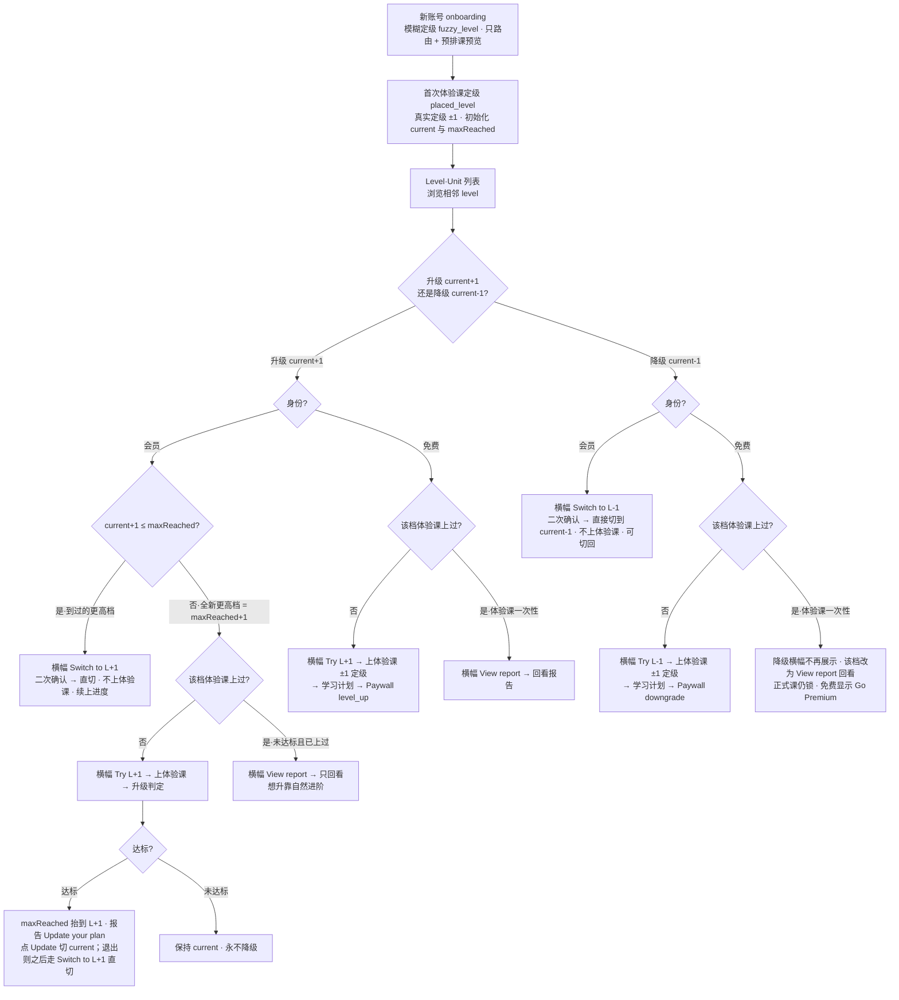
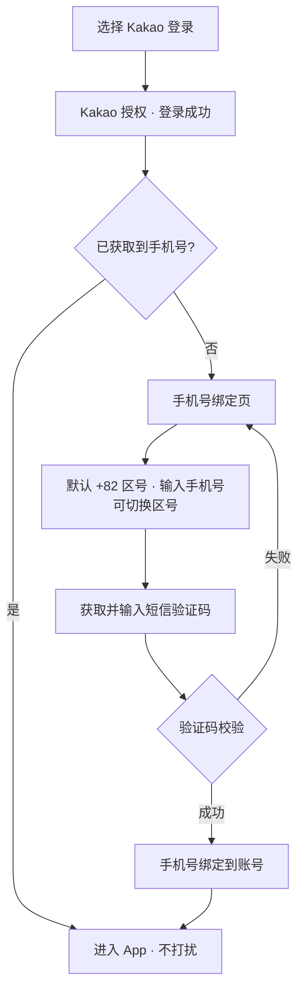

> **版本**：V1.3.1（功能性迭代版）
> **创建日期**：2026-06-28
> **依赖关系**：在 V1.3.0（游戏化激励体系 + 功能性迭代）之上叠加，复用其主流程、游戏化、经济与奖励、Explore / Play、解锁与学习计划链路；本期仅新增 / 修改下述 7 项
> **交互 Demo**：[V1.3.1 UI Demo](https://cyanlee888.github.io/cyan/dino-english/V1.3.1-ui-demo.html)

---

## 前言

V1.3.1 是一次聚焦的功能性迭代，在 V1.3.0 之上做 7 件事：

1. **支付页改竖屏** P0：Paywall 由横屏双栏改为竖屏单栏沉浸式页面，承接 onboarding / 报告等竖屏链路，减少横竖切换、提升转化。
2. **Class 首页「本周上完」探索引导** P1：用户上完本周解锁的课程后，在课程卡之后展示一张引导卡，把空窗期导向 Explore / Play。
3. **课程升降级** P0：在「自评模糊定级 + 体验课正式定级」之上，提供长期可用的升 / 降级入口，纠正定级偏差；尤其支撑免费偏高用户下探到合适 level 的体验课、拿到合适档位的报告后转化。
4. **背包手办 IP / 系列分层** P1：背包「手办」Tab 下按 IP（Dino 及「恐龙一家」不同角色）→ 系列 → 具体手办分层展示。
5. **Kakao 登录手机号绑定** P1：Kakao 第三方登录成功后，若未获取到用户手机号，强制进入手机号绑定页（输入手机号 + 短信验证码）完成绑定后再进入 App。
6. **手机号登录去前导 0** P1：手机号登录 / 绑定输入手机号时，默认自动去掉用户输入的首位「0」，再与区号拼接为国际格式提交。
7. **完课后「和 Dino 聊聊」入口** P1：课程完课后，在课程卡上展示一个按钮，引导用户跳转 Dino 沉浸式聊天页，就当前课程 / 学习内容与 Dino 聊一聊；不同入口需向对话工程传入「入口标识」（标识具体方案评审会讨论；对话工程按入口的差异化调整见淑怡后续需求文档）。

本期不改动 V1.3.0 的免费 / 付费权益边界、经济数值与玩法。

---

## 一、版本信息

| 项    | 内容         |
| ---- | ---------- |
| 版本号  | V1.3.1     |
| 创建日期 | 2026-06-28 |
| 审核人  | —          |

---

## 二、变更日志

| 时间         | 版本号    | 变更人 | 主要变更内容 |
| ---------- | ------ | --- | ------ |
| 2026-06-28 | V1.3.1 | 李双  | 新建需求文档 |

---

## 三、文档说明 · 名词解释

| 术语                  | 说明                                                                                                                                                                                                          |
| ------------------- | ----------------------------------------------------------------------------------------------------------------------------------------------------------------------------------------------------------- |
| 模糊定级（fuzzy_level）   | onboarding 自评产出的档位，**不是真定级**：仅用于①路由到首节体验课、②给一份临时预排课预览。它与 `current` 是**两个独立字段**、互不覆盖——真定级只由体验课报告写入 `current`；产出 `current` 后，`fuzzy_level` 不再参与正式排课。                                                          |
| 体验课定级（placed_level） | 体验课报告按课堂表现产出的**真定级**，写入当前档 `current` 并初始化「已到达最高档」；每次定级只在**当前档 ±1 或持平**内移动。                                                                                                                                  |
| 已到达最高档（maxReached）  | **仅会员概念**（免费用户无正式课、无自然进阶，不建立 maxReached）。会员历史到过的最高档：**首次定级、升级达标、自然进阶（学完某档正式课进阶）都会抬高，永不下降**。它是「可直切回」的边界——≤ maxReached 的任一档都可**直切、不重上体验课、续上原进度**；只有踏进 maxReached+1（从没到过的更高档）才需一次体验课校准。                                                                 |
| 升 / 降档入口            | 在模糊定级 + 体验课定级之上长期提供的升 / 降级入口，用于纠正定级偏差、给用户掌控感。核心规则：**目标档 ≤ maxReached → 直切（无体验课、续上进度）；目标档 = maxReached+1 → 一次体验课校准（升 / 维持，永不被拉低）；> maxReached+1 → 锁、逐级上**。横幅出现在所浏览的相邻 level 视图顶部（升在 current+1、降在 current-1）。 |
| IP（手办）              | 手办所属角色，Dino 及「恐龙一家」中爸爸 / 妈妈 / 姐姐 / 弟弟等各为一个独立 IP；出现在背包「手办」Tab。                                                                                                                                               |
| 系列（手办）              | IP 下的手办主题分组（星座系列 / 甜品系列 / 节日系列等）；出现在背包「手办」Tab。                                                                                                                                                              |
| Kakao 登录            | 通过 Kakao 第三方账号授权登录；Kakao 授权可能未返回 / 未授权用户手机号。                                                                                                                                                                |
| 手机号绑定               | 登录后若账号无手机号，强制让用户补绑一个联系手机号（手机号 + 短信验证码）的页面与流程。                                                                                                                                                               |

---

## 四、需求背景与目标

### 需求 1 · 支付页改竖屏

- **背景**：V1.3.0 起，onboarding、体验课报告、学习计划领取页等转化前置链路均为竖屏；Paywall 仍是横屏双栏，用户在「竖屏报告 → 横屏支付」间被迫旋转设备，打断转化心流；横屏双栏也挤压了年付卡与权益的呈现。
- **目标**：Paywall 与转化链路对齐为竖屏单栏，减少一次横竖切换；单栏从上到下叙事（价值 → 权益 → 价格 → 行动），底部吸顶 CTA 常驻，提高首屏到下单的转化。

### 需求 2 · Class 首页「本周上完」探索引导

- **背景**：会员在 7 天滚动解锁节奏下，常会提前上完本周 3 节，随后进入「无课可上、等下一批解锁」的空窗，缺少明确的下一步。
- **目标**：把空窗期转成探索与练习的增长机会——本周批次全部完成后，在课程卡之后追加一张引导卡，以单一 `Go to Explore` 引导用户去 Explore（Words & Sentences / Listening / Speaking），提升日活与留存。

### 需求 3 · 课程升降级

- **背景**：主链路是「自评模糊定级 → 上对应 level 体验课 → 报告按课堂表现产出真实定级 → 排课」，但模糊定级为家长自评、天然不可靠，体验课一次也只能在 current±1 内评估；任何定级都无法对所有用户精准，用户始终有「想试更难 / 太难想退」的诉求。尤其免费用户上不了正式课、体验课是其唯一产品体验，一旦首节体验课偏高太难（中途退出 / 报告吃力），转化即断。
- **目标**：提供长期可用、低门槛的升 / 降档入口，纠正定级偏差、给用户掌控感；重点支撑免费偏高用户下探到合适 level、拿到**合适档位的体验课报告**后在「刚好合适」的计划上转化。

### 需求 4 · 背包手办 IP / 系列分层

- **背景**：手办（Dino Figures）原为单一扁平集合。后续手办会扩展为**多 IP**（Dino 本体，以及「恐龙一家」中爸爸 / 妈妈 / 姐姐 / 弟弟等不同角色，每个角色即一个独立 IP），且每个 IP 下还会有**多个系列**（星座系列、甜品系列、节日系列等）。原扁平列表无法承载「角色 × 系列」的二维增长，手办越多越难找、收集目标也不清晰。
- **目标**：在背包「手办」Tab 下建立清晰的三层结构——**IP 子 Tab → 系列名分组 → 具体手办**，让用户按角色与系列浏览、收集手办；系列内以**置灰态**展示未获得手办（照常显示名称与形象，作为可见的收集目标）、显示每个系列的**收集进度（已获得 / 总数）**，并在系列集齐时给出**成就反馈**，强化收集目标与动机；为后续手办扩量与系列化运营打基础。

### 需求 5 · Kakao 登录手机号绑定

- **背景**：Kakao 第三方登录的账号常常未授权 / 未返回手机号；而手机号是后续找回账号、客服触达、营销触达与账号安全（验证身份）的关键联系方式。缺手机号会导致后续服务与触达断档。
- **目标**：在 Kakao 登录成功后，先判断账号是否已获取到手机号；**未获取到则强制进入手机号绑定页与流程**（手机号 + 短信验证码校验），绑定成功后再进入 App；已获取到则直接进入，不打扰。

### 需求 6 · 手机号登录去前导 0

- **背景**：韩国等地本地手机号习惯带前导 0（如 `010-1234-5678`），但拼接国际区号（+82）提交时前导 0 需去掉，否则号码非法、验证码发送失败。用户往往按本地习惯连 0 一起输入。
- **目标**：手机号输入（手机号登录、Kakao 手机号绑定）时，默认自动去掉用户输入手机号的**首位 0**，再与所选区号拼接为国际格式提交，降低因格式导致的发码 / 登录失败。本期仅逻辑层处理，无独立 UI 改动。

### 需求 7 · 完课后「和 Dino 聊聊」入口

- **背景**：课程完课是学习动机与成就感最高的时刻，但当前完课后缺少「把刚学的内容用起来、和 Dino 开口练」的顺畅出口；同时 Dino 沉浸式聊天来自多个入口，对话工程需要知道用户「从哪个场景进来、刚学了什么」才能给出更贴合的开场与引导。
- **目标**：在课程完课后于课程卡上提供一个「和 Dino 聊聊」按钮，一键跳转 Dino 沉浸式聊天页，就当前课程 / 学习内容展开对话，提升开口率与粘性；并向对话工程传入**入口标识**（当前为完课课卡），为后续多入口的差异化调整预留扩展。
- **说明**：入口标识的具体方案（字段与取值）**评审会讨论**；对话工程根据不同入口进行的调整**详见淑怡后续需求文档**，本文档不展开对话工程侧逻辑。

---

## 五、版本范围

| 项    | 说明                                                                                                                                                                          |
| ---- | --------------------------------------------------------------------------------------------------------------------------------------------------------------------------- |
| 版本定位 | V1.3.0 之上的聚焦功能性迭代版：补齐转化体验（竖屏支付 / 空窗引导）、课程升降级、账号触达与手办分层。                                                                                                                     |
| 基线依赖 | 复用 V1.3.0 的主流程、游戏化激励、经济与奖励、Explore / Play、解锁与学习计划、登录与支付链路；权益边界与经济数值沿用不变。                                                                                                    |
| 本期页面 | Paywall（竖屏改版）、Class 首页（探索引导卡、完课后「和 Dino 聊聊」入口）、账号 / 登录（Kakao 登录手机号绑定页、手机号输入去前导 0）、Level·Unit 列表（相邻 level 升 / 降横幅、免费偏高下探、升级判定报告）、背包 · 手办 Tab（IP / 系列分层）、Dino 沉浸式聊天页（承接完课入口）。 |
| 核心能力 | • 竖屏单栏 Paywall • 本周批次上完探索引导 • 课程升降级（免费采样定级 / 会员升要证明·降直切） • 背包手办 IP / 系列分层 • Kakao 登录后手机号缺失强制绑定 • 手机号登录 / 绑定输入去前导 0 • 完课后课卡「和 Dino 聊聊」入口（带入口标识给对话工程）                      |

---

## 六、关键流程

### 6.1 定级与升降级总流程（onboarding 模糊定级 → 体验课定级 → 列表内长期升降级）

> **起点 onboarding → 定级 → 列表内升降级**：新账号自评模糊定级（`fuzzy_level`，非真定级、只决定首次体验课 level 并先按此预排课预览）→ 首次体验课定级（`placed_level`，报告产出真实定级、校正排课，初始化 `current` 与 `maxReached`）→ 进入 Level·Unit 列表，浏览相邻 level 决定升还是降，再走对应流程。升 / 降可**反复发生**（各分支结束后都回到列表；「先升再降」「先降再切回」由此自然覆盖）；`maxReached` 只升不降（含自然进阶），作为可直接切回的最高档。
>
> 横幅状态取决于两件事：**① 身份（会员 / 免费）；② 该相邻档体验课是否上过（体验课一次性）**。会员切回已到过的档、会员降级均为**直接切换、不走体验课**；升到全新更高档需一次体验课校准——**达标即抬高 maxReached、报告只出一个 `Update your plan`（可当场切，也可退出后回列表直接切回）；未达标则保持 current、按钮变 `View report` 只回看**。

### 6.2 Kakao 登录 → 手机号绑定

---

## 七、页面与模块需求

> **先看 Demo，再看细则**：[V1.3.1 交互 Demo（点击预览）](https://cyanlee888.github.io/cyan/dino-english/V1.3.1-ui-demo.html)
> 建议相关同学先打开上方 Demo 走一遍完整链路（升 / 降级、体验课定级、Paywall、Kakao 绑定等），再对照下文逐项查看各页面 / 模块的详细需求。

### 1. Paywall（竖屏改版）

#### 1.1 竖屏单栏支付页

##### 展示内容

- 顶部：`Back`（关闭）+ `Restore`
- Hero 卡（从上到下）：
  - 顶部：`Dino Premium` 徽标 + 标题 `Unlock everything in Dino English`（标题下无副文案）
  - 标题下一行：**Dino 形象（左）＋ 信任背书条（右）**，背书条绿底强视觉、紧贴 Dino 右侧：
    - 徽标：`13 Years of Proven Trust`
    - 副文案：`Backed by over a decade of refinement and trusted by 1.8M families worldwide.`
  - 全宽精简权益清单（带勾、单列、每条一句）：
    - `All 864 core lessons unlocked`
    - `Personalized learning path · 3 lessons/week`
    - `Report after every lesson`
    - `All extension resources unlocked`
    - `Full rewards & gamified learning`
    - `Chat freely with Dino`
- 三档商品卡**竖向堆叠排列**（上→下 Yearly / Monthly / Weekly）：默认选中 Yearly（选中态高亮）；每张卡展示——计划名、**真实价格 + 计费周期**（如 `$59.99 / year`，**作为主视觉**，与 App Store 实际扣费口径一致）、**灰色划掉的原价**（灰色弱化；公式 = 真实价格 × X，X 为**全局统一**的倍数系数、**暂定 X = 1.4**，约「原价七折」力度）、折算后的 `~ /day`（**小字辅助行**，置于真实价格下方仅作参考，**不作主视觉**）；年卡（Yearly）顶部加角标 `Recommended`
- 底部吸顶 `Subscribe now`
- 协议行：`Cancel anytime · Terms · Privacy`
- 异常态：无网络 `Check your connection and try again`

##### 交互操作

- 出现场景：任意 `trigger_source` 拉起 Paywall
- 进入即以竖屏呈现；横屏来源（会员中心 / 锁课）先切竖屏，关闭 / 完成后回来源页（横屏来源回横屏）
- 点商品卡 → 切换选中态（边框 + 底色高亮）
- `Subscribe now` → 走 V1.3.0 支付链路；成功回来源页 + toast；支付取消静默返回不报错；校验失败留页提示
- `Restore` → 恢复购买
- 边界：**强制竖屏**；商品 / 计费 / `trigger_source` 归因沿用 V1.3.0，仅版式变化

##### 数据 · 接口

- 接口：商品 / 订阅 / Restore（沿用 V1.3.0）；`trigger_source` 归因沿用

### 2. Class 首页

#### 2.1 本周上完探索引导卡

##### 展示内容

- 追加于课程卡（含体验课卡）之后，采用区别于课程卡的轻量样式（浅色虚线卡 + 居中祝贺文案，不复用课程卡卡面）
- 祝贺标题：`All caught up this week, {name}!`（`{name}` = 孩子昵称）
- 副文案：`Next lessons unlock soon — explore more while you wait.`
- 单按钮：`Go to Explore`（单一引导）

##### 交互操作

- 出现场景：本周解锁批次课程**全部 Completed 且下一批未解锁**（7 天节流空窗）时展示；有未完成课程时不展示
- 点 `Go to Explore` → 切 Explore Tab
- 边界：与 V1.3.0 结业完成态卡**互斥**（结业态走结业卡）

##### 数据 · 接口

- 接口：本周排课 / 完成进度（沿用 V1.3.0）

#### 2.2 完课后课卡「和 Dino 聊聊」入口

##### 展示内容

- 课程完课后，在该课程卡面上展示一个按钮 `Chat with Dino`（纯文字、不带 emoji），引导用户就当前课程 / 学习内容与 Dino 对话
- **任意课程**完课（Completed）状态的课卡都展示该按钮，正式课与体验课卡一致；未完成的课卡不展示
- 入口**只在课卡上**，任何报告页（体验课报告 / 正式课报告 / 升级判定报告）都**不展示**该按钮，避免干扰报告页主 CTA（体验课→转化、完课→继续）

##### 交互操作

- 出现场景：课程卡（含体验课卡）进入完课（Completed）状态后
- 点击 → 跳转 Dino **沉浸式聊天页**，进入与当前课程 / 学习内容相关的对话
- **入口标识**：跳转时向对话工程传入「入口标识」以区分来源（`class_card` = 完课后课卡）；标识的具体字段与取值方案**评审会讨论**，后续新增入口时扩展枚举
- 对话工程根据不同入口进行的差异化调整（开场、引导、内容侧重等）**详见淑怡后续需求文档**，本文档不展开

##### 数据 · 接口

- 接口：Dino 沉浸式聊天页（沿用现有）；跳转参数携带入口标识（字段待评审）+ 课程上下文（level / unit / lesson）
- 完课状态：沿用 V1.3.0 课程完成进度

### 3. 登录注册页面

#### 3.1 Kakao 登录手机号绑定

##### 展示内容

- 登录方式沿用现有「Kakao 登录」入口（不新增 UI）
- 手机号绑定页（竖屏 takeover，参考 Figma 4867:18878）：
  - 标题 `Please add a contact phone number` + 副文案 `We will send an SMS verification code to your phone number to verify your identity.`
  - 已登录提示行：`Your Kakao account has been logged in`
  - 手机号输入：区号 + 手机号输入框——区号**默认预选韩国 +82**（Kakao 用户以韩国为主），用户无需主动选择即可直接输入本地手机号；如需其他国家可点开区号自行切换
  - 短信验证码：输入框 + `Get code`（发送后倒计时）
  - 底部 `Log in` + 说明 `A verification code will be sent to your phone via SMS`

##### 交互操作

- 流程：Kakao 授权登录成功 → **判断账号是否已获取到手机号**
  - 已获取 → 直接进入 App，不展示绑定页
  - 未获取 → 进入手机号绑定页（**强制步骤**，绑定成功前不进入 App）
- 绑定页：输入手机号后 `Get code` 可点 → 发送短信验证码并倒计时；输入手机号 + 验证码后 `Log in` 可点 → 校验验证码
  - 校验成功 → 手机号绑定到账号 → 进入 App
  - 校验失败 → 留页提示重试
- 边界：手机号绑定为强制步骤，无跳过；区号支持多国；验证码有发送频控（60s 倒计时再发）

##### 数据 · 接口

- 接口：Kakao 登录回调（返回是否含手机号）；发送短信验证码；手机号 + 验证码绑定（新增）；字段 `phone`、`country_code`、`phone_bound`

#### 3.2 手机号登录去前导 0

##### 展示内容

- 无独立 UI（输入框形态不变）
- 手机号输入框在提交 / 发码前，默认对用户输入做标准化：**自动去掉首位「0」**

##### 交互操作

- 适用场景：手机号登录、Kakao 手机号绑定等所有「区号 + 手机号」输入
- 规则：取用户输入手机号，若首位为 `0` 则去掉该前导 0（仅去首位一个 0），再与所选区号拼成国际格式提交
- 韩国等本地号码习惯带前导 0（如 `010-1234-5678` → `10-1234-5678`）
- 边界：仅本期逻辑层处理，不改输入框 UI；不影响区号选择；已是国际格式（无前导 0）的输入不变

##### 数据 · 接口

- 接口：沿用现有手机号登录 / 绑定接口，提交前做号码标准化（前端 + 后端双侧兜底）

### 4. 学习路径（Level·Unit 列表）

> 用户上完首次体验课、拿到定级后进入的长期学习页。这一页同时承载三件事：定级锚点（4.1）、用户主动升 / 降档的入口与规则（4.2–4.5，升 / 降横幅就出现在这一页相邻 level 的顶部）、以及级别卡与 Unit 的锁态展示（4.6）。升降级横幅本就在这个列表里出现，故合并为一个模块。

#### 4.1 首次体验课定级（定级锚点，沿用 V1.3.0）

> 首次体验课报告与定级是 V1.3.0 既有能力，本期**不改动**，此处仅作为后续升 / 降档的**定级锚点**简述（报告版式、老师点评、发音检查、CTA `Get study plan` / `Continue` 等均沿用 V1.3.0）。

- **模糊定级即先排课**：onboarding 自评模糊定级后，系统**先按模糊 level 预排课并展示在 Class 首页**（用户未上体验课时看到的就是这份预排课）；模糊定级同时**决定上哪个 level 的体验课**。
- **体验课报告校正定级**：报告按孩子课堂表现产出**真实定级**（落在所上体验课 level ±1，可能 ≠ 模糊定级、可低可高），据此**校正 / 确认排课**——首次定级**自动采用**（无需手动确认）。会员首次定级同时初始化 `current` 与 `maxReached`。

#### 4.2 升降级总则与口径

> 用户拿到定级后，仍可在这一页主动往上挑战或往下找更合适的档，纠正定级偏差。本节是规则总则、无独立界面；升 / 降的横幅见 4.3（升级）、4.4（降级），会员切档的二次确认见 4.5，完整状态枚举见文末**附录**。

- **两个定级字段**：`fuzzy_level`（onboarding 自评）**不是真定级**、**不写 `current`**，只路由首节体验课 + 给临时预排课预览；只有体验课报告写入 `current`。会员首次定级同时初始化 `current` 与 `maxReached`。
- **`maxReached`（仅会员）**：会员历史真实到过的最高档 = `max(首次定级、升级达标、自然进阶到过的最高 current)`，**只升不降**，是「可直接切回、无需重考」的天花板。免费用户无正式课、无自然进阶，**不建立 `maxReached`**，只有一个用于路由 / 预览的 `current` 指针。
- **身份分口径**：**会员**有正在真实学习的 `current` 需保护（升要证明、降靠自己、永不被体验课拉低）；**免费**上不了正式课、无排课可保护，任何方向都是统一的「采样定级」。
- **统一内核（会员，以 `maxReached` 为界）**：目标档 **≤ maxReached** → 直接切换、免体验课、**从首个未上正式课续上**（正式课一次性，从没学过的档即 Unit 1 · Lesson 1）；目标档 **= maxReached+1** → 一次体验课校准（**升 / 维持，永不下拉**）；**> maxReached+1** → 锁、一次只上一级。
- **设计约束**：体验课**永不触发系统自动降级**；会员所有改级**均由用户手动确认**（避免来回横跳）。
- **免费转会员落位**：订阅成功后 `current = maxReached = 转化前 `current` 指针所指档`（即用户最后一次体验课定级那档；若从未上过体验课，则为 onboarding 模糊预排课档）。`maxReached` 在此刻建立。
- **会员过期**：订阅到期即回免费态——正式课重新锁为 `Go Premium`、升 / 降横幅改走免费的「体验课 → Paywall」逻辑；`current` / `maxReached` **保留**，续订后按原档恢复（不清零、不重新定级）。

#### 4.3 升级横幅（current+1 视图）

浏览 current+1 level 时，其单元列表**顶部**展示绿色升级横幅（该 level 各单元均锁，横幅是唯一入口）。分会员 / 免费：

##### 会员

- **切回已到过的更高档**（current+1 ≤ maxReached，即之前下探过、现在切回）：主文案 `Ready to switch?` + 副文案 `Switch your plan to {L+1}.`，按钮 `Switch to {L+1}` → 二次确认（见 4.5）后**直接切换、不上体验课、从该档首个未上正式课续上**，maxReached 不变。
- **升到新档**（current+1 = maxReached+1，从没到过的更高档）：主文案 `Ready for the next level?` + 副文案 `Try a trial lesson — we'll set your plan based on how you do.`，按钮 `Try {L+1}` → 上一节 current+1 体验课判定（报告页文案沿用 V1.3.0）：
  - **达标** → 该档就此**解锁为「已到过」（maxReached 抬到 L+1）**；报告页只出一个主按钮 `Update your plan`（点击即切 current 到 L+1、弹二次确认排课，见 4.5），用户也可**直接退出不切**。
  - **未达标** → **保持 current、maxReached 不变、永不降级**（一节更难的课不否定已坐实的 current；想降级走降级横幅）。
- **达标后再回到列表**：因为该档已 ≤ maxReached，current+1 视图直接显示「切回」横幅 `Switch to {L+1}`，**无需再进报告**即可切换。
- **体验课一次性**：升到新档若**未达标**，上过后按钮变 `View report`（回看那次报告、不可重测；想上更高档靠自然进阶）。

##### 免费

- 主文案 `Ready for the next level?` + 副文案 `Try the {L+1} lesson — see how it fits.`，按钮 `Try {L+1}` → 上一节 current+1 体验课定级 → 体验课报告 → 学习计划领取页 → Paywall。
- **体验课一次性**：上过后按钮变 `View report`。

##### `View report` 回看（横幅上过体验课后统一口径）

- 进入：该 level 的**体验课 / 定级报告页**（竖屏 takeover，沿用 V1.3.0 报告版式），不重新上课、不重新判定。
- 底部按钮按状态：
  - **会员·未达标**：`View report` 仅回看，关闭返回列表、保持 current。
  - **免费**：`Get study plan` → 学习计划领取页 → Paywall。

##### 数据 · 接口

- 接口：当前定级 / 排课更新（沿用 V1.3.0 + 本期扩展）

#### 4.4 降级横幅（current-1 视图）

浏览 current-1 level 时，其单元列表**顶部**展示橙色降级横幅；分会员 / 免费：

##### 会员

- 主文案 `Ready to switch?` + 副文案 `Switch your plan to {L-1}.`，按钮 `Switch to {L-1}` → 二次确认（见 4.5）后**直接切换到 current-1、不上体验课、从该档首个未上正式课续上**；maxReached 不变，之后想回更高档走升级横幅的「切回」。

##### 免费

- 主文案 `Feeling too hard?` + 副文案 `Try the {L-1} lesson — see how it fits.`，按钮 `Try {L-1}` → 上一节 current-1（更简单）体验课 → 体验课报告按所上 level **±1** 真实定级 → 学习计划领取页 → Paywall；可**逐档下探直到舒适**。
- **体验课一次性**：该更低档上过后，按钮由 `Try {L-1}` 变为 `View report`（回看已有报告）；正式课仍锁、显示 `Go Premium`。

##### 何时展示 / 不展示（会员 / 免费均适用）

- **展示**：current-1 存在、且该更低档尚有更简单的未学内容可退时，在 current-1 视图顶部展示降级横幅。
- **不展示**：current 已自然进阶到 maxReached 之上时，current-1 属已学完的复习档（无更简单未学内容）→ 不展示降级横幅，该档按 `Completed` 级别卡 + `View lessons` 复习处理（见 4.6）。
- 一次一档：只处理相邻的 current → current-1。

##### 数据 · 接口

- 接口：当前定级 / 排课更新

#### 4.5 会员改级二次确认弹窗（切排课时机提示）

> 会员的**直接切换**（降级 `Switch to {L-1}` / 切回已到过的档 `Switch to {L+1}` / 升级达标 `Update your plan`）在确认前统一弹**二次确认弹窗**，明确告知新 level 的**排课时机**——依据「**本周已完成课程数**」判断本周是否还有解锁额度（每周 3 节，`WEEK_LESSONS=3`）。免费用户走「体验课 → Paywall」链路、无此排课承诺，不弹此窗。

- 标题：`Switch your plan to {L}?`
- 正文（按本周完成数分两种）：
  - **本周仍有剩余额度**（已完成 < 3 节）：`You've done {done} of this week's 3 lessons — we'll schedule your {L} lesson(s) right away ({remaining} left this week).`（新 level 本周即可上剩余 `remaining` 节）
  - **本周 3 节已上满**：`You've finished this week's 3 lessons — your {L} plan starts next week.`（新 level 计划下周开始）
- 按钮：`Cancel`（关闭不切） / `Confirm`（确认后执行切档，**从该 level 首个未上正式课续上**；从没学过的档即 Unit 1 · Lesson 1）
- 规则：**周额度不因切档刷新**（`weekDoneCount` 沿用，切档不重置本周已上数、不额外补发额度），避免用户靠反复切档刷新解锁额度

#### 4.6 级别卡与 Unit 锁态展示

##### 展示内容

- **级别卡（Level tab）**：三态——`You are here`（current）/ `Completed`（已学完并自然进阶过的更低档）/ `Locked`（其余：更高未解锁档，以及定级时跳过、从没学过的更低隔级档）。升 / 降引导由 current±1 顶部横幅承担。
- **当前 level**：已到达的 Unit 显示 `View lessons` 可进入 + 进度条（当前 Unit `In progress`）；本 level 内**尚未到达**的 Unit → 免费 `Go Premium` / 会员 `Opens soon`（按周节奏顺序解锁，与课程卡「Opens soon」一致）。
- **已完成的更低 level（`Completed`）**：该 level 各已学过的 Unit 显示 `View lessons`，可进入**回看已上过的正式课**（纯复习，不重新计费、不改 current / 排课，进度已存），进度显示已满。
- **其余非当前 level（更高未解锁 / 跳过没学过的更低隔级）**：该 level 下**所有 Unit 入口统一为锁**（免费 `Go Premium` / 会员 `Locked`），极简展示——只有 Unit 名 + 锁按钮，不显示 `View lessons`、进度条与标签。

##### 交互操作

- **免费**点 `Go Premium` → Paywall。
- **会员**点当前 level 的 `Opens soon`（单元级）→ toast `This unit isn't open yet`（Level·Unit 列表是**单元**粒度、用单元文案；Class 首页课程卡列表的 lesson 级点击沿用 V1.3.0 `This lesson isn't open yet`，两处不混用）。
- **会员**点锁定 level（非当前、非 Completed）的 `Locked` → toast `Change level from the next level up or down — one level at a time`（升 / 降只走相邻 level 顶部横幅、一次一档，逐级切过去）。
- **会员**点 `Completed` 级别卡下某 Unit 的 `View lessons` → 进入该 Unit 的 lesson 列表回看（复习已上过的正式课，不改 current）。
- 跨 level 的升 / 降**只**走相邻 level 顶部横幅，不从 Unit 入口进入；跨 level 报告回看由横幅 `View report` 承担。
- **部分完成后升级**：会员在某 level 只上了一部分就升级走（如 L3 上到一半升 L4），该 level **未真正学完** → **不标 `Completed`、按 `Locked` 极简展示**（不谎报整级完成）；但**进度数据不丢**——回切时从该 level 首个未上正式课续上。
- **进度续上**：正式课每节只能上一次、系统记录每节是否已上；切档 / 回切到某 level 时**从首个未上正式课续上**（已上过的不重复），从没学过的档才从 Unit 1 · Lesson 1 起步。
- 进入（可进入）的 Unit 内，Lesson 卡片沿用 V1.3.0 各态。

##### 数据 · 接口

- 接口：当前定级 / 排课更新（沿用 V1.3.0）

### 5. 背包 · 手办 Tab

#### 5.1 手办 IP / 系列分层

##### 展示内容

- 顶部 IP 子 Tab 行：IP emoji + 名称 + **收集进度** `已获得 / 总数`；展示全部有手办配置的 IP，按固定顺序 Dino → Emma（姐姐）→ Bob（弟弟）→ Hena（妈妈）→ Bruce（爸爸）
- 选中 IP 下按**系列名分组**（展示该 IP 下全部系列）：系列标题 + **收集进度** `已获得 / 总数` + 该系列手办卡片
- 卡片按获得状态分两态：
  - **已获得**：手办图（全彩）+ 名称 + `Collected`，重复获得沿用 `×N` 计数
  - **未获得**：**同一手办图置灰**（grayscale + 降透明）+ 名称 + `Not yet`，照常展示手办名称与形象，作为**明确的收集目标**呈现、不可点（收集类内容需看到「还差哪些」才有收集动机）
- **系列集齐成就**：当某系列全部手办均已获得时，用成就标签 `✨ Series complete` **直接替换该系列的收集进度**（占进度原位、不在标题另加徽标）
- 空态：无任何已获得手办时展示原空态（去玩盲盒）

##### 交互操作

- 出现场景：背包切到「手办」Tab
- 默认选中第一个 IP
- 点 IP 子 Tab → 切换并重渲染该 IP 的系列分组与收集进度
- 设计约束：手办仍为**纯收集**（无选中 / 无佩戴）；未获得以**置灰态**展示（照常显示名称与形象、不可点），用于呈现收集目标与进度；系列集齐时给出成就反馈

##### 数据 · 接口

- 数据：手办新增 `ip`、`series` 字段；IP / 系列配置（label、emoji、order，含**系列内手办总数**用于进度与集齐判定）；用户已获得手办及计数（沿用 V1.3.0）

---

## 附录 · 升降级横幅穷举表（研发验收基准）

> 状态位：会员用 `current` 与 `maxReached`、免费仅用 `current` 指针（详见 §3、4.2 引言）；下表为「浏览某 level 视图时横幅形态 → 按钮 → 去向」的唯一权威口径，4.3 / 4.4 为其展开说明。

**表 A · 会员**（浏览的 level ≠ current）

| #   | 浏览的 level（相对 current / maxReached）         | 该档体验课            | 横幅主 / 副文案                                                                                           | 按钮                                          | 点击去向                                                                |
| --- | ------------------------------------------ | ---------------- | --------------------------------------------------------------------------------------------------- | ------------------------------------------- | ------------------------------------------------------------------- |
| M0  | = current                                  | —                | `You are here`（无横幅）                                                                                 | —                                           | —                                                                   |
| M1  | L = current−1（更低档，必 ≤ maxReached）          | 不涉及              | `Ready to switch?` / `Switch your plan to {L}.`                                                     | `Switch to {L}`                             | 二次确认(排课时机) → 直切 L、**从 L 首个未上正式课续上**                                 |
| M2  | current < L ≤ maxReached（回到已到过的更高档，含刚达标未切的新档） | 不涉及           | `Ready to switch?` / `Switch your plan to {L}.`                                                     | `Switch to {L}`                             | 二次确认 → 直切 L、续上进度；maxReached 不变                                      |
| M3  | = maxReached+1（全新更高档）· 未上过                | 未上过              | `Ready for the next level?` / `Try a trial lesson — we'll set your plan based on how you do.`       | `Try {L}`                                   | 上体验课 → **达标** → maxReached=L、报告只出 `Update your plan`（点即切 current；退出则之后按 M2 直切）；**未达标** → 保持 current |
| M4  | = maxReached+1 · 已上过·**未达标**              | 已上过·**维持(不够)**   | `You've already tried {L}` / 回看报告                                                                   | `View report` → 只回看                          | 保持 current（想上更高档靠自然进阶）、**永不被拉低**                                    |
| M5  | > maxReached+1（高 2 级以上）                    | —                | 无横幅、Unit 全 `Locked`                                                                                 | 点 Unit → toast                              | `Change level from the next level up or down — one level at a time` |
| M6  | current=L1 无更低 / current=maxReached=L6 无更高 | —                | 该方向无横幅                                                                                              | —                                           | —                                                                   |

**表 B · 免费**（无正式排课、**无 maxReached**；仅一个 `current` 指针决定预排课预览与体验课路由，转会员时才建立 `current`/`maxReached`，见 F5）

| #   | 浏览的 level             | 该档体验课 | 横幅主 / 副文案                                                           | 按钮                                 | 点击去向                                  |
| --- | --------------------- | ----- | ------------------------------------------------------------------- | ---------------------------------- | ------------------------------------- |
| F0  | = current             | —     | `You are here`（无横幅）                                                 | —                                  | —                                     |
| F1  | = current+1           | 未上过   | `Ready for the next level?` / `Try the {L} lesson — see how it fits.` | `Try {L}`                          | 体验课 → ±1 定级(移动指针) → 学习计划领取页 → Paywall |
| F2  | = current−1           | 未上过   | `Feeling too hard?` / `Try the {L} lesson — see how it fits.` | `Try {L}`                          | 体验课 → ±1 定级 → 领取页 → Paywall           |
| F3  | 任意档                   | 已上过   | `View report`（回看该档报告）                                               | `Get study plan`                   | 报告 → 领取页 → Paywall                    |
| F4  | 非相邻且未上过（隔级）           | 未上过   | Unit 全锁                                                             | `Go Premium`                       | Paywall                               |
| F5  | — 转会员 —               | —     | —                                                                   | —                                  | `current=maxReached=转化前 current 指针档`（最后一次体验课定级；无则模糊档） |

