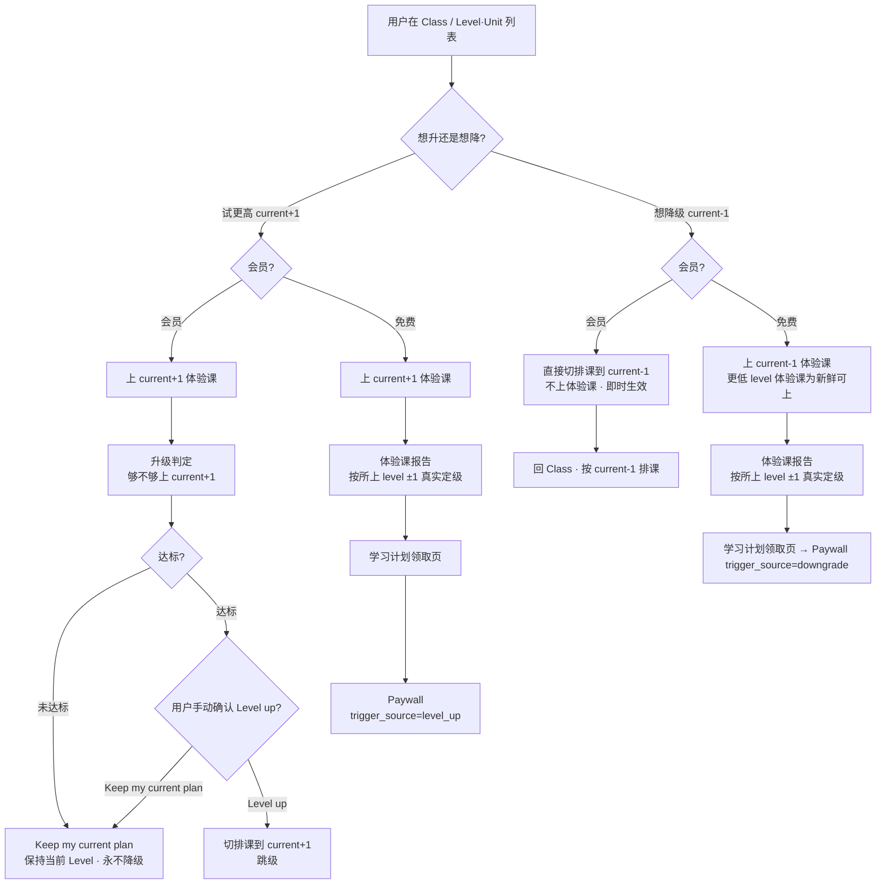
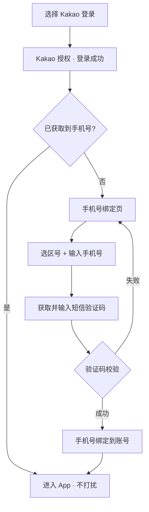

> **版本**：V1.3.1（功能性迭代版）
> **创建日期**：2026-06-28
> **依赖关系**：在 V1.3.0（游戏化激励体系 + 功能性迭代）之上叠加，复用其主流程、游戏化、经济与奖励、Explore / Play、解锁与学习计划链路；本期仅新增 / 修改下述 6 项
> **交互 Demo**：[V1.3.1 UI Demo](https://cyanlee888.github.io/cyan/dino-english/V1.3.1-ui-demo.html)

---

## 前言

V1.3.1 是一次聚焦的功能性迭代，在 V1.3.0 之上做 6 件事：

1. **支付页改竖屏**：Paywall 由横屏双栏改为竖屏单栏沉浸式页面，承接 onboarding / 报告等竖屏链路，减少横竖切换、提升转化。
2. **Class 首页「本周上完」探索引导**：用户上完本周解锁的课程后，在课程卡之后展示一张引导卡，把空窗期导向 Explore / Play。
3. **登录设备上限 3 台**：单账号最多 3 台设备同时在线，新设备登录自动登出最久未活跃的一台，并给温和提示。
4. **课程升降级（定级安全阀）**：在「自评模糊定级 + 体验课正式定级」之上，提供长期可用的升 / 降级入口，纠正定级偏差；尤其支撑免费偏高用户下探到合适 level 的体验课、拿到右档报告后转化。
5. **背包手办 IP / 系列分层**：背包「手办」Tab 下按 IP（Dino 及「恐龙一家」不同角色）→ 系列 → 具体手办分层展示。
6. **Kakao 登录手机号绑定**：Kakao 第三方登录成功后，若未获取到用户手机号，强制进入手机号绑定页（输入手机号 + 短信验证码）完成绑定后再进入 App。

本期不改动 V1.3.0 的免费 / 付费权益边界、经济数值与玩法。

---

## 一、版本信息

| 项 | 内容 |
| ---- | ---------- |
| 版本号 | V1.3.1 |
| 创建日期 | 2026-06-28 |
| 审核人 | — |

---

## 二、变更日志

| 时间 | 版本号 | 变更人 | 主要变更内容 |
| ---------- | ------ | --- | --- |
| 2026-06-28 | V1.3.1 | 李双 | 新建需求文档 |

---

## 三、文档说明 · 名词解释

| 术语 | 说明 |
| --- | --- |
| 定级安全阀 | 在自评模糊定级 + 体验课正式定级之上长期提供的升 / 降级入口，用于纠正定级偏差；出现在 Class 首页与 Level·Unit 列表。 |
| IP（手办） | 手办所属角色，Dino 及「恐龙一家」中爸爸 / 妈妈 / 宝宝等各为一个独立 IP；出现在背包「手办」Tab。 |
| 系列（手办） | IP 下的手办主题分组（星座系列 / 甜品系列 / 节日系列等）；出现在背包「手办」Tab。 |
| Kakao 登录 | 通过 Kakao 第三方账号授权登录；Kakao 授权可能未返回 / 未授权用户手机号。 |
| 手机号绑定 | 登录后若账号无手机号，强制让用户补绑一个联系手机号（手机号 + 短信验证码）的页面与流程。 |

---

## 四、需求背景与目标

### 需求 1 · 支付页改竖屏

- **背景**：V1.3.0 起，onboarding、体验课报告、学习计划领取页等转化前置链路均为竖屏；Paywall 仍是横屏双栏，用户在「竖屏报告 → 横屏支付」间被迫旋转设备，打断转化心流；横屏双栏也挤压了年付卡与权益的呈现。
- **目标**：Paywall 与转化链路对齐为竖屏单栏，减少一次横竖切换；单栏从上到下叙事（价值 → 权益 → 价格 → 行动），底部吸顶 CTA 常驻，提高首屏到下单的转化。

### 需求 2 · Class 首页「本周上完」探索引导

- **背景**：会员在 7 天滚动解锁节奏下，常会提前上完本周 3 节，随后进入「无课可上、等下一批解锁」的空窗，缺少明确的下一步。
- **目标**：把空窗期转成探索与练习的增长机会——本周批次全部完成后，在课程卡之后追加一张引导卡，引导用户去 Explore（Words & Sentences / Listening / Speaking）或 Play，提升日活与留存。

### 需求 3 · 登录设备上限 3 台

- **背景**：单账号被多设备 / 多人共享会侵蚀付费转化，也带来账号安全风险。
- **目标**：限制单账号最多 3 台设备同时在线；以「自动登出最久未活跃设备 + 温和提示」实现，零额外管理成本。

### 需求 4 · 课程升降级（定级安全阀）

- **背景与判断**：
  - 主链路为「onboarding 自评（模糊定级）→ 上对应 level 体验课 → 体验课报告**按课堂表现产出真实定级**（落在所上体验课 level ±1，可能 ≠ 模糊定级）→ 排课」。即**模糊定级只决定上哪个 level 的体验课**，最终定级看孩子在这节体验课上的表现：模糊定级是家长自评、前期常随手选、**天然不可靠**；体验课正式定级也只能在 current±1 内评估、一次最多 ±1。
  - 任何定级都不可能对所有用户完全精准，且从用户视角始终存在「想试更难 / 太难想退」的诉求（对标多邻国：有前置自适应测评，仍保留跳级）。因此**升降级不是补丁，而是长期存在的「安全阀」**。
  - **最高优先级是免费用户「体验课偏高 → 体验砸了 → 转化断」这条链路**：免费用户上不了正式课，体验课是其唯一的产品体验；若首节体验课偏高太难（中途退出无报告 / 勉强上完报告吃力），转化即丢失。
- **目标**：
  - 提供长期可用、低门槛的升 / 降级入口，纠正定级偏差，给用户「试更难 / 退更易」的掌控感。
  - 支撑免费偏高用户**下探到合适 level 的体验课**，拿到一次像样的体验与右档报告，在「刚好合适」的计划上转化。
- **体验课定级权责（按身份分口径：免费=采样定级 / 会员=升要证明、降靠自己）**：核心差异在于**会员有一个「已坐实、且正在真实学习」的 current 需要保护，免费没有**（免费上不了正式课，current 只是计划锚点 + 转化抓手）。据此两套口径：
  - **免费用户（对称「采样定级」漏斗）**：每一次体验课都是**定级试课**，机制完全一致——上某个 level 的体验课 → 报告按所上 level **±1** 产出真实定级 → 学习计划领取页 → Paywall。三条路同构：
    - 首次（初始定位）：上模糊定级对应 level 的体验课。
    - 试更高（current+1）：`Try this level` → 上 current+1 体验课 → ±1 定级 → 计划 → Paywall。
    - 试更低（current-1）：LP 降级横幅 `Try L{n}` → 上 current-1 体验课 → ±1 定级 → 计划 → Paywall。
    - **免费不设「达标才升」闸门**：体验课对免费只用于「采样找对计划去转化」，没有要保护的 current，故任何方向都只是重新定级。
  - **会员用户（不对称：升要证明 / 降靠自己 / 已坐实不被体验课拉低）**：current 已被首测 / 学习验证，**永不越过 current 被一节体验课往下拉**。
    - 首次（初始定位）：同样凭首体验课 ±1 建立真实定位（此时尚无已坐实 current）。
    - 升级尝试（current+1）：体验课只回答「够不够上 current+1」——**达标=升 current+1 / 未达标=保持 current，永不降级**；一节更难的课不构成否定既有 current 的证据。
    - 降级（current-1）：由用户**主动发起**表达「太难」，**不上体验课、不重新定级**，直接切排课到 current-1。
  - 结论：**没有任何「上了一节体验课就被系统意外降级」的路径**——免费的「向下」是用户主动去试更低并被重新定级；会员的「向下」只来自用户主动点降级。
- **跨 level 课程访问口径（浏览 vs 学习分离）**：排课只锚定 current level；其它 level 的 Lesson 内容（words / sentences / objectives）**任意 level 都可只读浏览**，但「真正开始上」按身份与 level 关系判定，避免出现「显示 Start Class 却进不去」的死胡同。
  - **免费用户**（正式 Lesson 都上不了，体验课是唯一产品体验），Lesson 卡片 / 入口 CTA 按 level 关系：
    - **当前 level**：仅首节开放为体验课（`Start Class`），其余正式 Lesson → `Go Premium` → Paywall。
    - **current+1**（试更高）→ `Try this level`：上 current+1 体验课 → 报告 ±1 真实定级 → 学习计划领取页 → Paywall（与首体验课同构，**非「达标才升」闸门**）。
    - **current-1**（试更低）→ LP 降级横幅 `Try L{n}`：上 current-1 体验课 → ±1 定级 → 计划 → Paywall。
    - **其它更高 / 更低 level**（> current+1 或被跳过的更低档）→ 该 level 正式 Lesson 一律 `Go Premium` → Paywall（本期试课范围只到相邻 ±1）。
    - 所有 level 的 Lesson 内容（words / sentences / objectives）均可**只读浏览**。
  - **会员用户**（拥有全部内容），Lesson 卡片 CTA 按 level 与进度关系：
    - **已学过的低 level**（定级起点 ≤ level < current，经自然进阶上过）→ 仅复习：`View report`（只读报告 + 卡面内容可读），**不可重上、不重排**。
    - **被跳过的低 level**（level < 定级起点，从未上过）→ 想真正学**必须降级**：CTA `Switch to L{n}`，点击=二次确认后**直接把排课重锚到该 level Unit1**（不上体验课、不重新定级）；会员可一步切到**任意更低**被跳过 level（纯选择式降级不受「一次一档」评估约束）。
    - **current+1**（升级尝试）→ `Try this level`（上体验课 → **达标则升、未达标保持，永不降级** → 手动确认）。
    - **更高（> current+1）**→ 锁定（`Locked`，需先完成当前 level）。
  - **一次一档**只约束需要「定级评估」的链路（首体验课 ±1、升级尝试只判断 current→current+1）；**会员的纯选择式降级不受此限**。

### 需求 5 · 背包手办 IP / 系列分层

- **背景**：手办（Dino Figures）原为单一扁平集合。后续手办会扩展为**多 IP**（Dino 本体，以及「恐龙一家」中爸爸 / 妈妈 / 宝宝等不同角色，每个角色即一个独立 IP），且每个 IP 下还会有**多个系列**（星座系列、甜品系列、节日系列等）。原扁平列表无法承载「角色 × 系列」的二维增长，手办越多越难找、收集目标也不清晰。
- **目标**：在背包「手办」Tab 下建立清晰的三层结构——**IP 子 Tab → 系列名分组 → 具体手办**，让用户按角色与系列浏览、收集自己已获得的手办；为后续手办扩量与系列化运营打基础。

### 需求 6 · Kakao 登录手机号绑定

- **背景**：Kakao 第三方登录的账号常常未授权 / 未返回手机号；而手机号是后续找回账号、客服触达、营销触达与账号安全（验证身份）的关键联系方式。缺手机号会导致后续服务与触达断档。
- **目标**：在 Kakao 登录成功后，先判断账号是否已获取到手机号；**未获取到则强制进入手机号绑定页与流程**（手机号 + 短信验证码校验），绑定成功后再进入 App；已获取到则直接进入，不打扰。

---

## 五、版本范围

| 项 | 说明 |
| --- | --- |
| 版本定位 | V1.3.0 之上的聚焦功能性迭代版：补齐转化体验（竖屏支付 / 空窗引导）、定级安全阀、账号安全与手办分层。 |
| 基线依赖 | 复用 V1.3.0 的主流程、游戏化激励、经济与奖励、Explore / Play、解锁与学习计划、登录与支付链路；权益边界与经济数值沿用不变。 |
| 本期页面 | Paywall（竖屏改版）、Class 首页（探索引导卡）、账号 / 登录（设备上限提示、Kakao 登录手机号绑定页）、Level·Unit 列表（降级入口）、体验课链路（免费下探入口）、升级 Level up、背包 · 手办 Tab（IP / 系列分层）。 |
| 核心能力 | • 竖屏单栏 Paywall<br>• 本周批次上完探索引导<br>• 登录设备上限 3 台 + 自动登出<br>• 升降级定级安全阀（免费采样定级 / 会员升要证明·降直切）<br>• 背包手办 IP / 系列分层<br>• Kakao 登录后手机号缺失强制绑定 |

---

## 六、关键流程

### 6.1 升降级总流程（按身份：免费采样定级 / 会员升要证明·降直切）



### 6.2 免费偏高转化救援（最高优先级链路）

```mermaid
flowchart TB
  A[免费用户 · 模糊定级偏高] --> B[上对应（偏高）体验课]
  B --> C{体验如何?}
  C -->|中途退出 · 太难| D["试一节更简单的"（current-1）]
  C -->|勉强上完 · 报告吃力| E["试一节更适合的"（current-1）]
  D --> F[上更低 level 新鲜体验课]
  E --> F
  F --> G{舒适?}
  G -->|否| D
  G -->|是| H[完整愉快体验 + 右档报告]
  H --> I[Paywall · 卖"刚好合适"的计划 → 转化]
```

### 6.3 Kakao 登录 → 手机号绑定



---

## 七、页面与模块需求

| 所属模块 | 功能点 | 展示内容 | 交互操作逻辑 | 数据 · 接口 | 优先级 |
| --- | --- | --- | --- | --- | --- |
| Paywall（竖屏改版） | 竖屏单栏支付页 | • 顶部：`Back`（关闭）+ `Restore`<br>• Hero：Dino 形象与首句引导文案（`Dino Premium` kicker + 标题）并排展示，Dino 不单独占据置顶；其下为副文案<br>• 权益清单（5 条带勾）<br>• 纵向三档商品卡：Annual（默认选中 + `Best value`）/ Monthly / Weekly，含价格与折算<br>• 底部吸顶 `Subscribe now`<br>• 协议行：`Cancel anytime · Terms · Privacy`<br>• 异常态：无网络 `Check your connection and try again` | • 出现场景：任意 `trigger_source` 拉起 Paywall<br>• 进入即以竖屏呈现；横屏来源（会员中心 / 锁课）先切竖屏，关闭 / 完成后回来源页（横屏来源回横屏）<br>• 点商品卡 → 切换选中态<br>• `Subscribe now` → 走 V1.3.0 支付链路；成功回来源页 + toast；支付取消静默返回不报错；校验失败留页提示<br>• `Restore` → 恢复购买<br>• 边界：**强制竖屏**；商品 / 计费 / `trigger_source` 归因沿用 V1.3.0，仅版式变化 | 接口：商品 / 订阅 / Restore（沿用 V1.3.0）；`trigger_source` 归因沿用 | P0 |
| Class 首页 | 本周上完探索引导卡 | • 追加于课程卡（含体验课卡）之后，采用区别于课程卡的轻量样式（浅色卡 + 居中祝贺文案，不复用课程卡卡面）<br>• 祝贺标题 + 副文案「下批课即将解锁，先去探索 / 玩一会」<br>• 按钮：`Explore content` / `Play a game` | • 出现场景：本周解锁批次课程**全部 Completed 且下一批未解锁**（7 天节流空窗）时展示；有未完成课程时不展示<br>• 受众主要为会员（免费用户更早被 Paywall 拦在前面）<br>• 点 `Explore content` → 切 Explore Tab；点 `Play a game` → 切 Play Tab<br>• 边界：与 V1.3.0 结业完成态卡**互斥**（结业态走结业卡） | 接口：本周排课 / 完成进度（沿用 V1.3.0） | P1 |
| 账号 / 登录 | 设备上限 3 台 | • 新设备登录达上限时弹提示弹窗：标题 `New device signed in` + 说明（最多 3 台、已登出最久未用设备）+ 列表（被登出设备 / 当前在线）+ `Got it`<br>• 提示文案：`已在新设备登录，账号最多保持 3 台设备在线，已自动登出最久未使用的设备` | • 出现场景：新设备登录且账号在线设备已达上限<br>• 后端维护设备列表（按 `device_id`、`last_active`）<br>• 新登录超限 → 自动登出**最久未活跃**设备 → 被登出端下次操作回登录页<br>• 新端弹一次提示，点 `Got it` 关闭<br>• 边界：阈值（3）可配置；本期不提供设备管理页 / 「我的设备」列表 | 接口：设备注册 / 心跳 / 登出（新增）；字段 `device_id`、`last_active_at`；阈值配置 `DEVICE_LIMIT`（默认 3） | P1 |
| 账号 / 登录 | Kakao 登录手机号绑定 | • 登录方式沿用现有「Kakao 登录」入口（不新增 UI）<br>• 手机号绑定页（竖屏 takeover，参考 Figma 4867:18878）：<br>　- 标题 `Please add a contact phone number` + 副文案<br>　- 已登录提示行：`Your Kakao account has been logged in`<br>　- 手机号输入：区号选择（默认 +966）+ 手机号<br>　- 短信验证码：输入框 + `Get code`（发送后倒计时）<br>　- 底部 `Log in` + 说明 `A verification code will be sent to your phone via SMS` | • 流程：Kakao 授权登录成功 → **判断账号是否已获取到手机号**<br>　- 已获取 → 直接进入 App，不展示绑定页<br>　- 未获取 → 进入手机号绑定页（**强制步骤**，绑定成功前不进入 App）<br>• 绑定页：输入手机号后 `Get code` 可点 → 发送短信验证码并倒计时；输入手机号 + 验证码后 `Log in` 可点 → 校验验证码<br>　- 校验成功 → 手机号绑定到账号 → 进入 App<br>　- 校验失败 → 留页提示重试<br>• 边界：手机号绑定为强制步骤，无跳过；区号支持多国；验证码有发送频控（60s 倒计时再发） | 接口：Kakao 登录回调（返回是否含手机号）；发送短信验证码；手机号 + 验证码绑定（新增）；字段 `phone`、`country_code`、`phone_bound` | P1 |
| 体验课报告（onboarding 首次） | 首体验课按表现定级 | • 竖屏报告：老师点评 + 真实定级（CEFR + Level）+ 课堂快照 + 发音检查<br>• 定级文案：`Based on today's trial, best-fit level is CEFR x · Level y`<br>• CTA：免费 `Get study plan`（→ 学习计划领取页 → Paywall）/ 会员 `Continue`（→ Class） | • 出现场景：onboarding 完成后首次体验课结束<br>• **模糊定级只决定上哪个 level 的体验课**；报告**按孩子课堂表现产出真实定级**，落在所上体验课 level ±1（可能 ≠ 模糊定级，可低可高）<br>• 首次定级**即学习计划**：免费 → 按定级出计划 → Paywall；会员 → 直接按定级排课开课<br>• **首次无 keep/update 手动确认**（区别于后期 Level check：已有计划才需 keep/update）<br>• Class 首页「体验课卡」保留展示**实际所上**的那节体验课内容 | 接口：体验课定级（返回所上 level ±1 内真实 level）/ 排课（沿用 V1.3.0） | P1 |
| 升降级 | 升降级总则与口径 | 无独立 UI（口径贯穿下列各行） | • **身份分口径**：**会员**有「已坐实、正在真实学习」的 current 要保护（升要证明 / 降靠自己 / 永不被体验课拉低）；**免费**没有要保护的 current（上不了正式课），任何方向都是统一的「采样定级」<br>• 口径：<br>　- 首次体验课（初始定位）：报告按所上 level **±1** 产出真实定级、直接采用排课<br>　- 试更高 current+1：**免费=定级试课**（上 current+1 体验课 → ±1 真实定级 → 学习计划 → Paywall，**非「达标才升」闸门**）；**会员=升要证明**（**达标=升 current+1 / 未达标=保持 current，永不降级**，`Level up my plan` 手动确认）<br>　- 试更低 current-1：**免费**=上 current-1 体验课 → ±1 定级 → 计划 → Paywall；**会员**=不上体验课、不重新定级，直接切排课到 current-1<br>• 设计约束：**没有任何「上一节体验课就被系统意外降级」的路径**；**不做自动改级**（不来回横跳），会员所有改级由用户手动确认 | 接口：当前定级 / 排课更新（沿用 V1.3.0 + 本期扩展） | P0 |
| Level·Unit 列表（Learning Path） | 降级入口（current-1 横幅） | • 出现场景下于单元列表顶部展示 `Feeling too hard?` 横幅<br>• 行动按钮按身份：会员 `Switch to {Level}` / 免费 `Try {Level}` | • 出现场景：所选 level == current-1 **且 current == 定级起点**（仍在初始定级 level、未自然进阶）时出现；其他 level 不展示<br>• **自然进阶后**（current > 定级起点）current-1 已是 Completed 级 → 横幅退场，低 level 改走「复习」（`View report`），不再是降级目标<br>• 会员点击 → 确认后**直接切排课到 current-1（不上体验课）** + toast；当前 Level 与定级起点同步下移到 current-1<br>• 免费点击 → 上 current-1 体验课 → 右档报告 → 学习计划领取页 → Paywall（`trigger_source=downgrade`）<br>• 边界：切换不可逆需二次确认 | 接口：当前定级 / 排课更新 | P0 |
| Level·Unit 列表（Learning Path） | 跨 level 课程 Lesson CTA | • Lesson 卡片按「身份 × level 关系」给出唯一 CTA，不再出现误导性 `Start Class` | • **免费**：当前 level 仅首节体验课（`Start Class`），其余正式 Lesson → `Go Premium`；current+1 → `Try this level`（**定级试课** → ±1 真实定级 → 学习计划 → Paywall）；current-1 → LP 降级横幅 `Try L{n}`（同为定级试课）；其它 >相邻 ±1 的更高 / 被跳过更低 level → `Go Premium`（本期试课范围只到相邻 ±1）<br>• **会员**：已学过低 level → `View report`（只读，不可重上）；被跳过低 level → `Switch to L{n}`（二次确认 → 直接重锚排课到该 level Unit1，不上体验课 / 不重新定级，可一步切到任意更低被跳过 level）；current+1 → `Try this level`（**升要证明**：达标才升、永不降）；更高（>current+1）→ `Locked`<br>• 所有 level 的 Lesson 内容（words / sentences / objectives）均可**只读浏览** | 接口：当前定级 / 排课更新（沿用 V1.3.0） | P1 |
| 体验课链路 | 免费偏高下探入口 | • 出现场景下提供 `试一节更简单的`（current-1）入口<br>• 入口位置：偏高体验课**中途退出**处与**报告吃力**处 | • 出现场景：免费用户体验课偏高（中途退出 / 报告吃力）<br>• 点击 → 上 current-1 新鲜体验课 → 右档报告 → 领取页 → Paywall（`trigger_source=downgrade`）<br>• 可逐档下探直到舒适<br>• 边界：更低 level 体验课需为「新鲜可上」（未上过）；已上过则直接看已有报告 | 接口：体验课定级 / 排课 | P0 |
| 升级尝试（Level check） | 试更高 Level · 会员升要证明（达标则升、永不降、手动确认） / 免费定级试课 | • current+1 首个 Unit 的入口，按钮 `Try this level`（尝试这个 Level 的课程）<br>• 入口下提示：试这一节课，看看是否准备好升到下一档<br>• 报告页按身份分形态 | • 出现场景：current+1 首个 Unit<br>• **会员**点入口 → 上 current+1 体验课 → **升级判定报告**「够不够上 current+1」：<br>　- **达标** → 标题「ready to level up」，并列 `Level up my plan`（切排课到 current+1）+ `Keep my current plan`，手动确认<br>　- **未达标** → 标题「Not quite ready for {target} yet」，**仅** `Keep my current plan`，**保持 current、永不降级**<br>• **免费**点入口 → 走**定级试课**（非达标判定）：上 current+1 体验课 → 竖屏体验课报告按所上 level **±1** 真实定级 → 学习计划领取页 → Paywall（`trigger_source=level_up`）<br>• **本入口不产生降级**（一节更难的课不否定已坐实的 current）；会员想降级走 current-1 降级入口<br>• 体验课不可重上则直接看已有报告 | 接口：沿用 V1.3.0；会员判定返回 current 或 current+1，免费返回所上 level ±1 | P1 |
| 背包 · 手办 Tab | 手办 IP / 系列分层 | • 顶部 IP 子 Tab 行：IP emoji + 名称 + 已获得计数；**仅展示「含至少 1 个已获得手办」的 IP**，按固定顺序 Dino → Emma（姐姐）→ Bob（哥哥）→ Hena（妈妈）→ Bruce（爸爸）<br>• 选中 IP 下按**系列名分组**：系列标题 + 该系列已获得数 + 该系列已获得手办卡片（沿用 ×N 重复计数）；仅展示该 IP 下含已获得手办的系列<br>• 空态：无任何已获得手办时展示原空态（去玩盲盒） | • 出现场景：背包切到「手办」Tab<br>• 默认选中第一个有已获得手办的 IP<br>• 点 IP 子 Tab → 切换并重渲染该 IP 的系列分组<br>• 设计约束：手办仍为**纯收集**，仅展示已获得，无选中 / 无佩戴、无未获得占位 / 锁定态 | 数据：手办新增 `ip`、`series` 字段；IP / 系列配置（label、emoji、order）；用户已获得手办及计数（沿用 V1.3.0） | P1 |

---

## 八、埋点

> 遵循 Dino English 埋点规范（`dino-english-analytics-tracking.mdc`）：三类事件（`screen_view` / `ui_click` / `business_result`）、`event_id` 全局唯一、`snake_case`、优先复用已有字段与枚举。本期新增 1 个页面浏览（`phone_bind` 手机号绑定页）；其余复用 `paywall`、`class_home`、`learning_path`、`trial_report` 等。

### 新增页面浏览（`screen_view`）

| 上线版本 | 更新日期 | 页面 / 模块 | event_id | 触发时机 | 其他属性及参数 |
| --- | --- | --- | --- | --- | --- |
| V1.3.1 | 2026-06-28 | 手机号绑定页 | `phone_bind` | Kakao 登录后未获取到手机号，进入绑定页曝光 | `login_method`：kakao |

### 新增点击交互（`ui_click`）

| 上线版本 | 更新日期 | 页面 / 模块 | event_id | 触发时机 | 其他属性及参数 |
| --- | --- | --- | --- | --- | --- |
| V1.3.1 | 2026-06-28 | Class 首页探索引导卡 | `class_explore_nudge` | 点击本周上完后的引导卡按钮 | `target`：explore、play |
| V1.3.1 | 2026-06-28 | Level·Unit 列表降级横幅 | `learning_path_downgrade` | 点击 current-1 的降级 / 试一试按钮 | `from_level`、`to_level`、`user_type`（free、premium） |
| V1.3.1 | 2026-06-28 | 体验课偏高下探入口 | `trial_try_easier` | 中途退出 / 报告吃力处点击「试更简单」 | `from_level`、`to_level`、`entry`（quit、report） |
| V1.3.1 | 2026-06-28 | 设备上限提示 | `device_limit_dismiss` | 点击设备上限提示的「Got it」 | 无额外参数 |
| V1.3.1 | 2026-06-28 | 背包手办 IP 子 Tab | `backpack_figure_ip_tab` | 在手办 Tab 切换 IP 子 Tab | `ip`（dino、emma、bob、hena、bruce…） |
| V1.3.1 | 2026-06-28 | 手机号绑定页 | `phone_bind_get_code` | 绑定页点击 `Get code` 发送验证码 | `country_code` |

### 新增业务结果（`business_result`，必带 `result`）

| 上线版本 | 更新日期 | 页面 / 模块 | event_id | 触发时机 | 其他属性及参数 |
| --- | --- | --- | --- | --- | --- |
| V1.3.1 | 2026-06-28 | 升降级 | `level_change_result` | 完成一次升级 / 降级切换 | `result`：success、cancel；`direction`：up、down；`method`：member_direct、trial；`from_level`、`to_level`、`user_type` |
| V1.3.1 | 2026-06-28 | 设备上限 | `device_signout_result` | 新设备登录触发自动登出最久未活跃设备 | `result`：success；`reason`：device_limit；`active_count` |
| V1.3.1 | 2026-06-28 | 手机号绑定 | `phone_bind_result` | 绑定页提交手机号 + 验证码的结果 | `result`：success、fail、cancel；`description`：code_invalid、code_expired（fail 时） |

### 复用 / 扩展枚举

- `purchase_result.trigger_source` 扩展枚举：新增 `downgrade`（免费降级走体验课报告后进入 Paywall 的归因）；`level_up` 沿用。
- 复用既有 `paywall` 曝光与点击事件，不为竖屏版式单独建事件；如需区分版式，可在 `paywall` 曝光加低基数参数 `layout`（portrait、landscape）。
- Kakao 登录沿用现有第三方登录入口，不扩展受约束的 `login_result.method`（仍 apple、google）；是否需绑定通过 `phone_bind` 曝光体现，并以 `login_method`（kakao）作为低基数来源参数；手机号绑定结果单独建 `phone_bind_result`，失败短码枚举：`code_invalid`、`code_expired`。
- 注册为维度的低基数字段：`target`、`direction`、`method`、`result`、`user_type`、`entry`、`trigger_source`、`layout`、`ip`、`login_method`；`from_level` / `to_level` 为 level 维度（低基数，可注册）。`series`、`country_code` 视基数决定是否注册。

---

## 附录 · 开放问题

- **设备上限动机优先级**：以「防共享」还是「账号安全」为主，影响是否需要后续补设备管理页 / 异常登录告警。
- **大错配阈值与是否建自适应测评**：自评与实际相差 ≥2 级（如自评 L1、实际 L5）本期不展开全程 / 跨级自适应测评；以 1.3.0 / 1.3.1 数据（体验课完成 / 中途退出率、定级方向分布、下探深度分布）判断是否值得投入。
- **手办是否展示未获得占位 / 系列集齐成就**：本期仅展示已获得；待 IP / 系列扩量后，再评估是否在系列下展示「未获得灰态占位 + 进度（x / 总数）」与集齐成就。
