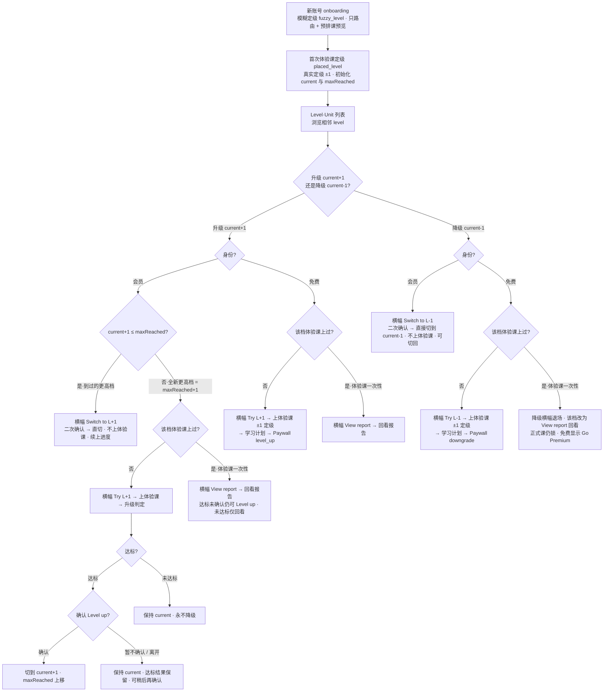
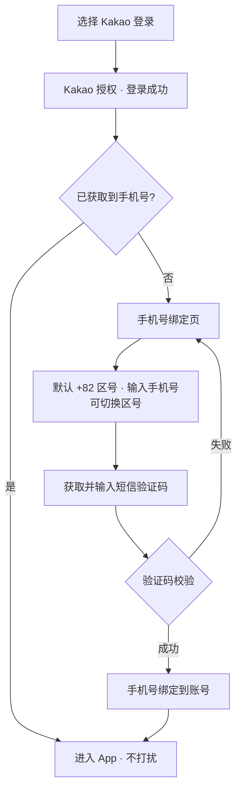

> **版本**：V1.3.1（功能性迭代版）
> **创建日期**：2026-06-28
> **依赖关系**：在 V1.3.0（游戏化激励体系 + 功能性迭代）之上叠加，复用其主流程、游戏化、经济与奖励、Explore / Play、解锁与学习计划链路；本期仅新增 / 修改下述 7 项
> **交互 Demo**：[V1.3.1 UI Demo](https://cyanlee888.github.io/cyan/dino-english/V1.3.1-ui-demo.html)

---

## 前言

V1.3.1 是一次聚焦的功能性迭代，在 V1.3.0 之上做 7 件事：

1. **支付页改竖屏** P0：Paywall 由横屏双栏改为竖屏单栏沉浸式页面，承接 onboarding / 报告等竖屏链路，减少横竖切换、提升转化。
2. **Class 首页「本周上完」探索引导** P1：用户上完本周解锁的课程后，在课程卡之后展示一张引导卡，把空窗期导向 Explore / Play。
3. **课程升降级（定级安全阀）** P0：在「自评模糊定级 + 体验课正式定级」之上，提供长期可用的升 / 降级入口，纠正定级偏差；尤其支撑免费偏高用户下探到合适 level 的体验课、拿到右档报告后转化。
4. **背包手办 IP / 系列分层** P1：背包「手办」Tab 下按 IP（Dino 及「恐龙一家」不同角色）→ 系列 → 具体手办分层展示。
5. **Kakao 登录手机号绑定** P1：Kakao 第三方登录成功后，若未获取到用户手机号，强制进入手机号绑定页（输入手机号 + 短信验证码）完成绑定后再进入 App。
6. **手机号登录去前导 0** P1：手机号登录 / 绑定输入手机号时，默认自动去掉用户输入的首位「0」，再与区号拼接为国际格式提交。
7. **完课后「和 Dino 聊聊」入口** P1：课程完课后，在课程卡上展示一个按钮，引导用户跳转 Dino 沉浸式聊天页，就当前课程 / 学习内容与 Dino 聊一聊；不同入口需向对话工程传入「入口标识」（标识具体方案评审会讨论；对话工程按入口的差异化调整见淑怡后续需求文档）。

本期不改动 V1.3.0 的免费 / 付费权益边界、经济数值与玩法。

---

## 一、版本信息

| 项    | 内容         |
| ---- | ---------- |
| 版本号  | V1.3.1     |
| 创建日期 | 2026-06-28 |
| 审核人  | —          |

---

## 二、变更日志

| 时间         | 版本号    | 变更人 | 主要变更内容 |
| ---------- | ------ | --- | ------ |
| 2026-06-28 | V1.3.1 | 李双  | 新建需求文档 |

---

## 三、文档说明 · 名词解释

| 术语       | 说明                                                                                                             |
| -------- | -------------------------------------------------------------------------------------------------------------- |
| 模糊定级（fuzzy_level） | onboarding 自评产出的档位，**不是真定级**：仅用于①路由到首节体验课、②给一份临时预排课预览。它与 `current` 是**两个独立字段**、互不覆盖——真定级只由体验课报告写入 `current`；产出 `current` 后，`fuzzy_level` 不再参与正式排课。 |
| 体验课定级（placed_level） | 体验课报告按课堂表现产出的**真定级**，写入当前档 `current` 并初始化「已到达最高档」；每次定级只在**当前档 ±1 或持平**内移动。 |
| 已到达最高档（maxReached） | 用户历史到过的最高档：**首次定级、升级达标、自然进阶（学完某档正式课进阶）都会抬高，永不下降**。它是「可直切回」的边界——≤ maxReached 的任一档都可**直切、不重上体验课、续上原进度**；只有踏进 maxReached+1（从没到过的更高档）才需一次体验课校准。 |
| 定级安全阀    | 在模糊定级 + 体验课定级之上长期提供的升 / 降级入口，用于纠正定级偏差、给用户掌控感。核心规则：**目标档 ≤ maxReached → 直切（无体验课、续上进度）；目标档 = maxReached+1 → 一次体验课校准（升 / 维持，永不被拉低）；> maxReached+1 → 锁、逐级上**。横幅出现在所浏览的相邻 level 视图顶部（升在 current+1、降在 current-1）。 |
| IP（手办）   | 手办所属角色，Dino 及「恐龙一家」中爸爸 / 妈妈 / 姐姐 / 弟弟等各为一个独立 IP；出现在背包「手办」Tab。                                                       |
| 系列（手办）   | IP 下的手办主题分组（星座系列 / 甜品系列 / 节日系列等）；出现在背包「手办」Tab。                                                                 |
| Kakao 登录 | 通过 Kakao 第三方账号授权登录；Kakao 授权可能未返回 / 未授权用户手机号。                                                                   |
| 手机号绑定    | 登录后若账号无手机号，强制让用户补绑一个联系手机号（手机号 + 短信验证码）的页面与流程。                                                                  |

---

## 四、需求背景与目标

### 需求 1 · 支付页改竖屏

- **背景**：V1.3.0 起，onboarding、体验课报告、学习计划领取页等转化前置链路均为竖屏；Paywall 仍是横屏双栏，用户在「竖屏报告 → 横屏支付」间被迫旋转设备，打断转化心流；横屏双栏也挤压了年付卡与权益的呈现。
- **目标**：Paywall 与转化链路对齐为竖屏单栏，减少一次横竖切换；单栏从上到下叙事（价值 → 权益 → 价格 → 行动），底部吸顶 CTA 常驻，提高首屏到下单的转化。

### 需求 2 · Class 首页「本周上完」探索引导

- **背景**：会员在 7 天滚动解锁节奏下，常会提前上完本周 3 节，随后进入「无课可上、等下一批解锁」的空窗，缺少明确的下一步。
- **目标**：把空窗期转成探索与练习的增长机会——本周批次全部完成后，在课程卡之后追加一张引导卡，以单一 `Go to Explore` 引导用户去 Explore（Words & Sentences / Listening / Speaking），提升日活与留存。

### 需求 3 · 课程升降级（定级安全阀）

- **背景**：主链路是「自评模糊定级 → 上对应 level 体验课 → 报告按课堂表现产出真实定级 → 排课」，但模糊定级为家长自评、天然不可靠，体验课一次也只能在 current±1 内评估；任何定级都无法对所有用户精准，用户始终有「想试更难 / 太难想退」的诉求。尤其免费用户上不了正式课、体验课是其唯一产品体验，一旦首节体验课偏高太难（中途退出 / 报告吃力），转化即断。
- **目标**：提供长期可用、低门槛的升 / 降级「安全阀」，纠正定级偏差、给用户掌控感；重点支撑免费偏高用户下探到合适 level、拿到**合适档位的体验课报告**后在「刚好合适」的计划上转化。

### 需求 4 · 背包手办 IP / 系列分层

- **背景**：手办（Dino Figures）原为单一扁平集合。后续手办会扩展为**多 IP**（Dino 本体，以及「恐龙一家」中爸爸 / 妈妈 / 姐姐 / 弟弟等不同角色，每个角色即一个独立 IP），且每个 IP 下还会有**多个系列**（星座系列、甜品系列、节日系列等）。原扁平列表无法承载「角色 × 系列」的二维增长，手办越多越难找、收集目标也不清晰。
- **目标**：在背包「手办」Tab 下建立清晰的三层结构——**IP 子 Tab → 系列名分组 → 具体手办**，让用户按角色与系列浏览、收集手办；系列内以**置灰态**展示未获得手办（照常显示名称与形象，作为可见的收集目标）、显示每个系列的**收集进度（已获得 / 总数）**，并在系列集齐时给出**成就反馈**，强化收集目标与动机；为后续手办扩量与系列化运营打基础。

### 需求 5 · Kakao 登录手机号绑定

- **背景**：Kakao 第三方登录的账号常常未授权 / 未返回手机号；而手机号是后续找回账号、客服触达、营销触达与账号安全（验证身份）的关键联系方式。缺手机号会导致后续服务与触达断档。
- **目标**：在 Kakao 登录成功后，先判断账号是否已获取到手机号；**未获取到则强制进入手机号绑定页与流程**（手机号 + 短信验证码校验），绑定成功后再进入 App；已获取到则直接进入，不打扰。

### 需求 6 · 手机号登录去前导 0

- **背景**：韩国等地本地手机号习惯带前导 0（如 `010-1234-5678`），但拼接国际区号（+82）提交时前导 0 需去掉，否则号码非法、验证码发送失败。用户往往按本地习惯连 0 一起输入。
- **目标**：手机号输入（手机号登录、Kakao 手机号绑定）时，默认自动去掉用户输入手机号的**首位 0**，再与所选区号拼接为国际格式提交，降低因格式导致的发码 / 登录失败。本期仅逻辑层处理，无独立 UI 改动。

### 需求 7 · 完课后「和 Dino 聊聊」入口

- **背景**：课程完课是学习动机与成就感最高的时刻，但当前完课后缺少「把刚学的内容用起来、和 Dino 开口练」的顺畅出口；同时 Dino 沉浸式聊天来自多个入口，对话工程需要知道用户「从哪个场景进来、刚学了什么」才能给出更贴合的开场与引导。
- **目标**：在正式课程完课后于课程卡上提供一个「和 Dino 聊聊」按钮，一键跳转 Dino 沉浸式聊天页，就当前课程 / 学习内容展开对话，提升开口率与粘性；并向对话工程传入**入口标识**（当前为完课课卡），为后续多入口的差异化调整预留扩展。
- **说明**：入口标识的具体方案（字段与取值）**评审会讨论**；对话工程根据不同入口进行的调整**详见淑怡后续需求文档**，本文档不展开对话工程侧逻辑。

---

## 五、版本范围

| 项    | 说明                                                                                                                                                                                      |
| ---- | --------------------------------------------------------------------------------------------------------------------------------------------------------------------------------------- |
| 版本定位 | V1.3.0 之上的聚焦功能性迭代版：补齐转化体验（竖屏支付 / 空窗引导）、定级安全阀、账号触达与手办分层。                                                                                                                                 |
| 基线依赖 | 复用 V1.3.0 的主流程、游戏化激励、经济与奖励、Explore / Play、解锁与学习计划、登录与支付链路；权益边界与经济数值沿用不变。                                                                                                                |
| 本期页面 | Paywall（竖屏改版）、Class 首页（探索引导卡、完课后「和 Dino 聊聊」入口）、账号 / 登录（Kakao 登录手机号绑定页、手机号输入去前导 0）、Level·Unit 列表（相邻 level 升 / 降横幅、免费偏高下探、升级判定报告）、背包 · 手办 Tab（IP / 系列分层）、Dino 沉浸式聊天页（承接完课入口）。 |
| 核心能力 | • 竖屏单栏 Paywall • 本周批次上完探索引导 • 升降级定级安全阀（免费采样定级 / 会员升要证明·降直切） • 背包手办 IP / 系列分层 • Kakao 登录后手机号缺失强制绑定 • 手机号登录 / 绑定输入去前导 0 • 完课后课卡「和 Dino 聊聊」入口（带入口标识给对话工程）                                  |

---

## 六、关键流程

### 6.1 定级与升降级总流程（onboarding 模糊定级 → 体验课定级 → 列表内长期升降级）

> **起点 onboarding → 定级 → 列表内升降级**：新账号自评模糊定级（`fuzzy_level`，非真定级、只决定首次体验课 level 并先按此预排课预览）→ 首次体验课定级（`placed_level`，报告产出真实定级、校正排课，初始化 `current` 与 `maxReached`）→ 进入 Level·Unit 列表，浏览相邻 level 决定升还是降，再走对应流程。升 / 降可**反复发生**（各分支结束后都回到列表；「先升再降」「先降再切回」由此自然覆盖）；`maxReached` 只升不降（含自然进阶），作为可直接切回的最高档。
>
> 横幅状态取决于两件事：**① 身份（会员 / 免费）；② 该相邻档体验课是否上过（体验课一次性）**。会员切回已验证档、会员降级均为**直切、不走体验课**；需体验课的路径若该档**已上过**，横幅按钮变 `View report` 回看已有报告（会员达标但未确认的，回看报告里仍可 `Level up my plan` 完成升级）。

### 6.2 Kakao 登录 → 手机号绑定

---

## 七、页面与模块需求

> **先看 Demo，再看细则**：[V1.3.1 交互 Demo（点击预览）](https://cyanlee888.github.io/cyan/dino-english/V1.3.1-ui-demo.html)
> 建议相关同学先打开上方 Demo 走一遍完整链路（升 / 降级、体验课定级、Paywall、Kakao 绑定等），再对照下文逐项查看各页面 / 模块的详细需求。

### 1. Paywall（竖屏改版）

#### 1.1 竖屏单栏支付页

##### 展示内容

- 顶部：`Back`（关闭）+ `Restore`
- Hero 卡（从上到下）：
  - 顶部：`Dino Premium` 徽标 + 标题 `Unlock everything in Dino English`（标题下无副文案）
  - 标题下一行：**Dino 形象（左）＋ 信任背书条（右）**，背书条绿底强视觉、紧贴 Dino 右侧：
    - 徽标：`13 Years of Proven Trust`
    - 副文案：`Backed by over a decade of refinement and trusted by 1.8M families worldwide.`
  - 全宽精简权益清单（带勾、单列、每条一句）：
    - `All 864 core lessons unlocked`
    - `Personalized learning path · 3 lessons/week`
    - `Report after every lesson`
    - `All extension resources unlocked`
    - `Full rewards & gamified learning`
    - `Chat freely with Dino`
- 三档商品卡**竖向堆叠排列**（上→下 Yearly / Monthly / Weekly）：默认选中 Yearly（选中态高亮）；每张卡展示——计划名、**真实价格 + 计费周期**（如 `$59.99 / year`，**作为主视觉**，与 App Store 实际扣费口径一致）、**灰色划掉的原价**（灰色弱化；公式 = 真实价格 × X，X 为**全局统一**的倍数系数、**暂定 X = 1.4**，约「原价七折」力度；用乘数而非固定加数、便于跨币种统一，不按地区 / 活动分别配）、折算后的 `~ /day`（**小字辅助行**，置于真实价格下方仅作参考，**不作主视觉**）；年卡（Yearly）顶部加角标 `Recommended`
- 底部吸顶 `Subscribe now`
- 协议行：`Cancel anytime · Terms · Privacy`
- 异常态：无网络 `Check your connection and try again`

##### 交互操作

- 出现场景：任意 `trigger_source` 拉起 Paywall
- 进入即以竖屏呈现；横屏来源（会员中心 / 锁课）先切竖屏，关闭 / 完成后回来源页（横屏来源回横屏）
- 点商品卡 → 切换选中态（边框 + 底色高亮）
- `Subscribe now` → 走 V1.3.0 支付链路；成功回来源页 + toast；支付取消静默返回不报错；校验失败留页提示
- `Restore` → 恢复购买
- 边界：**强制竖屏**；商品 / 计费 / `trigger_source` 归因沿用 V1.3.0，仅版式变化

##### 数据 · 接口

- 接口：商品 / 订阅 / Restore（沿用 V1.3.0）；`trigger_source` 归因沿用

### 2. Class 首页

#### 2.1 本周上完探索引导卡

##### 展示内容

- 追加于课程卡（含体验课卡）之后，采用区别于课程卡的轻量样式（浅色虚线卡 + 居中祝贺文案，不复用课程卡卡面）
- 祝贺标题：`All caught up this week, {name}!`（`{name}` = 孩子昵称）
- 副文案：`Next lessons unlock soon — explore more while you wait.`
- 单按钮：`Go to Explore`（单一引导）

##### 交互操作

- 出现场景：本周解锁批次课程**全部 Completed 且下一批未解锁**（7 天节流空窗）时展示；有未完成课程时不展示
- 点 `Go to Explore` → 切 Explore Tab
- 边界：与 V1.3.0 结业完成态卡**互斥**（结业态走结业卡）

##### 数据 · 接口

- 接口：本周排课 / 完成进度（沿用 V1.3.0）

#### 2.2 完课后课卡「和 Dino 聊聊」入口

##### 展示内容

- 课程完课后，在该课程卡面上展示一个按钮 `Chat with Dino`（纯文字、不带 emoji），引导用户就当前课程 / 学习内容与 Dino 对话
- 仅**正式课**完课（Completed）状态的课卡展示该按钮；未完成的课卡不展示
- 入口只在完课课卡上，与 `Chat freely with Dino` 会员权益一致（只有会员能上正式课、产生完课课卡）；体验课报告页**不加**该入口，避免与「和 Dino 自由聊」的会员权益冲突、也不干扰体验课→转化的主 CTA

##### 交互操作

- 出现场景：正式课程卡进入完课（Completed）状态后
- 点击 → 跳转 Dino **沉浸式聊天页**，进入与当前课程 / 学习内容相关的对话
- **入口标识**：跳转时向对话工程传入「入口标识」以区分来源（`class_card` = 完课后课卡）；标识的具体字段与取值方案**评审会讨论**，后续新增入口时扩展枚举
- 对话工程根据不同入口进行的差异化调整（开场、引导、内容侧重等）**详见淑怡后续需求文档**，本文档不展开

##### 数据 · 接口

- 接口：Dino 沉浸式聊天页（沿用现有）；跳转参数携带入口标识（字段待评审）+ 课程上下文（level / unit / lesson）
- 完课状态：沿用 V1.3.0 课程完成进度

### 3. 登录注册页面

#### 3.1 Kakao 登录手机号绑定

##### 展示内容

- 登录方式沿用现有「Kakao 登录」入口（不新增 UI）
- 手机号绑定页（竖屏 takeover，参考 Figma 4867:18878）：
  - 标题 `Please add a contact phone number` + 副文案 `We will send an SMS verification code to your phone number to verify your identity.`
  - 已登录提示行：`Your Kakao account has been logged in`
  - 手机号输入：区号 + 手机号输入框——区号**默认预选韩国 +82**（Kakao 用户以韩国为主），用户无需主动选择即可直接输入本地手机号；如需其他国家可点开区号自行切换
  - 短信验证码：输入框 + `Get code`（发送后倒计时）
  - 底部 `Log in` + 说明 `A verification code will be sent to your phone via SMS`

##### 交互操作

- 流程：Kakao 授权登录成功 → **判断账号是否已获取到手机号**
  - 已获取 → 直接进入 App，不展示绑定页
  - 未获取 → 进入手机号绑定页（**强制步骤**，绑定成功前不进入 App）
- 绑定页：输入手机号后 `Get code` 可点 → 发送短信验证码并倒计时；输入手机号 + 验证码后 `Log in` 可点 → 校验验证码
  - 校验成功 → 手机号绑定到账号 → 进入 App
  - 校验失败 → 留页提示重试
- 边界：手机号绑定为强制步骤，无跳过；区号支持多国；验证码有发送频控（60s 倒计时再发）

##### 数据 · 接口

- 接口：Kakao 登录回调（返回是否含手机号）；发送短信验证码；手机号 + 验证码绑定（新增）；字段 `phone`、`country_code`、`phone_bound`

#### 3.2 手机号登录去前导 0

##### 展示内容

- 无独立 UI（输入框形态不变）
- 手机号输入框在提交 / 发码前，默认对用户输入做标准化：**自动去掉首位「0」**

##### 交互操作

- 适用场景：手机号登录、Kakao 手机号绑定等所有「区号 + 手机号」输入
- 规则：取用户输入手机号，若首位为 `0` 则去掉该前导 0（仅去首位一个 0），再与所选区号拼成国际格式提交
- 韩国等本地号码习惯带前导 0（如 `010-1234-5678` → `10-1234-5678`）
- 边界：仅本期逻辑层处理，不改输入框 UI；不影响区号选择；已是国际格式（无前导 0）的输入不变

##### 数据 · 接口

- 接口：沿用现有手机号登录 / 绑定接口，提交前做号码标准化（前端 + 后端双侧兜底）

### 4. 首次体验课定级（沿用 V1.3.0 · 仅作升降级锚点）

> 首次体验课报告与定级是 V1.3.0 既有能力，本期**不改动**；此处仅作为「升降级（需求 3）」自洽所需的**定级锚点**简述，不重复展开 V1.3.0 细则（报告版式、老师点评、发音检查、CTA `Get study plan` / `Continue` 等均沿用 V1.3.0）。

- **模糊定级即先排课**：onboarding 自评模糊定级后，系统**先按模糊 level 预排课并展示在 Class 首页**（用户未上体验课时看到的就是这份预排课）；模糊定级同时**决定上哪个 level 的体验课**
- **体验课报告校正定级**：报告按孩子课堂表现产出**真实定级**（落在所上体验课 level ±1，可能 ≠ 模糊定级、可低可高），据此**校正 / 确认排课**——首次定级**自动采用**（无需手动确认）
- 手动确认（`Level up my plan` / `Keep my current plan`）**只用于会员后续的升级判定**（详见「6.1 升级横幅」）

### 5. 升降级

#### 5.1 升降级总则与口径

##### 展示内容

- 本节为升降级**规则总则**，无独立界面；各方向的横幅与交互见 §6.1（升级横幅）、§6.2（降级横幅），完整状态枚举见文末**附录 · 升降级横幅穷举表**。

##### 交互操作（总则）

- **两个定级字段**：`fuzzy_level`（onboarding 自评）**不是真定级**、**不写 `current`**，只路由首节体验课 + 给临时预排课预览；只有体验课报告写入 `current`，首次定级同时初始化 `current` 与 `maxReached`。
- **身份分口径**：**会员**有正在真实学习的 `current` 需保护（升要证明、降靠自己、永不被体验课拉低）；**免费**上不了正式课、无排课可保护，任何方向都是统一的「采样定级」。
- **统一内核**（以 `maxReached` 为界）：目标档 **≤ maxReached** → 直切、免体验课、**从首个未上正式课续上**（正式课一次性，无需额外进度快照；从没学过的档即 Unit 1 · Lesson 1）；目标档 **= maxReached+1** → 一次体验课校准（**升 / 维持，永不下拉**）；**> maxReached+1** → 锁、一次只上一级。
- **设计约束**：体验课**永不触发系统自动降级**；会员所有改级**均由用户手动确认**（避免来回横跳）。
- **免费转会员落位**：订阅成功后 `current = maxReached = 转化时所领学习计划那档`（以所领计划为准起步，覆盖免费期采样漂移）。

##### 会员改级二次确认弹窗（切排课时机提示）

> 会员的**直接切档**（降级 `Switch to {L-1}` / 切回已验证档 `Switch to {L+1}` / 升级达标 `Level up my plan`）在确认前统一弹**二次确认弹窗**，明确告知新 level 的**排课时机**——依据「**本周已完成课程数**」判断本周是否还有解锁额度（每周 3 节，`WEEK_LESSONS=3`）。免费用户走「体验课 → Paywall」链路、无此排课承诺，不弹此窗。

- 标题：`Switch your plan to {L}?`
- 正文（按本周完成数分两种）：
  - **本周仍有剩余额度**（已完成 < 3 节）：`You've done {done} of this week's 3 lessons — we'll schedule your {L} lesson(s) right away ({remaining} left this week).`（新 level 本周即可上剩余 `remaining` 节）
  - **本周 3 节已上满**：`You've finished this week's 3 lessons — your {L} plan starts next week.`（新 level 计划下周开始）
- 按钮：`Cancel`（关闭不切） / `Confirm`（确认后执行切档，**从该 level 首个未上正式课续上**；从没学过的档即 Unit 1 · Lesson 1）
- 规则：**周额度不因切档刷新**（`weekDoneCount` 沿用，切档不重置本周已上数、不额外补发额度），避免用户靠反复切档刷新解锁额度

##### 数据 · 接口

- 接口：当前定级 / 排课更新（沿用 V1.3.0 + 本期扩展）；`week_done_count`（本周已完成课程数）用于二次确认的排课时机判断

### 6. Level·Unit 列表（Learning Path）

> **已到达最高档（maxReached）** = 用户历史到过的最高 Level，取 `max(首次定级、升级达标、自然进阶到过的最高 current)`——**自然进阶（学完某档正式课进阶）也会抬高它**、只升不降。降级 / 下探只移动当前 Level，maxReached 不下移，作为向上「可切回、无需重考」的天花板：**目标档 ≤ maxReached → 直切、续上进度（不重上体验课）；目标档 = maxReached+1（从没到过的更高档）→ 一次体验课校准（升 / 维持）**。

#### 6.1 升级横幅（current+1 视图）

浏览 current+1 level 时，其单元列表**顶部**展示绿色升级横幅（该 level 各单元均锁，横幅是唯一入口）。分会员 / 免费：

##### 会员

- **切回已到达过的更高档**（current+1 ≤ maxReached，即之前下探过、现在切回）：主文案 `Ready to go back up?` + 副文案 `Switch your study plan back to {L+1}.`，按钮 `Switch to {L+1}` → 二次确认（排课时机提示见 5.1）后**直接切排课、不上体验课、不重新定级、从该档首个未上正式课续上**，maxReached 不变
- **升到更高的新档**（current+1 = maxReached+1，从没到过的更高档）：主文案 `Ready for the next level?` + 副文案 `Try a trial lesson — we'll set your study plan based on how you do.`，按钮 `Try {L+1}` → 上一节 current+1 体验课，出**升级判定报告**「够不够上 current+1」：
  - **达标** → 报告标题 `{name} is ready to level up!`，并列 `Level up my plan`（切排课到 current+1，点后弹二次确认排课时机弹窗，见 5.1）+ `Keep my current plan`，手动确认
  - **未达标** → 报告标题 `Not quite ready for {L+1} yet`，**仅** `Keep my current plan`，**保持 current、永不降级**（一节更难的课不否定已坐实的 current；想降级走降级横幅）
- **达标但暂不确认**：用户达标后没点 `Level up my plan`（直接离开）→ **保持 current、不自动升级**，达标结果保留；下次该横幅按钮为 `View report`，回看报告里**仍可 `Level up my plan` 完成升级**（升级动作可延后、始终由用户手动确认）
- 体验课一次性：上过后按钮变 `View report`（回看该次定级报告，不可重测）

##### 免费

- 一律：主文案 `Ready for the next level?` + 副文案同上，按钮 `Try {L+1}` → 上一节 current+1 体验课定级 → 体验课报告 → 学习计划领取页 → Paywall（`trigger_source=level_up`）
- 体验课一次性：上过后按钮变 `View report`

##### `View report` 回看（横幅上过体验课后统一口径）

- 进入：该 level 的**体验课 / 定级报告页**（竖屏 takeover，沿用 V1.3.0 报告版式），不重新上课、不重新判定
- 底部按钮按状态：
  - **会员·达标未确认**：`Level up my plan`（确认后切到 current+1）+ `Keep my current plan`（关闭返回列表）
  - **会员·未达标**：仅 `Keep my current plan`（关闭返回列表，保持 current）
  - **免费**：`Get study plan` → 学习计划领取页 → Paywall（`trigger_source=level_up`）

##### 数据 · 接口

- 接口：当前定级 / 排课更新（沿用 V1.3.0 + 本期扩展）

#### 6.2 降级横幅（current-1 视图）

浏览 current-1 level 时，其单元列表**顶部**展示橙色降级横幅，主文案统一 `Feeling too hard?`；副文案按身份区分（会员有排课、免费无排课）。分会员 / 免费：

##### 会员

- 副文案 `Switch your study plan to {L-1}.`，按钮 `Switch to {L-1}` → 二次确认（排课时机提示见 5.1）后**直接切排课到 current-1、不上体验课、不重新定级、从该档首个未上正式课续上**；**maxReached 不变**，之后想回更高档走升级横幅的「切回」

##### 免费

- 副文案 `Try the {L-1} lesson — see if it fits better.`（免费无正在跑的排课，**不用「Switch your study plan」**），按钮 `Try {L-1}` → 上一节 current-1（更简单）体验课 → 体验课报告按所上 level **±1** 真实定级 → 学习计划领取页 → Paywall（`trigger_source=downgrade`）；可**逐档下探直到舒适**
- **偏高体验课的额外下探入口**：免费用户首节体验课偏高时，除降级横幅外，在**体验课中途退出处**与**报告吃力处**也提供 `Try an easier lesson`（current-1）入口，走同一条「更简单体验课 → 更合适档位的报告 → 领取页 → Paywall」链路
- 体验课一次性：该更低档上过后 → **降级横幅消失（该横幅不再展示，非换文案）**；该档改为回看入口 `View report`（回看已有报告），正式课仍锁、显示 `Go Premium`（两者位置不同、不是二选一）

##### 横幅消失与规则（会员 / 免费均适用）

- **「退场」= 该横幅整条消失、不再展示**（不是换一句文案）；对应 level 视图回落到普通锁态 / 回看入口。
- 当 current 已**自然进阶到 maxReached 之上**时，current-1 属已学复习档（无更简单的未学内容可退），降级横幅消失（走普通锁态 / 回看）。
- 一次一档：只处理相邻的 current→current-1。

##### 数据 · 接口

- 接口：当前定级 / 排课更新

#### 6.3 Unit 入口锁态与极简展示（当前 / 非当前 level）

##### 展示内容

- **级别标签（Level tab）**：三态——`You are here`（current）/ `Completed`（已学完并自然进阶过的更低档）/ `Locked`（其余：更高未解锁档，以及定级时跳过、从没学过的更低隔级档）。不引入 `Recommended`；升 / 降引导仍由 current±1 顶部横幅承担。注：`Completed` 只标在**级别卡**上，点进该更低档后其 Unit 仍走下方「非当前 level」的极简锁态（内容按周迭代、过去不复看）。
- **当前 level**：已到达的 Unit 显示 `View lessons` 可进入 + 进度条（当前 Unit `In progress`）；本 level 内**尚未到达**的 Unit → 免费 `Go Premium` / 会员 `Opens soon`（按周节奏顺序解锁，与课程卡「Opens soon」一致）
- **非当前 level（无论更高还是更低）**：该 level 下**所有 Unit 入口统一为锁**（免费 `Go Premium` / 会员 `Locked`），且**不显示** `View lessons`**、不显示进度条、不显示 Completed / Skipped 标签**（极简，只有 Unit 名 + 锁按钮）

##### 交互操作

- **免费**点 `Go Premium` → Paywall（`trigger_source=lock_lesson`）
- **会员**点当前 level 的 `Opens soon`（单元级）→ toast `This unit isn't open yet`（Level·Unit 列表是**单元**粒度，用单元文案；Class 首页课程卡列表的 lesson 级点击沿用 V1.3.0 `This lesson isn't open yet`，两处不混用）
- **会员**点非当前 level 的 `Locked` → toast `Change level from the next level up or down — one level at a time`（升 / 降横幅只在相邻 level 顶部、一次一档；非相邻的更高 / 更低档无横幅，逐级切过去）
- 跨 level 的升 / 降**只**走相邻 level 顶部的升 / 降横幅，不从 Unit 入口进入；跨 level 报告回看由横幅 `View report` 承担
- **部分完成后升级的边界（仅展示极简）**：会员在某 level 只上了一部分就升级进阶走（如 L3 上到一半升 L4），该 level 转为非当前 level → **展示上统一显示** `Locked`**、不标 Completed、不显示进度条**（列表极简、不谎报整级完成）；但这仅是**展示**取舍，**进度数据不丢**（见下条）
- **进度续上（正式课一次性天然保住）**：正式课每节只能上一次、系统记录每节是否已上；因此切档 / 回切到某 level 时，**从该 level 首个未上正式课续上**（已上过的不重复），而**不是**回 Unit 1 · Lesson 1 重来——从没学过的档才从 Unit 1 · Lesson 1 起步。此为本期明确口径（与「正式课只能上一次」自洽）
- **内容按周迭代**：正式内容首发仅第一个 Unit，其后每周迭代一个 Unit；更低 level 多数 Unit 暂无内容，故一律不提供 `View lessons`（与「非当前 level 统一锁」一致）
- 进入到的（当前 level）Unit 内，Lesson 卡片沿用 V1.3.0 各态

##### 数据 · 接口

- 接口：当前定级 / 排课更新（沿用 V1.3.0）

### 7. 背包 · 手办 Tab

#### 7.1 手办 IP / 系列分层

##### 展示内容

- 顶部 IP 子 Tab 行：IP emoji + 名称 + **收集进度** `已获得 / 总数`；展示全部有手办配置的 IP，按固定顺序 Dino → Emma（姐姐）→ Bob（弟弟）→ Hena（妈妈）→ Bruce（爸爸）
- 选中 IP 下按**系列名分组**（展示该 IP 下全部系列）：系列标题 + **收集进度** `已获得 / 总数` + 该系列手办卡片
- 卡片按获得状态分两态：
  - **已获得**：手办图（全彩）+ 名称 + `Collected`，重复获得沿用 `×N` 计数
  - **未获得**：**同一手办图置灰**（grayscale + 降透明）+ 名称 + `Not yet`，照常展示手办名称与形象，作为**明确的收集目标**呈现、不可点（收集类内容需看到「还差哪些」才有收集动机）
- **系列集齐成就**：当某系列全部手办均已获得时，用成就标签 `✨ Series complete` **直接替换该系列的收集进度**（占进度原位、不在标题另加徽标）
- 空态：无任何已获得手办时展示原空态（去玩盲盒）

##### 交互操作

- 出现场景：背包切到「手办」Tab
- 默认选中第一个 IP
- 点 IP 子 Tab → 切换并重渲染该 IP 的系列分组与收集进度
- 设计约束：手办仍为**纯收集**（无选中 / 无佩戴）；未获得以**置灰态**展示（照常显示名称与形象、不可点），用于呈现收集目标与进度；系列集齐时给出成就反馈

##### 数据 · 接口

- 数据：手办新增 `ip`、`series` 字段；IP / 系列配置（label、emoji、order，含**系列内手办总数**用于进度与集齐判定）；用户已获得手办及计数（沿用 V1.3.0）

---

## 八、埋点

> 遵循 Dino English 埋点规范（`dino-english-analytics-tracking.mdc`）：三类事件（`screen_view` / `ui_click` / `business_result`）、`event_id` 全局唯一、`snake_case`、优先复用已有字段与枚举。本期新增 1 个页面浏览（`phone_bind` 手机号绑定页）；其余复用 `paywall`、`class_home`、`learning_path`、`trial_report` 等。

### 新增页面浏览（`screen_view`）

| 上线版本   | 更新日期       | 页面 / 模块 | event_id     | 触发时机                     | 其他属性及参数              |
| ------ | ---------- | ------- | ------------ | ------------------------ | -------------------- |
| V1.3.1 | 2026-06-28 | 手机号绑定页  | `phone_bind` | Kakao 登录后未获取到手机号，进入绑定页曝光 | `login_method`：kakao |

### 新增点击交互（`ui_click`）

| 上线版本   | 更新日期       | 页面 / 模块              | event_id                 | 触发时机                                           | 其他属性及参数                                                                |
| ------ | ---------- | -------------------- | ------------------------ | ---------------------------------------------- | ---------------------------------------------------------------------- |
| V1.3.1 | 2026-06-28 | Class 首页探索引导卡        | `class_explore_nudge`    | 点击本周上完后的引导卡按钮                                  | `target`：explore（单按钮 `Go to Explore`）                                  |
| V1.3.1 | 2026-06-28 | Level·Unit 列表升 / 降横幅 | `learning_path_step`     | 点击相邻 level 顶部的升级 / 降级横幅按钮                      | `direction`（up、down）、`method`（direct=直切 / trial=需体验课校准）、`from_level`、`to_level`、`user_type`（free、premium） |
| V1.3.1 | 2026-06-28 | 体验课偏高下探入口            | `trial_try_easier`       | 中途退出 / 报告吃力处点击「试更简单」                           | `from_level`、`to_level`、`entry`（quit、report）                           |
| V1.3.1 | 2026-06-28 | 背包手办 IP 子 Tab        | `backpack_figure_ip_tab` | 在手办 Tab 切换 IP 子 Tab                            | `ip`（dino、emma、bob、hena、bruce…）                                        |
| V1.3.1 | 2026-06-28 | 手机号绑定页               | `phone_bind_get_code`    | 绑定页点击 `Get code` 发送验证码                         | `country_code`                                                         |
| V1.3.1 | 2026-06-28 | 「和 Dino 聊聊」入口        | `chat_dino_enter`        | 完课课卡点击 `Chat with Dino` 跳转 Dino 沉浸式聊天页 | `chat_entry_source`（`class_card`）、`level`、`lesson_id`   |

### 新增业务结果（`business_result`，必带 `result`）

| 上线版本   | 更新日期       | 页面 / 模块 | event_id              | 触发时机              | 其他属性及参数                                                                                                      |
| ------ | ---------- | ------- | --------------------- | ----------------- | ------------------------------------------------------------------------------------------------------------ |
| V1.3.1 | 2026-06-28 | 升降级     | `level_change_result` | 完成一次升级 / 降级切换，**或会员上更高档体验课后判定「维持」（未切换）** | `result`：success、cancel、**hold**；`direction`：up、down；`method`：member_direct、trial；`from_level`、`to_level`、`user_type` |
| V1.3.1 | 2026-06-28 | 手机号绑定   | `phone_bind_result`   | 绑定页提交手机号 + 验证码的结果 | `result`：success、fail、cancel；`description`：code_invalid、code_expired（fail 时）                                 |

### 复用 / 扩展枚举

- `purchase_result.trigger_source` 扩展枚举：新增 `downgrade`（免费降级走体验课报告后进入 Paywall 的归因）；`level_up` 沿用。
- 复用既有 `paywall` 曝光与点击事件；Paywall 为竖屏单版式，无需 `layout` 区分参数。
- Kakao 登录沿用现有第三方登录入口，不扩展受约束的 `login_result.method`（仍 apple、google）；是否需绑定通过 `phone_bind` 曝光体现，并以 `login_method`（kakao）作为低基数来源参数；手机号绑定结果单独建 `phone_bind_result`，失败短码枚举：`code_invalid`、`code_expired`。
- Dino 聊天入口新增低基数参数 `chat_entry_source`（入口标识，用于区分不同来源，当前枚举仅 `class_card`=完课后课卡）：既随 `chat_dino_enter` 上报，也作为跳转参数传给对话工程；后续新增入口时**扩展枚举待评审**（对话工程侧调整见淑怡后续需求文档）。
- `level_change_result` 的「`direction=up` + `method=member_direct`」= 会员**下探后切回已到达过的更高档**（≤ maxReached，不上体验课的直接切档）；`method=trial` 表示需体验课定级的升级判定；`result=hold`（仅 `method=trial`）= 会员上更高档体验课**判定维持、未切换**（保持 current），用于量化「试更高档→没升成」这一关键漏斗节点，避免该结果无事件承载。
- **免费转会员落位**（无独立事件）：免费用户 `purchase_result{result=success}` 后，`current = maxReached = 转化时所领学习计划那档`；后续按此起步。
- 注册为维度的低基数字段：`target`、`direction`、`method`、`result`、`user_type`、`entry`、`trigger_source`、`layout`、`ip`、`login_method`、`chat_entry_source`；`from_level` / `to_level` 为 level 维度（低基数，可注册）。`series`、`country_code` 视基数决定是否注册。

---

## 附录 · 升降级横幅穷举表（研发验收基准）

> 状态位仅 `current` 与 `maxReached`（详见 §3、§6 引言）；下表为「浏览某 level 视图时横幅形态 → 按钮 → 去向 → 埋点」的唯一权威口径，§6.1 / §6.2 为其展开说明。

**表 A · 会员**（浏览的 level ≠ current）

| # | 浏览的 level（相对 current / maxReached） | 该档体验课 | 横幅主 / 副文案 | 按钮 | 点击去向 | 埋点 |
| --- | --- | --- | --- | --- | --- | --- |
| M0 | = current | — | `You are here`（无横幅） | — | — | `learning_path` 曝光 |
| M1 | L = current−1（更低档，必 ≤ maxReached） | 不涉及 | `Feeling too hard?` / `Switch your study plan to {L}.` | `Switch to {L}` | 二次确认(排课时机) → 直切 L、**从 L 首个未上正式课续上** | `learning_path_step`{direction=down, method=direct} → 确认后 `level_change_result`{result, direction=down, method=member_direct} |
| M2 | current < L ≤ maxReached（回到之前下探过的更高档） | 不涉及 | `Ready to go back up?` / `Switch your study plan back to {L}.` | `Switch to {L}` | 二次确认 → 直切 L、续上进度；maxReached 不变 | `learning_path_step`{direction=up, method=direct} → `level_change_result`{direction=up, method=member_direct} |
| M3 | = maxReached+1（全新更高档） | 未上过 | `Ready for the next level?` / `Try a trial lesson — we'll set your study plan based on how you do.` | `Try {L}` | 上体验课 → 校准：**升** → 报告 `Level up my plan`(+`Keep`)；**维持** → 仅 `Keep` | `learning_path_step`{direction=up, method=trial}；`trial_report` 曝光 |
| M4 | = maxReached+1 | 已上过·**升(达标未确认)** | `You're ready for {L}!` / 报告可延后确认 | `View report` → `Level up my plan` + `Keep` | `Level up my plan` → 二次确认 → 切 L、maxReached=L | `level_change_result`{result=success/cancel, direction=up, method=trial} |
| M5 | = maxReached+1 | 已上过·**维持(不够)** | `You've already tried {L}` / 回看报告 | `View report` → 仅 `Keep` | 保持 current（想上更高档靠自然进阶）、**永不被拉低** | 完成判定无切换 → `level_change_result`{result=hold, direction=up, method=trial} |
| M6 | > maxReached+1（高 2 级以上） | — | 无横幅、Unit 全 `Locked` | 点 Unit → toast | `Change level from the next level up or down — one level at a time` | — |
| M7 | current=L1 无更低 / current=maxReached=L6 无更高 | — | 该方向无横幅 | — | — | — |

**表 B · 免费**（无正式排课；`current`/`maxReached` 仅决定预排课预览与体验课路由）

| # | 浏览的 level | 该档体验课 | 横幅主 / 副文案 | 按钮 | 点击去向 | 埋点 |
| --- | --- | --- | --- | --- | --- | --- |
| F0 | = current | — | `You are here`（无横幅） | — | — | `learning_path` 曝光 |
| F1 | = current+1 | 未上过 | `Ready for the next level?` / 同 M3 副文案 | `Try {L}` | 体验课 → ±1 定级(移动指针) → 学习计划领取页 → Paywall | `learning_path_step`{direction=up}; `trial_report`; `purchase_result`{trigger_source=level_up} |
| F2 | = current−1 | 未上过 | `Feeling too hard?` / `Try the {L} lesson — see if it fits better.` | `Try {L}` | 体验课 → ±1 定级 → 领取页 → Paywall | `learning_path_step`{direction=down}; `trial_report`; `purchase_result`{trigger_source=downgrade} |
| F3 | 任意档 | 已上过 | `View report`（回看该档报告） | `Get study plan` | 报告 → 领取页 → Paywall | `trial_report` 曝光; `purchase_result`{trigger_source=level_up/downgrade} |
| F4 | 非相邻且未上过（隔级） | 未上过 | Unit 全锁 | `Go Premium` | Paywall | `purchase_result`{trigger_source=lock_lesson} |
| F5 | 首节体验课偏高（中途退出 / 报告吃力处） | — | 额外下探入口 | `Try an easier lesson`（=current−1） | 同 F2 链路 | `trial_try_easier`{from/to, entry=quit/report} |
| F6 | — 转会员 — | — | — | — | `current=maxReached=所领计划档` | `purchase_result`{result=success} |

