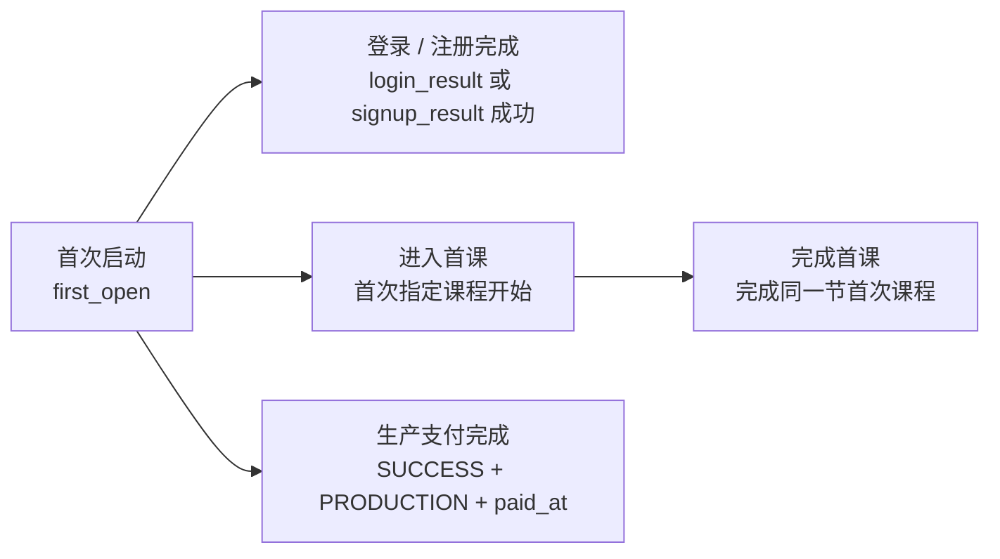

# 用户里程碑完成时长模块

## 目标

回答用户首次启动后多久完成账号、进入首课、完成首课和生产支付。模块只描述已完成样本的时间分布，不替代转化率漏斗。

## 指标

| 层级 | 指标 | 定义 | 数据源 | 展示 | 目标 | 告警 |
|---|---|---|---|---|---|---|
| 模块主指标 | 首课完成 P50 | 已完成首次课程设备的 `完成时间 − first_open` 中位数 | GA4 BigQuery | KPI + 分布条形图 | 先建立 4 个完整周基线 | 周样本 ≥500 后，P50 连续两周较基线上升 ≥25% |
| 输入指标 | 登录 / 注册完成 P50 | 首次成功 `login_result` 或 `signup_result` 与 first_open 的时间差 | GA4 BigQuery | KPI + 分布条形图 | 先建立 4 个完整周基线 | 周样本 ≥500 后，P50 连续两周较基线上升 ≥25% |
| 输入指标 | 进入首课 P50 | 首次命中指定课程 `class_lesson_start` 与 first_open 的时间差 | GA4 BigQuery | KPI + 分布条形图 | 先建立 4 个完整周基线 | 周样本 ≥500 后，P50 连续两周较基线上升 ≥25% |
| 业务指标 | 生产支付 P50 | 首次生产成功订单 `paid_at − first_open` | GA4 BigQuery + `de_ods.payment_order` | KPI + 分布条形图 | 暂不设绝对目标 | 4 周累计可映射支付账号 ≥100 后再启用 |
| 健康指标 | 支付首启映射覆盖 | 可映射窗口内 first_open 的生产成功账号 ÷ 生产成功账号 | GA4 `user_id` + `payment_order.user_id` | 说明条 | ≥95% | 低于 90% 时检查身份链路 |

P75、P90 用于识别长尾，不单独设目标。

## 时间分桶

`1 分钟内`、`1–3 分钟`、`3–5 分钟`、`5–10 分钟`、`10–30 分钟`、`30–60 分钟`、`1–6 小时`、`6–24 小时`、`1–3 天`、`3–7 天`、`7 天以上`。

## 数据口径

- 窗口：2026-07-10 00:00 UTC 至统一统计截点。
- 测试设备：任一事件命中 `user_type=test` 的 `(platform, user_pseudo_id)` 全量排除；其映射支付账号同步排除。
- 账号完成：不强制区分新注册与已有账号登录，取首次成功 `login_result` 或 `signup_result`。
- 首课集合：Lesson ID `732`、`1615`、`734`、`733`、`1613`、`1614`、`1661`、`1616`。
- 首课完成：匹配首次开始的同一 Lesson；六节体验课兼容 `trial_lesson_complete`。
- 支付完成：只认 `app_code=DINO_ENGLISH`、`status=SUCCESS`、`env_type=PRODUCTION`，时间取 `paid_at`。同一账号多笔成功订单只取首次成功。
- 多设备支付账号：选择支付前已完成身份映射的最早 first_open 作为起点；无法映射的账号不进入分布并单独披露。
- 截断：只统计截点前已完成里程碑的样本。靠后的 cohort 尚未完成的用户不会进入分布，因此不能把分布占比解释为转化率。

## 复盘节奏

- 每日：检查查询完整性、支付映射覆盖和异常极值。
- 每周：比较 P50/P75/P90 与分桶结构；当前页面先提供总体与平台切换。
- 每月：复核分桶、样本门槛和告警阈值。
