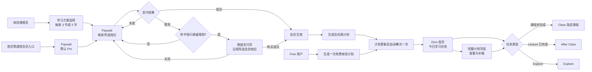
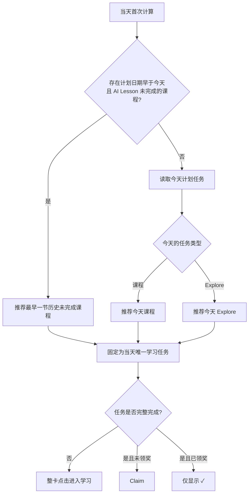
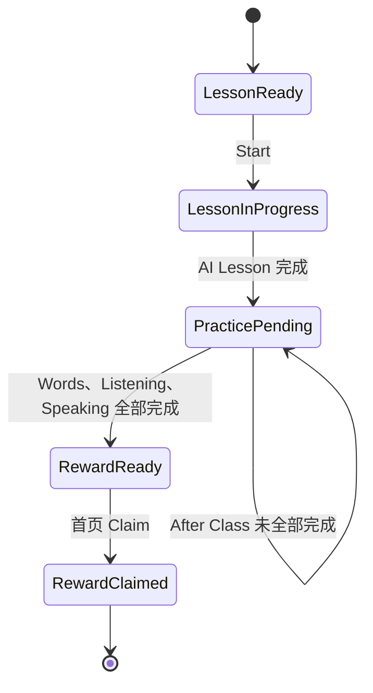

# Dino AI V1.8.0 会员与学习计划产品需求文档

> **版本**：V1.8.0
> **创建日期**：2026-09-01
> **依赖基线**：[V1.7.0 主链路产品需求文档](./V1.7.0-主链路产品需求文档.md)、V1.5.6 会员与滚动周期、现行课程与 Explore 内容
> **交互 Demo**：[V1.8.0 在线 Demo](https://cyanlee888.github.io/cyan/dino-english/V1.8.0-ui-demo.html)

## 1. 变更日志

| 日期 | 版本 | 变更人 | 变更内容 |
| --- | --- | --- | --- |
| 2026-09-01 | V1.8.0 | 产品 | 新建需求文档 |

## 2. 名词解释

| 名词 | 定义 |
| --- | --- |
| Free | 未购买有效会员的用户 |
| Dino Pro | 标准会员；每周 3 个课程任务 + 4 个 Explore 任务 |
| Dino Max | 加速会员；每周 5 个课程任务 + 2 个 Explore 任务 |
| 课程任务 | 1 节 AI Lesson + 该课全部 After Class：Words、Listening、Speaking |
| Explore 任务 | 完成任意 1 个 Explore 内容即可完成的任务 |
| 今日学习任务 | Dino 首页当天唯一推荐的学习任务 |
| 历史未完成课程 | 计划日期早于今天，且 AI Lesson 尚未完成的课程；After Class 未完成不占用课程顺序 |
| 免费体验计划 | Free 用户每个账号仅生成一次的 Day 1—Day 7 体验任务；完成或内容耗尽后不循环更新 |
| 会员周计划 | Pro / Max 按 Day 1—Day 7 编排、每周更新的 7 项课程或 Explore 任务 |

## 3. 需求背景

现有单一 Premium 无法承接标准与加速两种课包。V1.8.0 将会员拆分为 Pro 与 Max，并让购买时承诺的课量直接体现在学习计划中；同时为 Free 用户提供固定的体验计划。

Dino 首页继续以角色陪伴和聊天为主，只在右侧回答“今天学什么”；完整安排、历史补做和计划奖励统一由完整计划浮层承接。Class、After Class、Explore 继续负责具体学习过程，本需求仅定义任务入口、状态与回传规则。

## 4. 版本范围

| 项目 | 本期范围 |
| --- | --- |
| 会员 | Free / Pro / Max 档位、SKU 映射、购买、恢复、升级与到期 |
| 购买 | 学习方案选择页、Paywall 双档切换、商品周期与权益对比 |
| 学习计划 | Free 一次性体验计划、Pro / Max 会员周计划、计划曝光与历史任务补做 |
| Dino 首页 | 今日学习任务推荐、课程两阶段进度、任务奖励、完整计划入口 |
| 配套入口 | Store 合入金币入口；Backpack 合入 Dino 称号与经验入口 |

以下内容不在本期重复设计：V1.7.0 登录与 Onboarding 主链路、Class 页面课程路径、After Class 三类练习页面、Explore 内容页、主题课活动页、签到礼浮层。

## 5. 产品目标与指标

### 5.1 产品目标

1. 家长能清楚理解 Pro 与 Max 的学习节奏差异，并购买匹配的会员。
2. 进入 Dino 首页的家长或孩子可立即识别今天唯一需要优先完成的任务。
3. 漏学、补学和提前学习时，推荐结果稳定，不追 Explore 欠账，也不在一天内自动连续推送新任务。

### 5.2 核心指标

| 指标 | 观察口径 |
| --- | --- |
| Pro / Max 选择与购买转化 | 按入口、国家、档位、周期拆分 |
| 今日学习任务启动率 | 按课程 / Explore、Start / Continue 拆分 |
| 会员周计划课程完成率 | Pro 完成 3 节、Max 完成 5 节课程任务的周期占比 |
| 完整计划完成率 | 7 项任务全部完成的计划占比 |

## 6. 产品结构

## 7. 会员与购买

### 7.1 档位配置

| 档位 | 每周期计划 | 学习价值 | 支持周期 |
| --- | --- | --- | --- |
| Free | 一次性 3 个免费课程任务 + 4 个 Explore | 体验完整学习方法 | 无付费周期 |
| Dino Pro | 3 个课程任务 + 4 个 Explore | 稳定建立学习习惯 | 周、月、季、半年、年 |
| Dino Max | 5 个课程任务 + 2 个 Explore | 以 Pro 的约 1.7 倍速度提升水平 | 月、季、半年、年 |

- 订阅周期只决定价格与权益时长，不改变该档位的每周计划。
- Free 内容池有限，不按自然周重复生成；每个账号只生成一次免费体验计划，完成后通过 `Unlock full learning plan` 承接付费转化。
- 前台仅使用 Free、Dino Pro、Dino Max；
- 历史 Premium、手动会员、终身会员默认映射为 Pro；仅有效 Max SKU 可生效 Max。

### 7.2 学习方案选择页

- 体验课报告后进入，用于选择学习节奏，不展示价格。
- 标题为 `How many lessons a week for {nickname}?`。
- 两张卡片主文案分别为 `3 lessons`、`5 lessons`，右上角显示 `Dino Pro`、`Dino Max`。
- 每次进入页面默认选中 Pro；用户可切换 Pro / Max。选择 Pro 时展示每周 3 节课、12 个月到达下一个 Level；选择 Max 时展示每周 5 节课、7 个月到达下一个 Level，个性化目标区使用暖色背景。
- CTA 为 `Unlock {nickname}'s Learning Plan`，进入 Paywall 并透传所选档位。

### 7.3 Paywall

页面顺序为：三屏价值轮播 → Pro / Max 切换 → 限时优惠 → 服务端返回的在售商品 → 三列权益表 → 固定购买区。

| 权益 | Dino Pro | Dino Max |
| --- | ---: | ---: |
| 每周 AI 课 | 3 | 5 |
| 水平提升速度 | 1× | 约 1.7× |
| 年度单元测评 | 13 | 21 |
| 英语定级 | ✓ | ✓ |
| 864 节 CEFR 课程 | ✓ | ✓ |
| 每课学习反馈 | ✓ | ✓ |
| 口语、练习与复习 | ✓ | ✓ |

- 除前三项真实差异外，其余权益保持现有 Paywall 文案，两档均打勾。
- 学习方案选择页进入时继承所选档位；通用会员入口默认 Pro；会员中心升级入口默认 Max。
- 用户可切换 Pro / Max；价格、选中商品与权益高亮必须同步更新。
- 商品列表、展示顺序、默认选中项、推荐标签、币种、价格、划线价、日均价和续费文案均取服务端针对当前国家、平台、渠道和会员档位返回的配置；客户端不得写死年订、商品数量或 `Best value`。
- Pro / Max 的每个在售 SKU 必须映射明确会员档位。切换档位时重新读取该档位商品：原选周期仍在售则继续选中，否则选中服务端指定默认商品；没有默认值时选中返回列表第一项。
- 现有 Promo Code、KOL 专属价、IAP Offer、优惠倒计时、频控、本地化价格、续费说明和 Restore 逻辑保持不变；V1.8.0 只增加 `tier` 维度与 SKU—档位映射。
- 系统支付取消后先执行现行挽留页命中判断：命中则展示同一会员档位下可用的挽留 SKU；未命中或该档位无有效挽留 SKU，则返回主 Paywall。挽留页关闭后返回主 Paywall，支付失败留在当前页面重试。
- 从主 Paywall 主动返回时，继续沿用 V1.7.0 的“人工咨询资格 → 返回挽留页 → 退出”判断顺序，不在本期重做频控与页面视觉。
- 挽留购买成功后生效进入挽留页时所选的 Pro / Max，不得静默回落为另一档；恢复购买按商店返回的有效 SKU 还原真实档位。

### 7.4 会员变更

会员档位、付费生效时间、差价、退款和续费日均以 App Store / Google Play 与服务端订阅结果为准，确认支付前必须展示商店返回的信息。计划切换遵循“当前计划不重排，新模板从下个计划周期开始”的统一规则。

| 场景 | 会员权益 | 学习计划 |
| --- | --- | --- |
| Pro 升级 Max | 按商店结果生效 Max；完成记录和奖励不变 | 当前 Pro 周计划保持不变；下一计划周期生成 Max 5 课 + 2 Explore |
| Max 降级 Pro | 生效日前继续使用 Max；生效日后使用 Pro | 当前周计划保持不变；生效后的下一计划周期生成 Pro 3 课 + 4 Explore |
| 取消自动续费 | 权益持续到已付费周期结束 | 到期前继续生成当前档位计划；到期后停止生成会员计划 |
| 会员到期为 Free | 到期即时锁定全部正式会员课程及其 After Class | 保留历史计划；未使用过免费体验计划则生成或继续该计划，已使用完则不再重复生成 |
| Restore | 按商店返回的有效 SKU 恢复真实档位与有效期 | 不重排当前计划；档位模板从下一计划周期应用 |

- 当前计划不得因升降级撤销、补塞或替换任务；已完成内容、已生成奖励资格和已领取奖励均保留。
- 会员到期后，无论正式课程是未开始、进行中，还是已完成 AI Lesson 但 After Class 未完成，均统一上锁；仅体验课、免费主题课和其他 Free 内容可进入。
- 如业务后续需要宽限期，必须由服务端权益单独配置，不得根据“任务已开始”自动放行。

## 8. 学习计划

### 8.1 计划生成

| Day | Free 一次性体验计划 | Dino Pro 会员周计划 | Dino Max 会员周计划 |
| ---: | --- | --- | --- |
| 1 | 当前 Level 体验课 | Lesson A | Lesson A |
| 2 | Explore | Explore | Lesson B |
| 3 | Knock Knock Party | Lesson B | Lesson C |
| 4 | Explore | Explore | Lesson D |
| 5 | The Tiny Team | Lesson C | Lesson E |
| 6 | Explore | Explore | Explore |
| 7 | Explore | Explore | Explore |

- `Lesson A—E` 仅表示模板中的课程顺序占位；生成计划时绑定真实 `lesson_id` 和课程名，前台不展示字母编号。
- 每个任务绑定 `plan_date`、`day_index` 和唯一 `plan_task_id`，前台按 Day 1—Day 7 展示。
- Free 每个账号仅生成一次体验计划；Day 7 后未完成任务仍可在该计划内补做，但不生成下一套体验计划，也不重复投放已消耗的免费内容。
- Pro / Max 每周生成新计划。新周期开始时，未完成的 Explore 不结转；未完成的课程内容按课程顺序占用新计划第一个课程位，避免跳课或重复生成同一课程。
- 升降级不修改已生成计划，新模板按 7.4 的生效规则从下个计划周期应用。

### 8.2 今日学习任务推荐规则

1. 首页先检查 `plan_date < 今天` 且 AI Lesson 未完成的课程；有多节时当天只推荐计划日期最早的一节。
2. 没有历史未完成课程时，课程日推荐当天课程，Explore 日推荐当天 Explore。
3. 课程必须按顺序推进，推荐课程始终为从前到后第一节 AI Lesson 未完成的课程；After Class 未完成不阻塞下一节 AI Lesson。
4. 推荐结果当天固定。任务完成或领奖后不继续推下一项，只显示 `✓`。
5. 用户可以从 Class 提前完成后续 AI Lesson 与 After Class；对应计划节点同步完成，但首页不在当天连续追加推荐。
6. 错过的 Explore 不占用后续日期，也不进入首页自动追补，只能从完整计划中主动补做。

| 场景 | 今日学习任务 |
| --- | --- |
| Day 1 课程未完成，Day 2 原定 Explore | 继续推荐 Day 1 课程 |
| Day 1、Day 3 课程均未完成，今天 Day 4 | 只推荐 Day 1 课程；完成后当天停止 |
| 历史课程均完成，今天为 Explore 日 | 推荐今天的 Explore |
| 今天课程已提前完整完成且奖励已领 | 只显示 `✓` |
| 昨日 Lesson 已完成、After Class 未完成，今天为 Explore | 推荐今天的 Explore；昨日练习从完整计划或 Class 补做 |
| 多日未打开 App，只有 Explore 未做 | 按今天原计划推荐；历史 Explore 只在完整计划补做 |

### 8.3 任务完成口径

#### 8.3.1 课程任务

- AI Lesson 完成后，完整计划中的课程节点立即打勾并解锁下一节课；节点不展示课后练习进度点。
- AI Lesson 与 Words、Listening、Speaking 全部完成后，课程任务才进入待领奖，并计入整套计划完成度。
- 首页课程卡只展示 `Lesson → Practice → Gift`，详细练习分项仅在 After Class 展示。

#### 8.3.2 Explore 任务

- 从今日学习任务进入时，完成任意 1 个有效 Explore 内容，即完成当天 `plan_task_id`。
- 从历史节点补做时，完成任意 1 个有效 Explore 内容，即完成所选历史 `plan_task_id`；同一内容允许用于不同节点，不限制内容唯一性。
- 从底部 Explore Tab 普通进入时不带计划上下文，不自动完成或追补任何计划任务。
- Explore 任务完成后进入待领奖；不因用户在一天内自由完成多个 Explore 内容而自动完成后续节点。

### 8.4 Dino 首页学习任务卡

| 状态 | 卡片信息 | 操作 |
| --- | --- | --- |
| 课程未开始 / 进行中 | 课程名；Lesson → Practice → Gift | 整张卡片进入指定课程 |
| Lesson 完成、练习未完成 | 同一课程名；Practice 节点高亮 | 整张卡片进入 After Class |
| Explore 未完成 | Explore；Complete any 1 activity | 整张卡片进入 Explore |
| 任务完整完成、奖励未领 | 原任务完成态 | `Claim` |
| 奖励已领 | 只显示 `✓` | 无 |
| Free 体验日结束且无可自动推荐任务 | 体验计划待补做或已完成 | `View starter plan` |

- Start / Continue 不使用独立按钮；只有当前可执行的学习任务卡使用轻微呼吸边框。`Claim` 是独立领取行为，保留明确按钮。
- 任务卡不预先展示金币数量；点击 `Claim` 后再通过礼物动效展示实际奖励。
- 历史任务从完整计划补做完成后，返回首页优先展示该任务的 `Claim`；领取后恢复当天推荐。若补做任务就是当天推荐，领取后当天只显示 `✓`。
- 同时存在多笔待领奖时按完成时间展示最早一笔；领取后显示下一笔，资格由服务端保存。
- 今日任务卡展示任务完成人数。Demo 使用固定假数据；正式环境使用服务端统计或运营配置，无有效数据时隐藏。

| 入口 | 目标 | 关键上下文 | 完成回传 |
| --- | --- | --- | --- |
| 课程 · Lesson 未完成 | Class 指定课程 | `plan_id`、`plan_task_id`、`lesson_id`、`source=today` | Lesson 状态与完成时间 |
| 课程 · Lesson 已完成 | After Class | 同上 + 未完成练习项 | 三项练习状态 |
| 今日 Explore | Explore | `plan_id`、`plan_task_id`、`source=today` | 有效内容完成 |
| 历史课程 / Explore | 对应学习页面 | 同上，`source=plan_makeup` | 完成并归属指定节点 |

- App 回到前台或返回 Dino 首页时刷新服务端状态；完成状态不可逆，多设备冲突以服务端记录为准。
- 内容下架时服务端替换同 Level 可用内容；无法替换则显示可重试状态，不生成错误深链。

### 8.5 完整计划浮层

#### 8.5.1 曝光与展示

- Free 体验计划生成后首次回到 Dino 首页自动曝光一次；后续仅从 `Starter plan` 主动进入。
- Pro / Max 每周计划更新后，用户首次回到 Dino 首页自动曝光一次；同一 `plan_id` 不重复强弹，后续从 `Weekly plan` 主动进入。
- 服务端因模板或内容异常替换并生成新 `plan_version` 时，仅在确实改变用户任务后再自动曝光一次。
- 浮层展示 Day 1—Day 7、实际任务类型、真实课程名、完成状态、当前节点和末端周礼物；不展示模板中的 Lesson A—E。
- 顶部展示计划参与人数，任务节点可展示任务完成人数。正式环境无有效数据时隐藏；Demo 可使用固定假数据。

#### 8.5.2 节点状态与补做

| 节点状态 | 展示 | 点击行为 |
| --- | --- | --- |
| 已完成 | 对勾 | 课程练习未完时进入 After Class；其余可查看内容 |
| 今天 | 正常高亮 | 进入今日课程或 Explore |
| 历史未完成课程 | 正常可点击 | 仅最早一节未完成 AI Lesson 可进入；Lesson 完成后可补 After Class |
| 历史未完成 Explore | 正常可点击，不显示 Start / Continue | 带所选 `plan_task_id` 进入 Explore |
| 未来任务 | 置灰 | 不可点击 |

- 历史 Explore 只通过点击对应节点补做；普通进入 Explore 不自动归属历史任务。
- 同一天可补多个历史 Explore，但每次须先选择一个具体节点；完成内容后只完成本次携带的 `plan_task_id`。
- 课程节点的对勾表示 AI Lesson 已完成；整套计划完成仍要求所有课程任务完整完成且全部 Explore 节点完成。

#### 8.5.3 底部 CTA

| 状态 | CTA | 行为 |
| --- | --- | --- |
| 今日课程未开始 | `Start lesson` | 进入指定课程 |
| 今日课程 Lesson 已完成 | `Continue` | 进入 After Class |
| 今日 Explore 未完成 | `Start Explore` | 进入 Explore |
| 今日任务待领奖 | `Back to today` | 关闭浮层，回首页 Claim |
| 今日任务已完成 | `✓` | 关闭浮层 |
| 7 项完成、计划奖励未领 | `Claim plan gift` | 原地打开末端礼物并发奖 |
| 计划奖励已领 · Free | `Unlock full learning plan` | 进入 Paywall，默认 Pro |
| 计划奖励已领 · Pro / Max | `Explore more` | 进入 Explore |

### 8.6 奖励

- 每个课程或 Explore 任务完整完成后生成单任务奖励资格，只在 Dino 首页手动领取。
- 7 项全部完成后生成计划奖励资格，只在完整计划末端礼物盒领取。
- 任务卡和计划路径不提前展示金币数量，领取动效中展示实际到账数量。
- 奖励资格、领取结果以 `plan_task_id` 或 `plan_id + reward_id` 幂等保存；失败可重试，不重复到账。
- 奖励数量由成长体系配置下发；新人签到、单任务和计划奖励分别配置额度、周期上限与总预算，客户端不写死数值。

## 9. Dino 首页其他调整

### 9.1 页面结构

- 左侧保留 Dino 角色、对话气泡与 `Chat with Dino`，三处均可进入沉浸式聊天。
- 右侧仅承载当前档位、完整计划入口、今日学习任务和新人签到礼；会员入口不得与主题课入口重叠。
- Pro / Max 显示 `Weekly plan`，Free 显示 `Starter plan`，均不显示完成数量。
- 顶部金币入口同时表达余额与 Store；Dino 称号 / 经验入口旁展示 Backpack，不保留独立 Store、Backpack 大卡片。
- 仅当前可执行学习任务使用呼吸边框；主题活动、签到礼和 Backpack 不使用循环动效。
- 新人签到礼资格只由“是否处于新人签到周期”决定，不按会员档位区分；现有周期、补签与奖励配置保持不变。
- 新人签到礼与学习计划相互独立，顺序不限；签到礼沿用学习任务卡样式，领取后按钮变为对勾。

### 9.2 主题课入口去重

- 主题课入口用于发现活动，学习任务用于执行指定内容。
- 两者 `content_id` 相同时隐藏主题课入口，只保留学习任务；不同时可同时展示。
- 首页顶部只保留一个静态主题课 / 活动聚合入口；多项时按运营优先级展示最高一项，点击进入主题课列表，无有效内容时隐藏。

## 10. 埋点增量

本期事件须并入现行埋点表，不在 PRD 维护完整字典。至少覆盖：

| 场景 | 关键参数 |
| --- | --- |
| 方案选择、Paywall 档位切换 | `tier`、`source` |
| 支付发起与结果 | `tier`、`cycle`、`sku`、`source`、`is_success` |
| 完整计划曝光、主动查看 | `plan_id`、`plan_type`、`tier`、`source` |
| 今日任务曝光与点击 | `plan_task_id`、`type`、`status`、`recommendation_reason` |
| 完整计划节点点击 | `plan_task_id`、`type`、`day_index`、`source` |
| 任务与奖励完成 | `plan_task_id`、`reward_id`、`is_success` |

## 11. 依赖

| 依赖 | 责任方 | 开发前交付 |
| --- | --- | --- |
| Pro / Max SKU、价格、升降级规则 | 商业化 / 服务端 | 各商店可售周期、地区价格、验签映射 |
| 计划生成与推荐 | 服务端 | `plan_date`、课程顺序、推荐原因、节点状态 |
| Class / After Class 跳转 | 课程专项 | 深链参数与完成回调 |
| Explore 完成 | 内容 / 客户端 | 今日与历史补做上下文、有效完成事件 |
| 奖励发放 | 成长体系 / 服务端 | 单任务与计划奖励配置、幂等接口 |
| 埋点 | 数据 | 事件表更新与验收口径 |

## 12. 参考资料

- [V1.8.0 多会员套餐购买竞品调研](./V1.8.0-多会员套餐购买竞品调研.md)
- [不同会员学习计划评审文档](https://qjphu5vphyf4.jp.larksuite.com/wiki/D56EwZWGmiNcKMkT0q9jWikYpnh)
- [课程专项会纪要](https://qjphu5vphyf4.jp.larksuite.com/docx/BvdAdid7Do4qxnxyjeUjLAAVpVc)
- [最新方案评审纪要](https://qjphu5vphyf4.jp.larksuite.com/docx/Xr4qdVauOojqe0xtN3aj51vRpzd)
