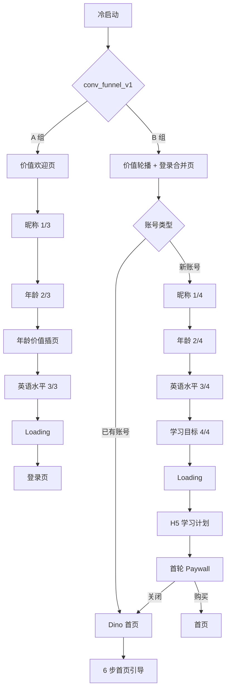

# Dino English Demo 版本拆分基线

> 更新日期：2026-07-27
> Demo：[V1.4.2 A组现有链路优化](./V1.4.2-A-flow-ui-demo.html) · [V1.5.1](./V1.5.1-ui-demo.html)
> 旧地址：[V1.4.3-ui-demo.html](./V1.4.3-ui-demo.html) 仅保留兼容跳转。

## 版本边界

| Demo | 默认链路 | 课程主动升降级 | Play 扩充题型 | 新手到访奖励 |
| --- | --- | --- | --- | --- |
| V1.4.2 A组现有链路优化 | A 组；状态机可切 B 组对照 | 不包含 | 不包含，使用原文本选择题 | 不包含 |
| V1.5.1 | B 组；状态机可切 A 组回归 | 包含 | 包含题干朗读、看图选词、听音选图与口语跟读配图 | 包含 8 日奖励及 A/B 曝光场景 |

两版共享已验证的 A/B 转化链路基线，通过版本能力开关控制差异。V1.4.2 仍保留 Level / Unit 学习计划、首次定级体验课和正常顺序升 Level，不展示主动升降级入口、升级报告状态或扩充题型状态。

## 研发核对参考

以下分支只用于后续核对，不作为本轮版本拆分和页面合并依据。

| 平台 | 仓库与分支 | Commit | 作为 Demo 依据 |
| --- | --- | --- | --- |
| Android | `prime-future/dino-english-android` · `dev/feature/0729` | `56f6f28501c77c89044ea09cfeb065ebfc34145a` | 实验框架、Onboarding V2、首页新手引导、非会员入口 |
| iOS | `prime-future/dino-english-ios` · `dev-abtest` | `c73f897b6b7396407aa1fb30351a6140fb788982` | `conv_funnel_v1` A/B 契约、合并登录页、学习计划回流、B 组首页引导 |

当前选择的是两端仍在集成的开发分支，不是滞后的默认 `main`。iOS 的 `dev-changeName` 仍是独立品牌改名分支，尚未进入本次集成基线，因此 Demo 继续使用 Dino English。本地镜像放在 `.local-sources/`，已加入 `.gitignore`，只用于核对，不进入产品文档仓。

## V1.4.2 A/B 转化链路



## 已落入 Demo 的源码事实

- 实验键为 `conv_funnel_v1`，支持 A、B 两条完整可演示路径。
- V1.5.1 对符合资格的新用户全量启用到访奖励，不改变 `conv_funnel_v1` 分组；States 面板可查看 A 登录后、B 补资料、学习计划、首页引导、课堂深链、安全首页和 D7 最终奖励。
- 到访奖励在资格成立时先发放，登录、资料补全、学习计划、Paywall、首页引导、课堂和报告占用时只轻提示或静默延后，首个安全首页窗口再完整展示。
- 身份问题不再进入有效链路，默认按儿童学习者文案处理。
- A 组保留年龄价值插页，不再展示学习目标题。
- B 组把价值轮播和登录方式合并到同一页；新账号登录后完成 4 题，已有账号直接进入第一个 MainTab（Dino）。
- 登录方式按默认、韩国、越南三种配置演示；无配置时回退默认组合。
- B 组学习计划的返回与主 CTA 都进入 `study_plan` 来源的首轮 Paywall。
- B 组免费用户关闭该 Paywall 后直接回首页，不经过 win-back，并触发无 Skip 的 6 步引导：Dino → Play → Explore → Class → 选老师 → 第一节课。

## 保留但不伪造的能力

- 服务端实验分配、失败回退、本地缓存与跨端一致性由原生工程负责，单文件 Demo 只提供显式状态切换。
- H5 学习计划在 Demo 中复用现有学习计划页面，不模拟 WebView、JSBridge 或真实接口。
- 登录按钮模拟授权成功；真实 OAuth、短信、账号合并和风控仍以原生实现为准。
- FM、Paywall、win-back 与主题课等公共能力继续保留；课程主动升降级、Play 扩充题型和新手到访奖励只在 V1.5.1 开启。

## 证据入口

- iOS：`openspec/changes/conv-funnel-ab/`
- iOS：`openspec/changes/home-guide-group-b/`
- Android：`core/experiment/`
- Android：`feature/main/impl/.../newbieguide/`

## 后续同步

```bash
git -C .local-sources/dino-english-android fetch origin
git -C .local-sources/dino-english-android switch --detach origin/dev/feature/0729

git -C .local-sources/dino-english-ios fetch origin
git -C .local-sources/dino-english-ios switch --detach origin/dev-abtest
```

每次更新先记录新 commit，再核对四类差异：页面顺序、状态门槛、返回目标、埋点/来源参数。只有用户可感知的产品事实进入 Demo，运行时实现细节留在本说明中。
